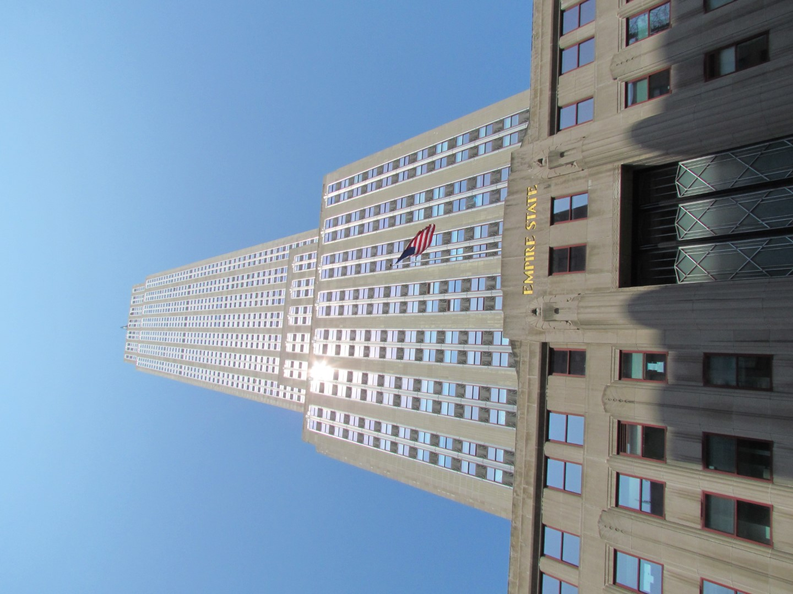
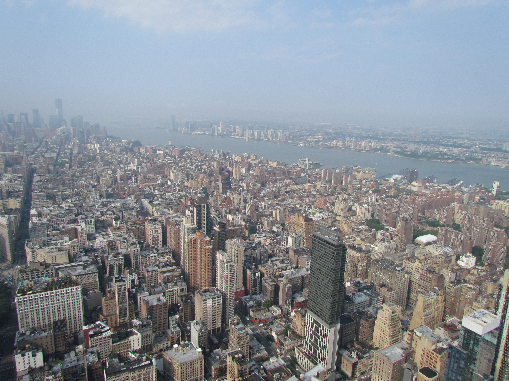
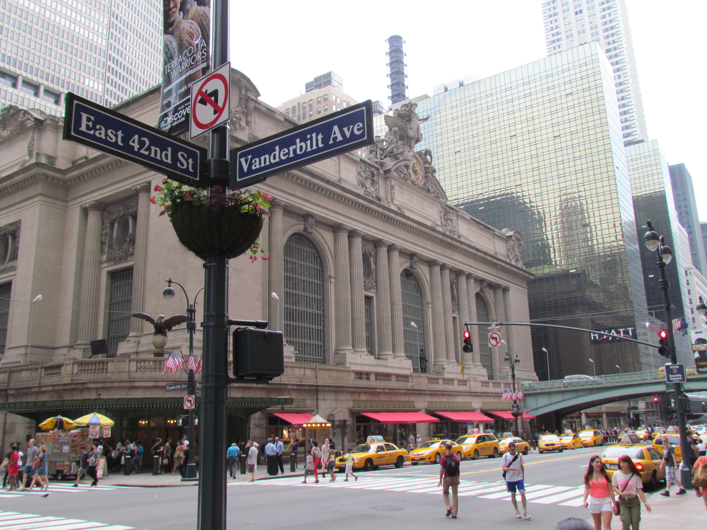
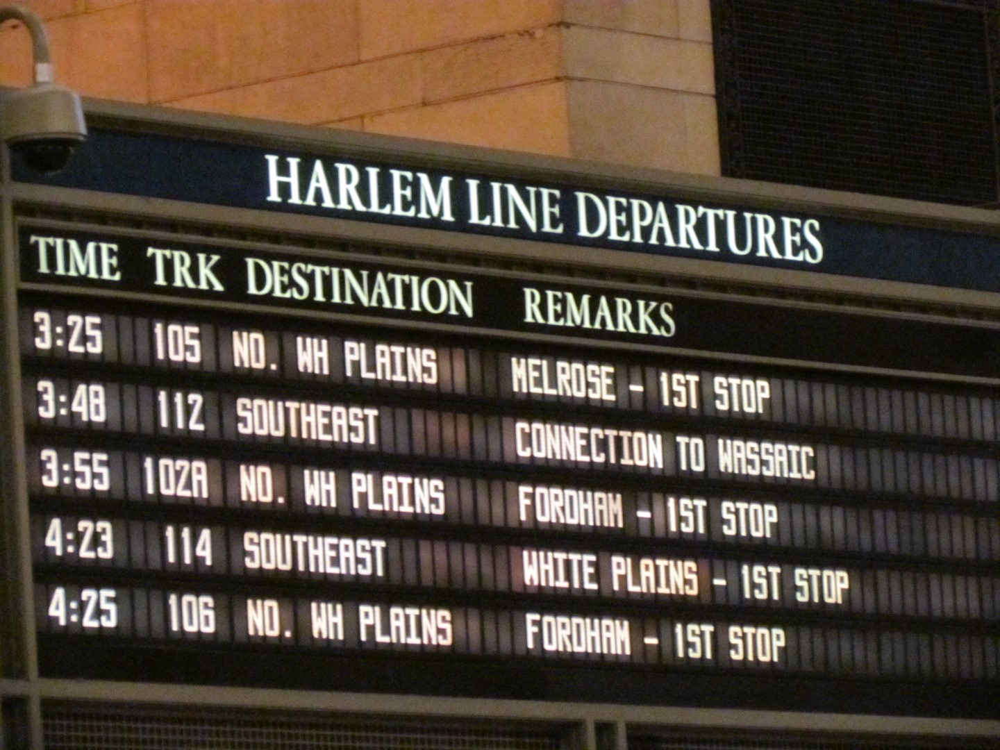
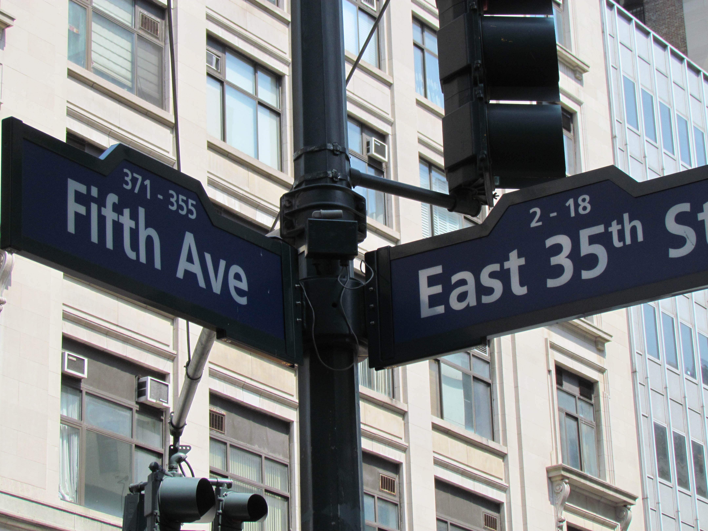

Toen we met dank aan de jetlag om 8 uur 's morgens bij het Empire State Building aankwamen, stond er al een beste rij. Iedereen die al eens in Amerika is geweest, zal beamen dat het aan personeel in het algemeen niet ontbreekt bij attracties en bedrijven, maar het Empire spande wel de kroon: voordat we op de 86e verdieping van het uitzicht konden genieten, hebben we minstens 75 mannen en vrouwen in uniform gezien, die je continu de weg wijzen. Niet dat je een verkeerde kant op kunt hoor. Bij de lift alleen al staan 6 man!

Maar het uitzicht is fenomenaal...

Helemaal in de verte zie je nog net de Freedom Tower, waar ons hotel dus ook is.

Na de lunch hebben we nog een tijdje in Bryant Park gezeten, lekker koel onder de bomen.

En toen op naar Grand Central Train Station waar we de gids ontmoeten van de Food on Foot tour.

Met deze tour bezoeken we 4 kleinere restaurantjes om een hapje en een drankje te doen. We lopen of nemen de metro om van de ene naar de andere plek te gaan. Onderwijl kun je een beetje babbelen met de mede tourgangers. We spraken een Australiër die vorig jaar op familiebezoek is geweest in Cuijk (geboorteplaats van Chantal)... We hebben er hartelijk om kunnen lachen :-)

Het eten zelf was verre van culinair (een "gourmet" hotdog, een gehaktbal, een broodje shoarma en een lokaal bekende koek), toch was het een erg leuke trip, omdat je op plekken komt, waar je normaal gezien niet zo snel komt.
