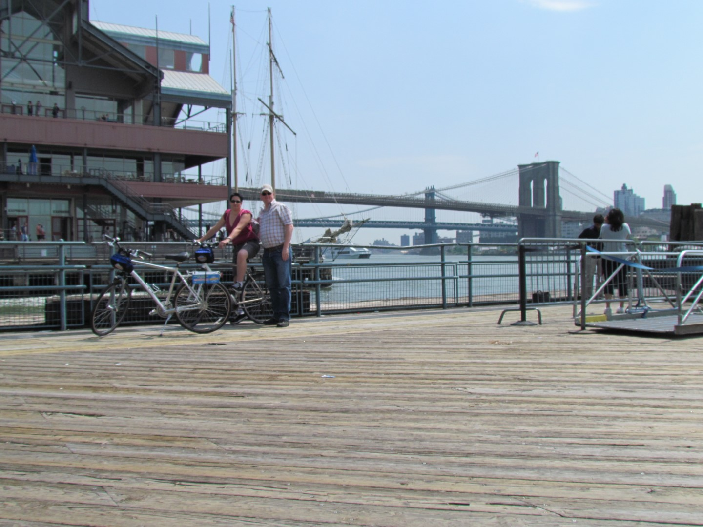
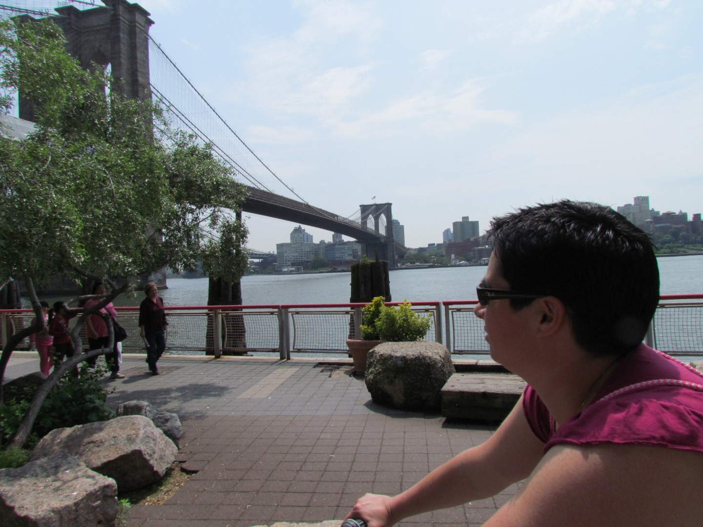
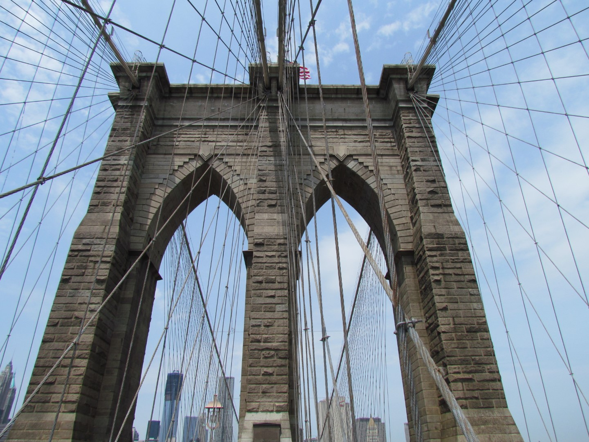
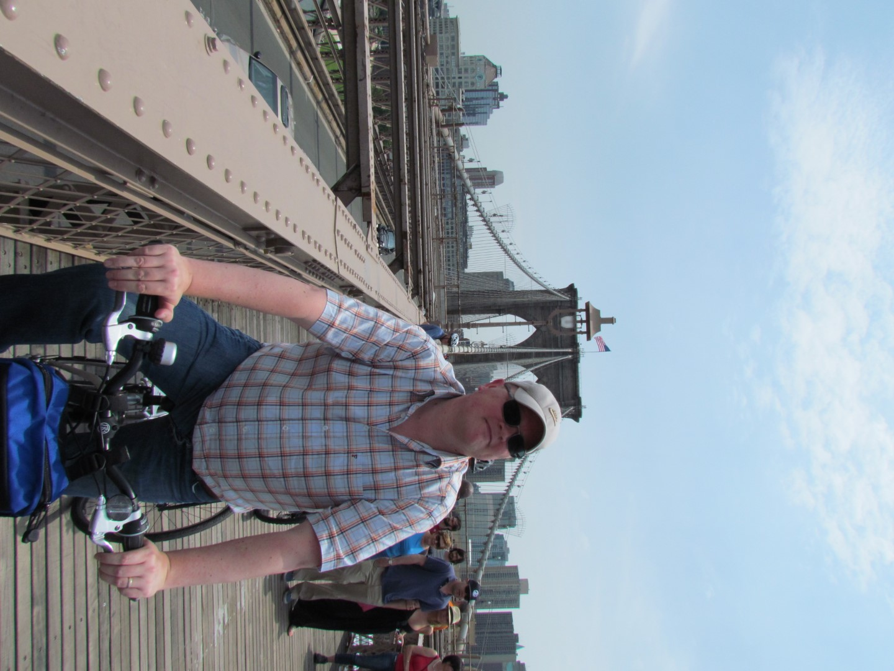
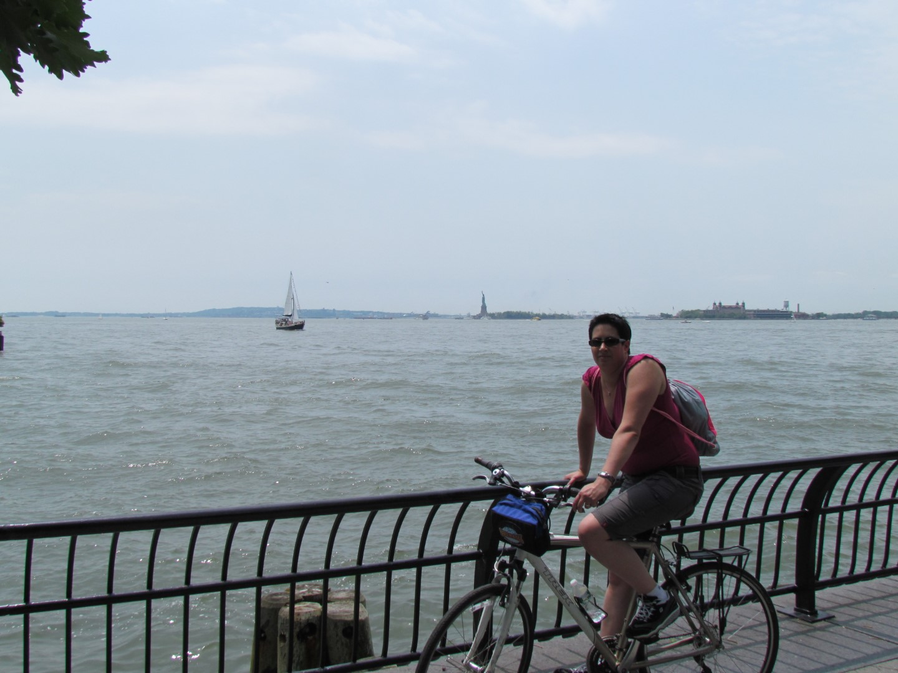
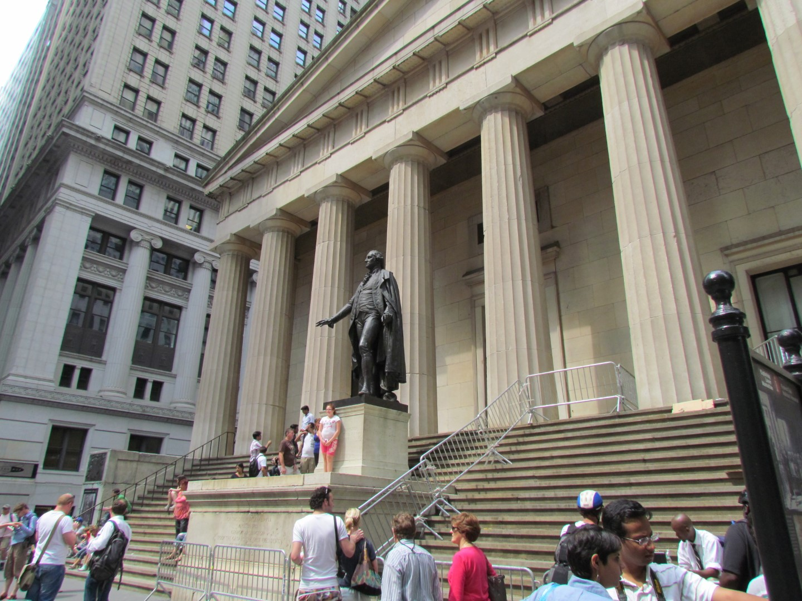
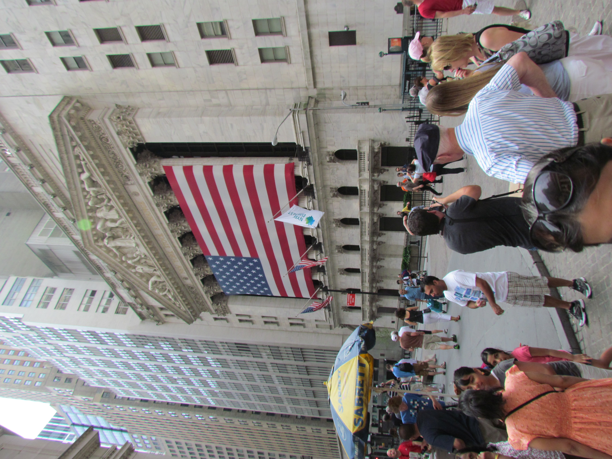

Vandaag staan twee activiteiten op het programma. Als eerste hebben we fietsen gehuurd en zijn we naar de Brooklyn Bridge gereden. Het is zondag en blijkbaar is het dan de lokale volkssport om met z'n allen op het fietspad van de brug te gaan lopen, om het de fietser zo moeilijk mogelijk te maken. Al bellend en slingerend hebben we zonder blijvend letsel de overkant bereikt. Afgezien van de hoeveelheid mensen, was het zeker de moeite waard. Overigens is fietsen door Manhattan levensgevaarlijk: automobilisten zijn duidelijk geen fietsers gewend op de openbare weg, dus je moet constant op je hoede zijn.

En vandaag hebben we het Vrijheidsbeeld voor de eerste keer kunnen zien!

Na de lichte lunch (want zwaar ontbijt), gingen we op pad met een gids in de Slavery and underground railroad tour. Het tweede deel van de titel is een beetje misleidend, wij dachten dat we in oude verlaten metrotunnels werden rondgeleid. Het blijkt echter een metafoor te zijn voor het helpen ontsnappen uit het slavenbestaan in de 19e eeuw. Vergelijkbaar dus met het laten onderduiken van de Joden in de Tweede Wereldoorlog. Nu ik erover nadenk zou het natuurlijk ook wel een beetje rare combinatie zijn in één tour: slavernij en metrotunnels...

Met de tour kwamen we ook door Wallstreet, waar alle economische ellende van de laatste 4 jaar is veroorzaakt. Wel indrukwekkend om van dichtbij te zien.

