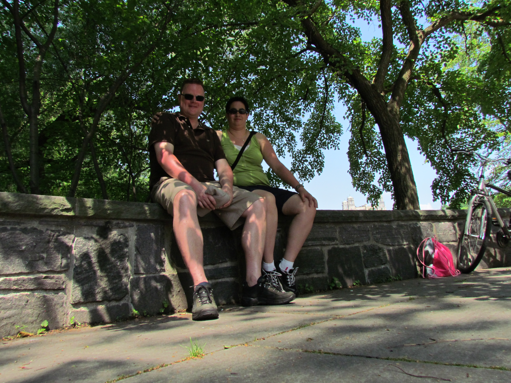
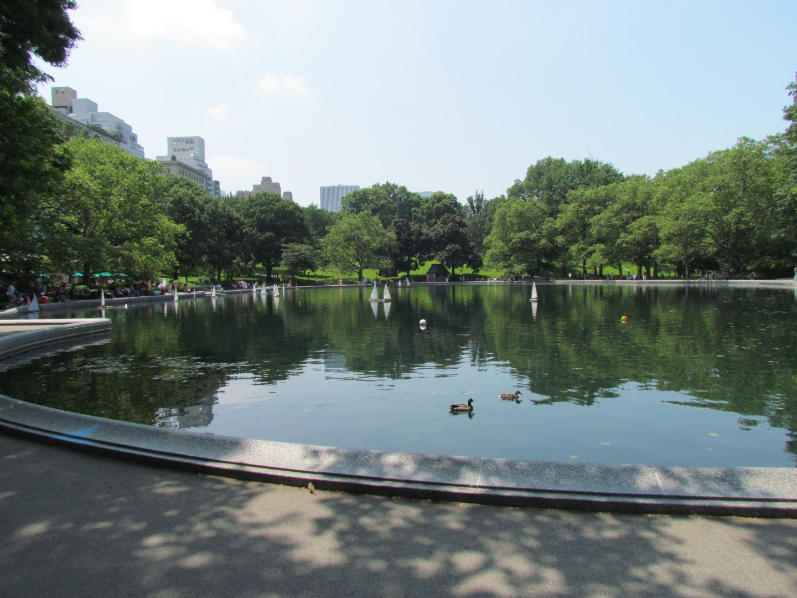
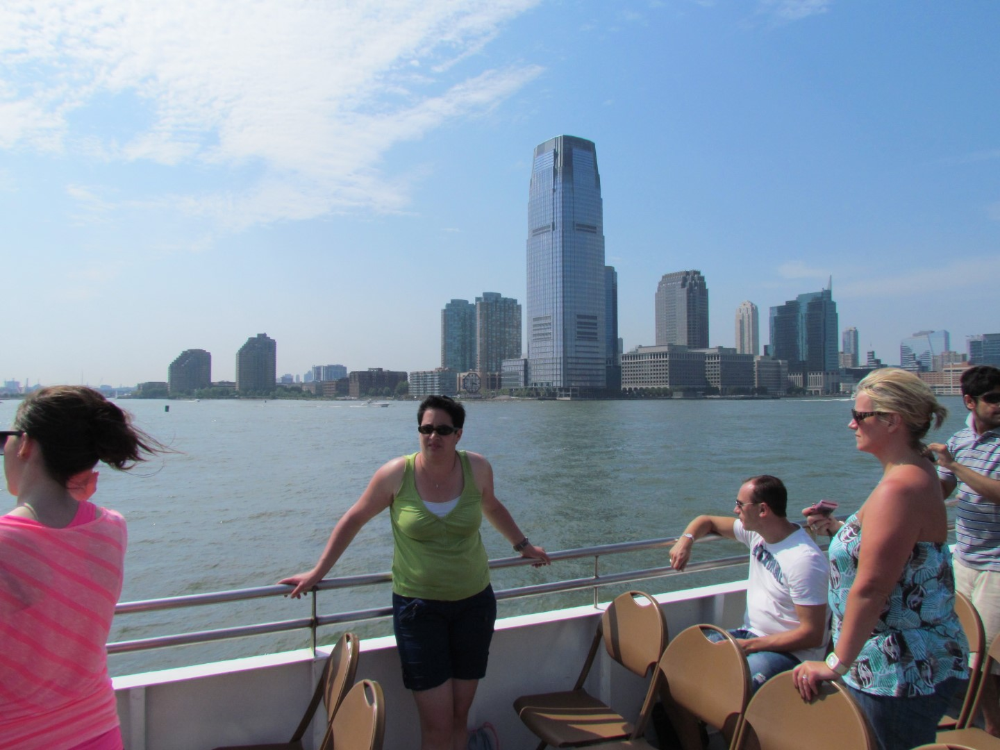
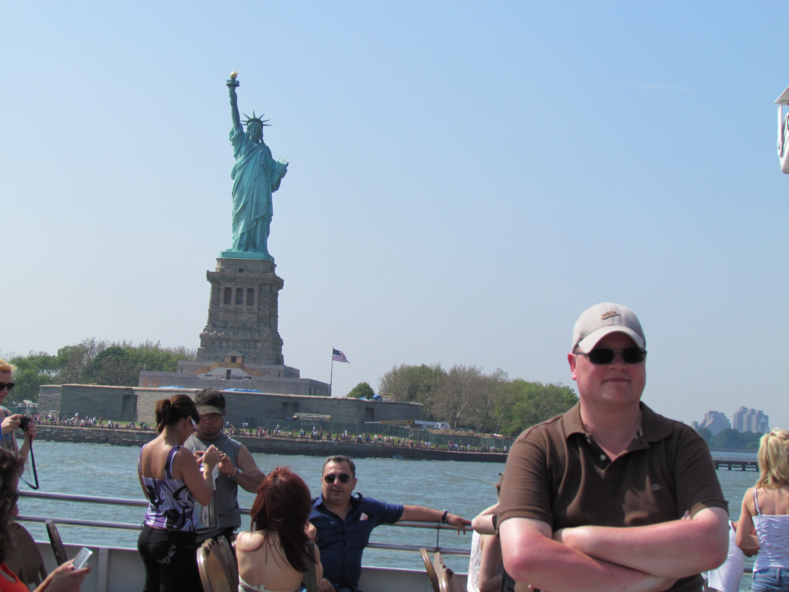
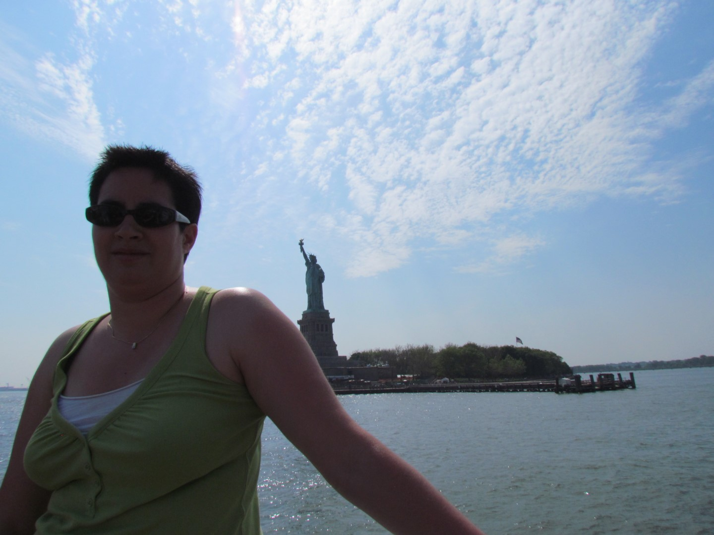

Central Park is het bekendste park van New York en behoorlijk groot. Het is enorm druk met hardlopers, fietsers en wandelaars, maar wel weer op z'n Amerikaans opgezet. Dus geen mooi slingerend fietspad, nee, het is een driebaans geasfalteerde weg waar iedereen als een stelletje mieren doorheen krioelt. En de Amerikanen doen dat uiteraard weer fully equiped, alsof ze meedoen aan de Tour de France, compleet met zo'n airodynamische toeter op hun kop.

Wij hebben hier ook weer twee fietsen gehuurd en hebben een rondje gemaakt van een uur of twee.

Na de lunch moesten we snel met de metro naar 42nd street (Times Square) en dan een kwartiertje westwaards lopen naar de Circle Line. Dit is een rondvaartboot waarmee je de skyline van Manhattan mooi kan zien en die rond het Vrijheidsbeeld vaart. In de volle zon hebben we genoten van het uitzicht!

Hierna hebben we nog het 9-11 Memorial bezocht. Op de plek waar de twee WTC torens hebben gestaan, hebben ze twee enorme bassins gemaakt met daarlangs op bronzen platen de namen van alle slachtoffers van de aanslagen op het WTC en het Pentagon.



## 3 opmerkingen

### Anoniem 29 mei 2012 om 22:04

Een geboren Cuijkenaar met een aussie accent genaamd De Boer, of lees ik het verkeerd. Mooie verslagen. Have fun! B uit W&A

### Mac 29 mei 2012 om 22:31

Weer mooie epistels en plaatjes, keep up the good work!!
Oranje gestroomlijnde toeter op je hoofd en gaan, want de rest van het lichaam is al gestroomlijnd genoeg natuurlijk.
Veel plezier en lees je later...

### Anoniem 30 mei 2012 om 09:26

Bekende locaties die jullie hebben aangedaan! Erg herkenbaar. Of ik er deze maand nog was ;-)

Marcel
