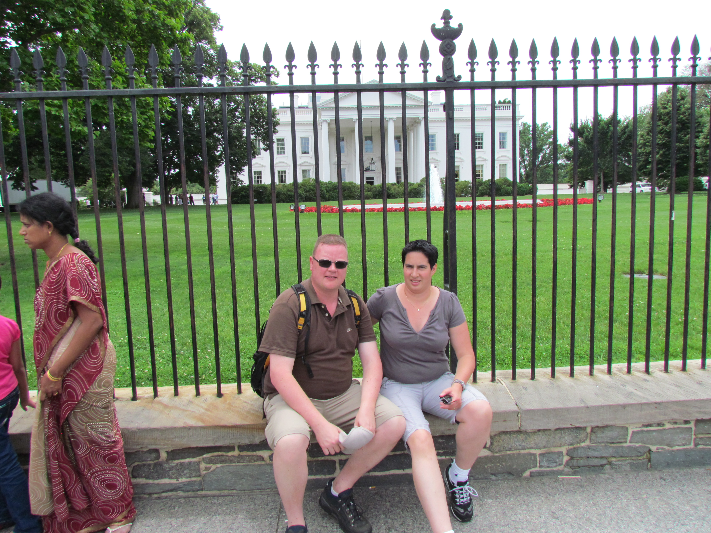
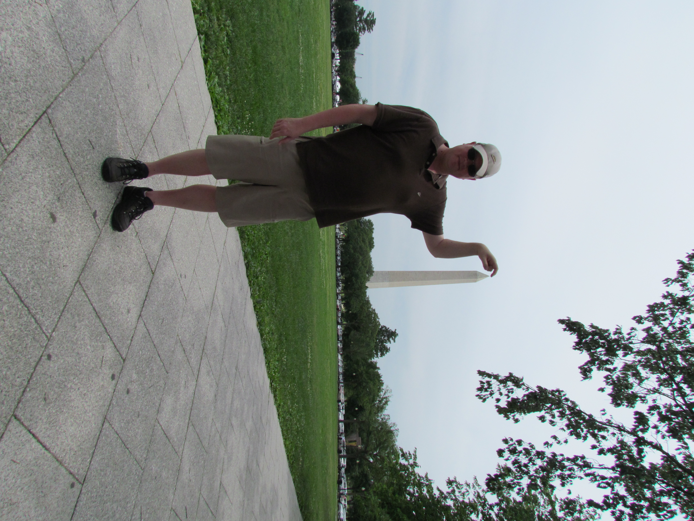
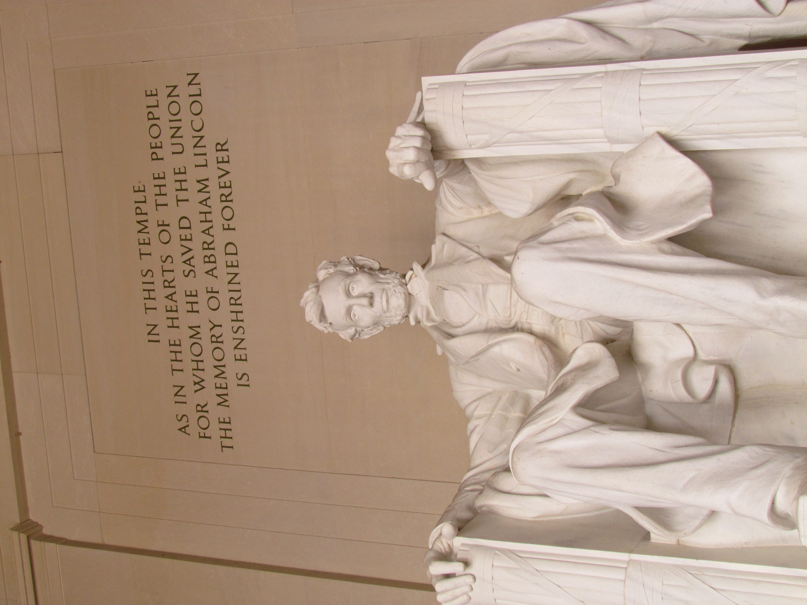
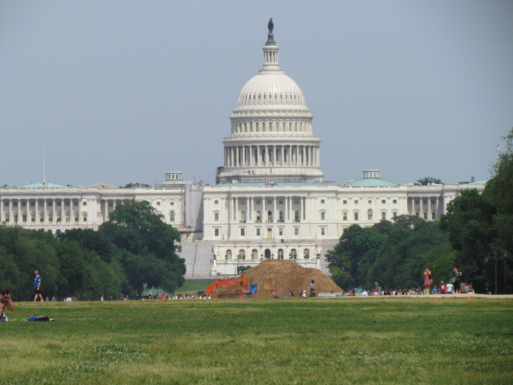

Na een taxirit van een dik uur hebben we de camper opgehaald in Middletown, New Jersey. Hij is nog geen half jaar oud, dus hij ziet er nog goed en schoon uit.

Eerste bestemming is camping Cherry Hill Park, onder de rook van Washington DC. Op de camping stopt een stadsbus die je in 20 minuten naar een metrostation brengt. Na een paar haltes stap je uit de trein op een paar minuten lopen van het Witte Huis. Heel apart, je hebt het allemaal zo vaak op tv en in films gezien, maar nu dus in het echt.

Ik had gedacht dat het huis veel verder van de straat stond, en dat het groter zou zijn.

Wat ook veel kleiner was dan ik had gedacht is het Washington Monument.

Excuus, door de klamme hitte ben ik een beetje flauw geworden. Het is een beste toren!

Het Abraham Lincoln Memorial, druk bezocht door, met name, ongeinteresseerde schoolkinderen.

Na deze verplichte nummertjes zijn we nog naar een van de vele Smithsonian Musea geweest. Het viel ons wat tegen, met name door de enorme drukte. Maar goed, het is dan ook gratis toegankelijk, en daar komen blijkbaar veel, wederom ongeinteresseerde, schoolkinderen op af.
