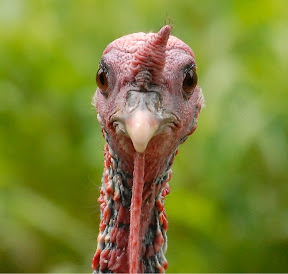
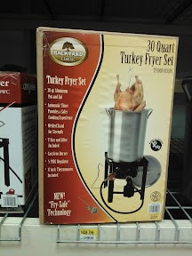

Gisteren stond in het teken van watervallen. We hebben de Linville Falls bezocht. Hiervoor moet je in totaal een kilometer of 3 wandelen om bij verschillende uitzichtpunten te komen. We vonden het boven verwachting mooi.

Het landschap hier is een stuk lieflijker dan wat we gewend zijn in het westen van de VS te zien. Het is allemaal niet zo hoog en ruw en uitgestrekt, en als je van de Parkway afgaat, dan zit je binnen niet al te lange tijd in bewoond gebied (Starbucks!).

Na de lunch zijn we doorgereden naar de Crabtree Falls, waar we ook gecampeerd hebben. Vanaf de camping was het een stuk naar beneden lopen naar de waterval, die zeker de moeite waard was.

Het was al wat later op de dag, en het begon al een beetje te schemeren, dus we waren erg op onze hoede dat we geen slapende beren zouden wakker maken. Op een gegeven moment lopen we door een donker stuk bos, dus wij extra voorzichtig, en opeens springt er vlak voor me een beest een in de lucht en komt op ons afrennen! We schrokken enorm, en ik denk dat ik een halve meter de lucht in sprong! Wat bleek? Het was een wilde kalkoen!! Die rennen hier bij bosjes door het bos.

Haha, onze wraak zal zoet zijn de komende kerst!

Vannacht hebben we overigens niet zo heel goed geslapen. De camper tegenover ons heeft de hele nacht z'n generator aangehouden, terwijl dat Verboten ist. We hebben om 11 uur op z'n deur geklopt, maar die oelewapper deed natuurlijk alsof hij ons niet hoorde. Tsja, the great outdoors is natuurlijk pas leuk als je de hele dag in je camper blijft zitten, met de airconditioning en je 90 inch plasma aan. Je zult dan in ieder geval niet worden aangevallen door een kalkoen!

We staan nu weer op een luxe camping met een zwembad. Chantal is nu wat kleren aan 't wassen, vanaf morgen duiken we een dag of 5 onder de radar in Great Smokey Mountains National Park, en zijn we dus volledig op alle faciliteiten van de camper aangewezen.
