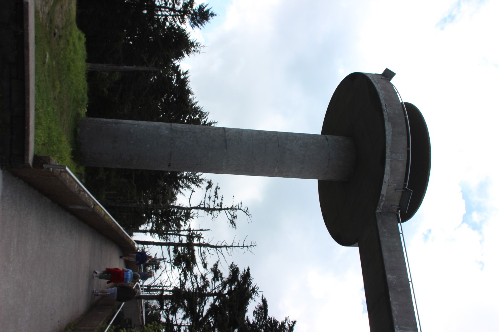

De Appalachian Trail is het langste wandelpad ter wereld en loopt in 3500 kilometer van de staat Georgia in het zuiden van de VS, helemaal naar Maine in het noord oosten. Er zijn mensen die het hele pad in één keer lopen en zij doen daar gemiddeld 6 maanden over. Chantal en ik hebben daar vorig jaar het erg grappige boek "A walk in the woods" van Bill Bryson over gelezen.

Het hoogste punt van dit pad wordt op Clingmans Dome bereikt in Great Smoky Mountains en wij zijn daar vandaag wezen kijken. Op Clingmans Dome staat een uitkijktoren waarop je een 360 graden view hebt op de omgeving en vormt met 2024 meter tevens het hoogste punt van het park.

Het is maar een klein stukje van de parkeerplaats naar de uitkijktoren over een mooi geasfalteerd padje, maar wel heel erg steil. De kuitspieren protesteerden behoorlijk! Onderweg zagen we nog een mamabeer met haar twee jongen. Via een mooie spiraal loop je van de bodem naar de uitkijktoren.

Op de weg terug hebben we een zijpadje genomen en een stukje van de Appalachian Trail gelopen. Al was het maar een kilometer of zo, wij vonden het wel speciaal en mooi.

's Middags hebben we lekker geluierd op de Smokemond camping.

