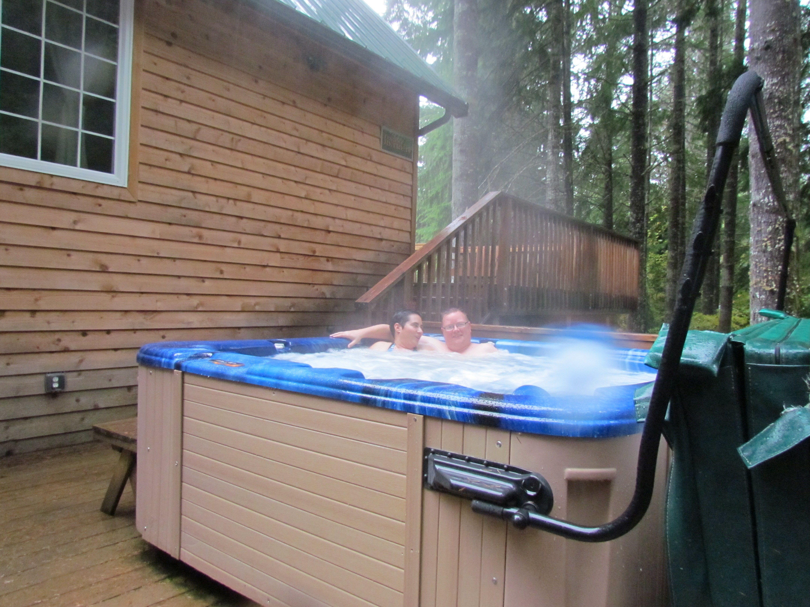

Na de lange vlucht van ruim 10 uur zijn we rond 12 uur 's middags geland op Seattle Tacoma International Airport. Het ging redelijk vlot bij de douane, en de koffers lagen al te wachten op de caroussel toen we daar aankwamen. Dus toen in de shuttlebus op weg naar Alamo, waar ons autootje al met ronkende motor klaar stond. De Chevrolet Tahoe is, zeker voor ons tweeën, eigenlijk idioot groot. Hij is groter dan mijn studentenkamer in Delft!

Ben wel benieuwd naar het verbruik (5,3 liter, v8, 320 pk), dat zal niet misselijk zijn... Maar wat een fantastisch geluid zeg als je goed gas geeft, wow!

We hebben voor de eerste drie nachten een huisje gehuurd bij Copper Creek Inn in Ashford, vlak bij de ingang van Mount Rainier National Park. Met dank aan de lange reis, hebben we beiden zeer goed geslapen!

Mount Rainier is een actieve vulkaan en aangezien het hier vaak regent, is het erg mooi groen. Maar hoe hoger we de berg oprijden, hoe witter het landschap wordt. We kunnen vanwege de sneeuw niet verder dan Paradise, dus daar hebben we in het bezoekerscentrum wat gegeten, en toen ondanks de regen toch maar het besneeuwde pad richting de Myrtle falls gelopen. Er lag veel sneeuw, op sommige plekken tot halverwege de kuiten. Af en toe moesten we zelfs skieërs ontwijken.

Na iets meer dan een kilometer waren we er al, en mede door de sneeuw was het best een mooi plaatje.



Hetgeen ons op de been hield tijdens deze barre winterse expeditie was de wetenschap dat een hot-tub op ons wachtte bij onze cabin. Dus bij thuiskomst de natte kleren voor de open haard gehangen, en toen vlug de zwembroek aan en in het bubbelbad!

## 2 opmerkingen

### David 29 oktober 2012 om 07:35

Beetje groot die hot tube, niet? Jullie hadden net zo goed de film ploeg er ook in kunnen stoppen ;-)

### sergio 29 oktober 2012 om 22:43

wat een vervelende plek, wahhh!!! veel plezier
