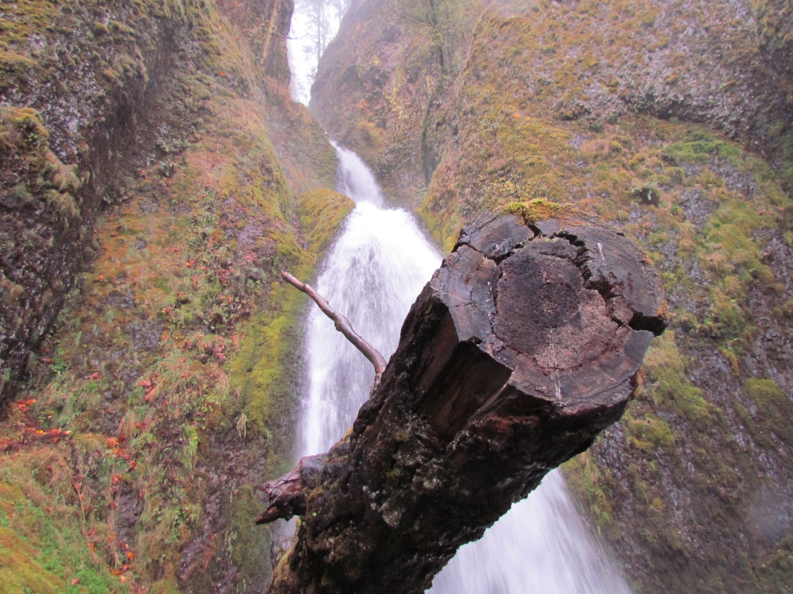

Een pizza als ontbijt... Het klinkt niet goed, maar het smaakte zeer lekker! Pete, de eigenaar van de B&B, had goed zijn best gedaan om het ons naar de zin te maken door op een lichte pizzabodem tomaat, ui, paprika, hashbrowns (een soort rösti), roerei en kaas te doen. Speciaal voor mij had 'ie het ei weggelaten. Als "toetje" kregen we overheerlijke muffins, wat advies over dingen die we in de omgeving konden gaan doen, restaurantsuggesties, en, heel belangrijk, twee paraplu's te leen.

Uiteindelijk zijn we via de noordelijke oever van de Columbia River, dus aan de Washington-kant, naar het westen gereden. Bij Portland zijn we de rivier overgestoken, en toen via de zuidelijke oever terug gereden naar het Oosten. Hierbij hebben we zoveel mogelijk de Historic Columbia River Highway gevolgd. Aan deze Oregon-zijde zijn veel watervallen te vinden, en daarvan hebben we een aantal bezocht.

Na een kort wandelingetje kwamen we aan bij de Bridal Veil.





Op aanraden van Pete zijn we gaan eten bij North Oak Brasserie in Hood River: zo'n lekker fout Italiaans restaurant met plastic druiven aan het plafond en Frank Sinatra op de radio. We hebben heerlijk gegeten!

## 1 opmerking

### Gerard 4 november 2012 om 12:42

Het is toch toch wel heel wat moois wat ik nu aan het inhalen ben. Maar jullie weten ik ben druk druk druk..... Het is er toch al winters daar en jullie hebben een leuk optrekje. Ook dit is weer een mooie omgeving. Veel plezier nog.
