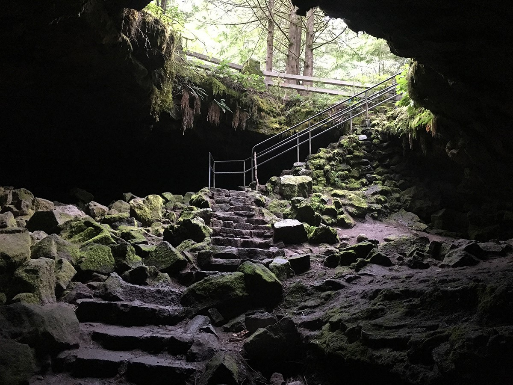

Helaas de laatste dag bij Carson Ridge B&B, we hebben hier echt genoten, ondanks het wat twijfelachtige weer. Het ontbijt was wederom erg goed (een quiche en breadpudding "brulé"), dus we stapten met pijn in het hart (en volle buik) in de auto.

Het plan voor vandaag is om via de zuid- en westkant van Mount Saint Helens naar onze tussenstop, en tevens enige hotelovernachting deze reis, in Olympia te rijden.

Maar eerst zijn we naar de Lower Falls gereden. Op de rit van ruim een uur door prachtig gekleurde bossen, hebben we het aantal tegenliggers geteld en we kwamen niet verder dan 3. De waterval was boven verwachting mooi, spectaculair bijna en we waren er echt helemaal alleen!



Na dit onverwacht spektakel was het tijd voor Ape Cave. Dit is een tunnel van meer dan 2 mijl lang die ontstaan is door lavastromen. Je kunt er zelf helemaal doorheen lopen, maar aangezien we maar een klein zaklampje (en een zaklamp-app op de telefoon) bij ons hebben, zijn we er maar een klein stukje in gegaan. Het was aardedonker, en dus niet verantwoord om heel ver te gaan.

Omdat we toch onze benen wilden strekken, zijn we een stuk de bergen in gereden naar Lava Canyon. Hier hebben we een mooie wandeling gemaakt in de stromende regen. Voor het eerst sinds wij samen op vakantie gaan hebben we onze noodponcho's, die dus al járen in de rugzakken liggen, moeten aantrekken.

Na al dit spektakel moesten we snel op weg om nog redelijk op tijd in Olympia aan te komen. Het Red Lion hotel was zeker niet slecht, maar ook niks bijzonders. We waren moe, dus hebben gewoon in het hotel gegeten.
