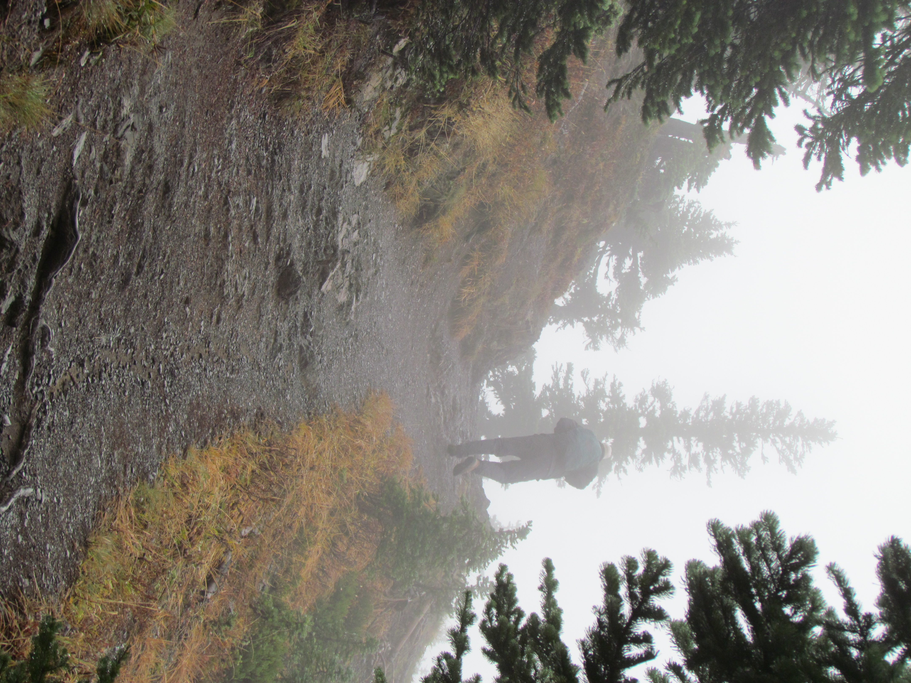
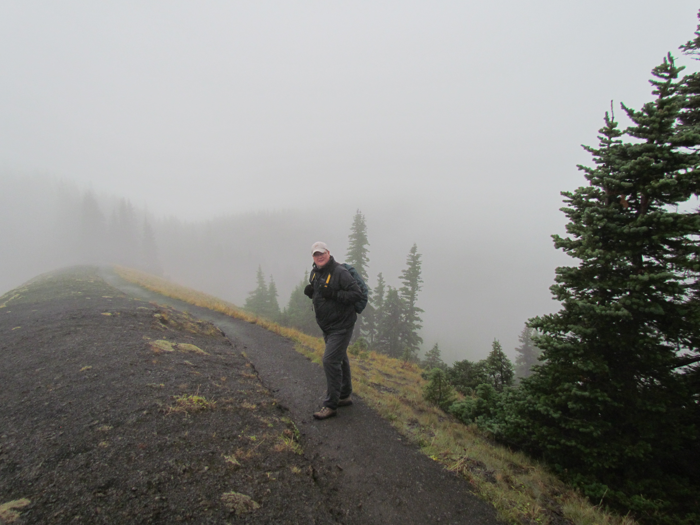
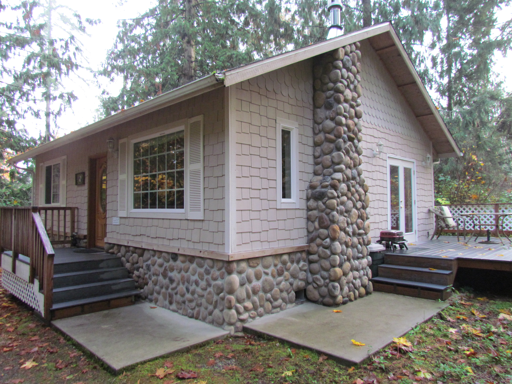

Vanmorgen waren we lui en hebben dus rustig aan gedaan. De koffers moeten weer in de auto, want vandaag gaan we alweer naar onze laatste cabin. Maar eerst een stukje rijden naar de Hurricane Ridge. Op bijna 2000 meter hoogte zou je normaal gesproken een fantastisch uitzicht moeten hebben op Mount Olympus, maar toen wij boven aankwamen bleken de wolken andere plannen te hebben met ons. Niet dat het regende, maar het was mistig, op sommige plekken kon je amper 50 meter voor je uit kijken. Daarnaast stond er een snoeiharde, ijskoude wind. Toch hebben we de stoute wandelschoenen (en ik m'n lange onderbroek) aangetrokken, en een tochtje gemaakt van een kilometer of drie.

Al snel ging het steil bergopwaarts, maar toen we bij Sunrise point aankwamen bleek die naam op z'n minst gezegd nogal misleidend. Je zag werkelijk geen hand voor ogen en al zeker geen zon.

Verkleumd zijn we weer naar Port Angeles gereden om wat boodschappen te doen voor de laatste dagen. Onze slaapplaats voor de laatste dagen, is "A Hidden Haven". Deze cabin ligt midden in de bossen, een kwartiertje rijden buiten het dorp.

 Dit is veruit het mooiste huisje wat we tot nu toe gehad hebben. De stilte 's avonds is oorverdovend! Jodi en Chris hebben er wat moois van gemaakt!

## 1 opmerking

### Anoniem6 november 2012 om 10:25

Al jullie verhalen doen nieuwe plannen kweken in downunder. Genieten nog maar ff.
B&H
