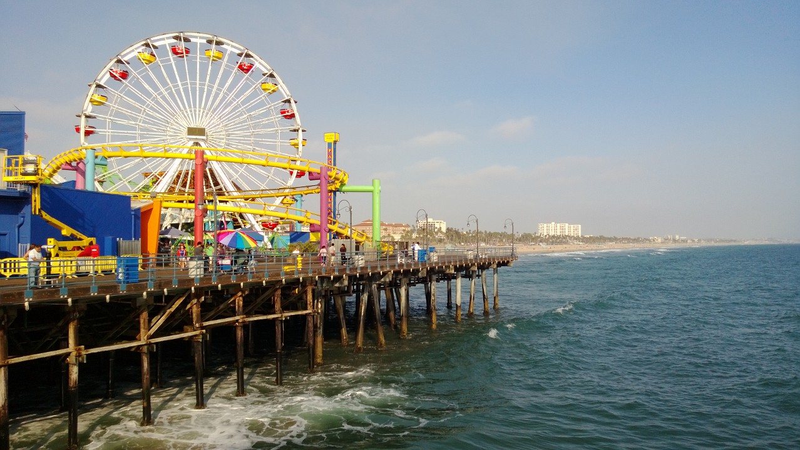
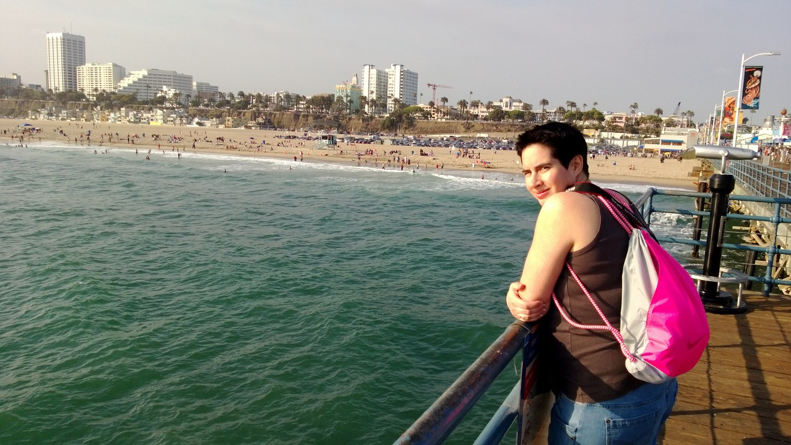
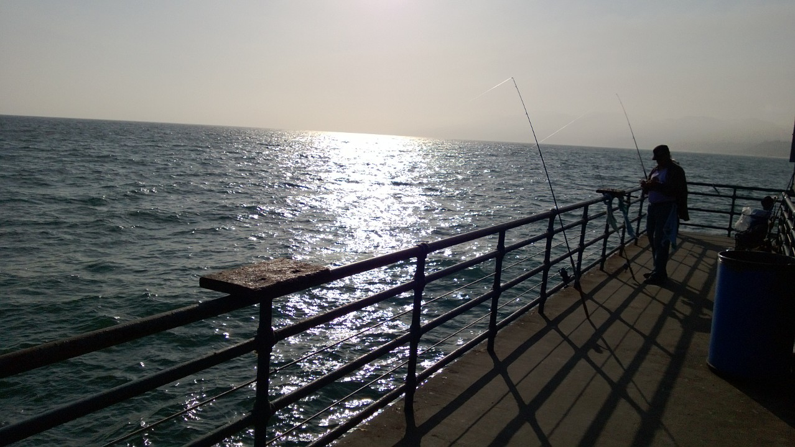

Na 10 uur en 10 minuten genieten in economy stoelen van de KLM landden we heelhuids en redelijk uitgerust in Los Angeles. Zowel de chicken als de pasta was deze keer best goed te pruimen, en verder hebben we beiden redelijk goed kunnen slapen. Mede dankzij onze stoelen direct bij de uitgang. Best prettig eigenlijk, helemaal niemand die voor je zit.

Het leek er even op dat we erg lang moesten gaan wachten bij de douane, want er stonden twee vliegtuigen vol met Chinezen voor ons in de rij. Gelukkig werd voor de KL0601 een speciaal loket geopend, en aangezien wij als allereerste uit het vliegtuig waren, stonden we na een minuut of 20 te wachten bij de shuttlebus naar Avis. Daar kregen we een upgrade aangeboden naar een Ford Mustang!

Toen maar eerst naar het hotel in Marina del Rey om de koffers in de kamer te leggen, even rusten en douchen. Daarna zijn we naar Santa Monica gereden om aldaar de beroemde pier te bezichtigen. De pier is vergelijkbaar met die van Scheveningen, alleen staat deze helemaal vol met kermisattracties.

Zaterdag kunnen we de camper al om 8 uur ophalen in Agoura Hills, en dan begint de vakantie natuurlijk pas echt.
