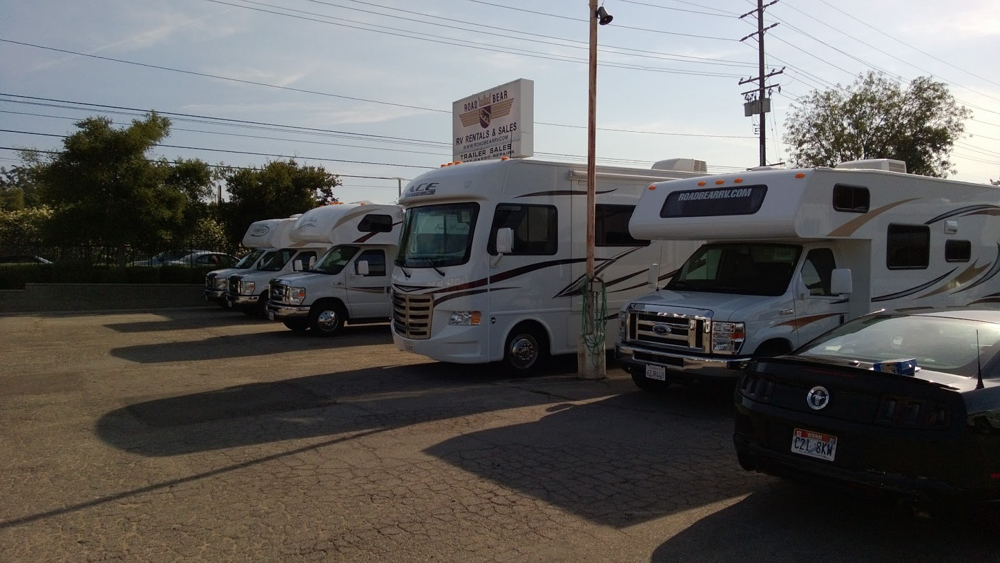
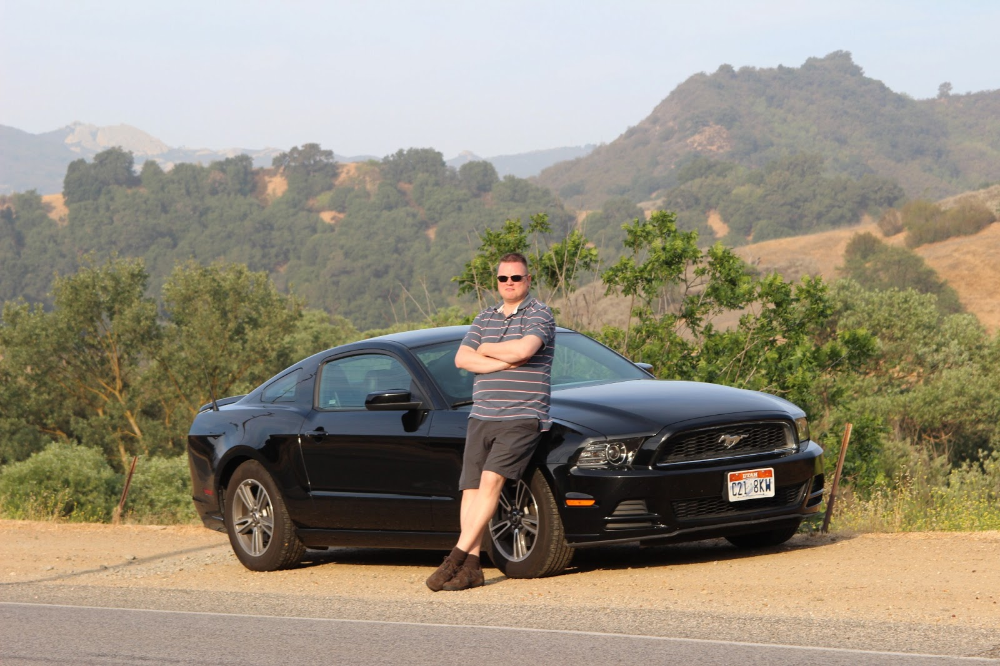
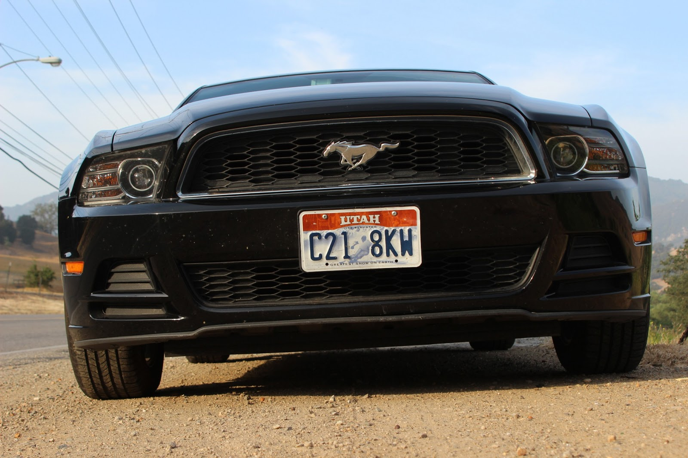
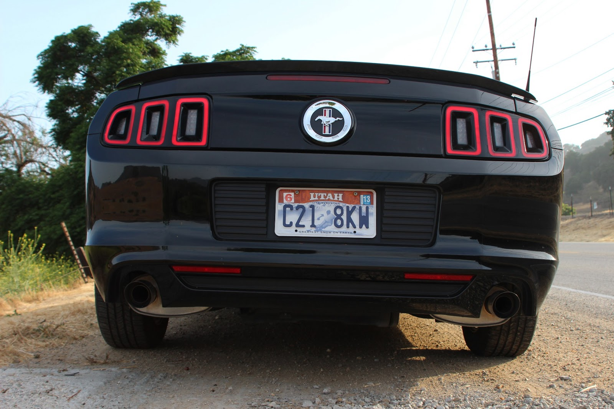
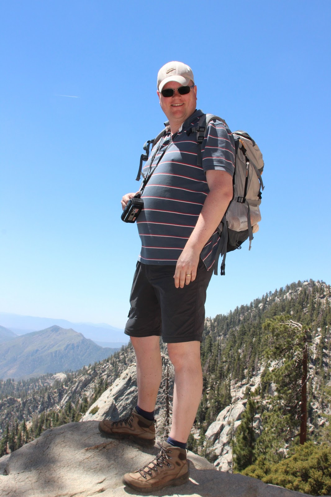

Met dank aan de jetlag waren we om 6 uur 's morgens al onderweg van ons hotel in Marina del Rey naar de camperverhuurder in Agoura Hills. Aangezien we alle tijd van de wereld hadden, zijn we via Santa Monica en Malibu gereden over de Pacific Coast Highway. Deze weg kronkelt helemaal van Los Angeles naar het noorden, en die hebben we in verschillende etappes op voorgaande reizen al meerdere malen gereden. Op dit stuk is de weg verre van aantrekkelijk (van het type drie-baans snelweg), maar het blijft toch bijzonder om de Pacific van zo dichtbij te kunnen zien. Bij Malibu gingen we het binnenland weer in, om via een spectaculair weggetje bij Road Bear RV aan te komen.

Na het benodigde papierwerk konden we om 8.30 een dorp verder de Mustang inleveren, met pijn in 't hart, ik vond het een geweldige auto!

Na het emotionele afscheid hebben we boodschappen gedaan en de verplichte jaarlijkse investering van 15 dollar voor de enige echte BackYard BBQ! Eerste halte is Palm Springs, op het Happy Traveler RV Park. Deze ligt in het centrum van het stadje, heeft wifi en een zwembad. Met name dat laatste was erg welkom, want het is hier echt enorm warm. 's Avonds om 8 uur was het nog 38 graden... We hebben geprobeerd om zonder airco te slapen (het ding maakt van binnen nogal wat herrie namelijk), maar om 1 uur 's nachts heb ik het ding toch maar weer aangezet. Verder hebben we prima geslapen.

Zondagochtend zijn we vroeg naar de Palm Springs Tramway gegaan. Met deze "skilift", uiteraard de grootste in z'n soort (hij draait 360 graden in de rondte), ga je in no-time Mount San Jacinto op. Het bijzondere hieraan is, is dat de temperatuur beneden (40 graden) zakt naar een aangename 20 graden! In de boekjes staat dat je het moet vergelijken met een reis van Mexico naar Canada... Haha, hier is weer een of andere marketing jongen creatief geweest :-) Op het eindpunt van de lift is kom je aan in Mount San Jacinto State Park, en hier hebben we een kort wandelingetje gemaakt.

![Mount San Jacinto State Park](./images/IMG_2669.JPG

## 1 opmerking

### Gerard 3 juni 2013 om 09:39

Het genieten is begonnen maar jullie hebben er wel erg warm weer bij. Veel plezier....
