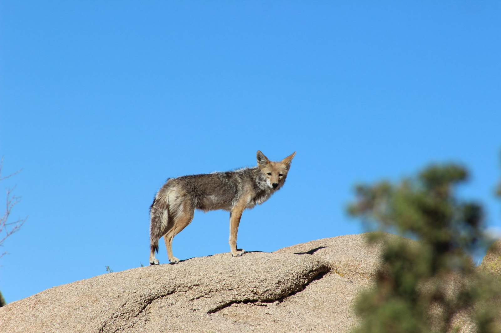
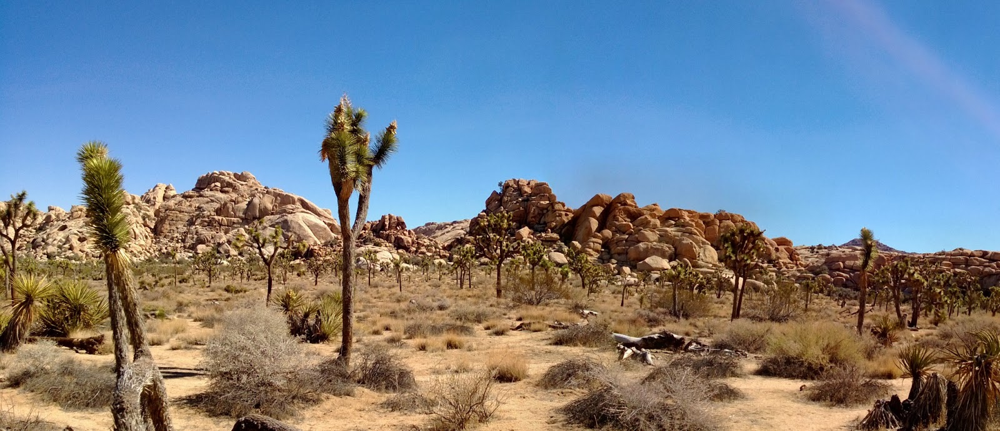

De overnachting op het TwentyNine Palms Resort is goed bevallen. De camping was van alle gemakken voorzien: wifi, golfbaan, zwembad, jacuzzi, en ook een sauna. We hebben even gevoeld, maar in de sauna is het dus koeler dan buiten. Volgens de lokale gasten hier, is het warmer dan anders, zo vroeg in de zomer. Het is allemaal de schuld van Al Gore, die voormalige presidentskandidaat die de hele wereld over gevlogen is om overal te gaan vertellen dat het helemaal niet goed gaat met het milieu.

Vanmorgen hebben we de watervoorraad weer op peil gebracht en de tanks geleegd, want we gaan in het nationale park Joshue Tree overnachten. We hebben gekozen voor de Jumbo Rock campground. Bij het uitzoeken van ons overnachtingsplekje reden we nog bijna een coyote omver...

Om 9 uur waren we al aan de wandel, om zo de ergste hitte voor te zijn. We hebben twee wandelingetjes gedaan. Als eerste was daar de Barker Dam. Het padje was erg leuk, en we hebben veel Joshua Trees van dichtbij kunnen bekijken. Het is een ongelooflijk dorre toestand hier, en heet. Na 2 kilometer wandelen, hadden we al 2 liter water gedronken. Had ik al gezegd dat het heet was?De dam zelf was niet zo heel bijzonder trouwens. Het schijnt dat hier vroeger nogal veel gras gegroeid heeft, maar toen het begin vorige eeuw minder vaak ging regenen, is dat langzaamaan verdwenen, dus ook de veeteelt en de behoefte aan de dam.

De Hidden Canyon trail was zeker niet minder mooi, je verwacht ieder moment in een hinderlaag te lopen van een paar outlaws, waarna Clint zelf je in hoogsteigen persoon komt redden.

Na al de activiteit was het tijd voor de lunch bij Keys View, het hoogste punt in het park waar je met de auto kunt komen. Hier hebben we de camper geparkeerd, het zonnescherm uitgeklapt en heerlijk in de schaduw in de koele wind gegeten. Even verderop werden we door een bordje gewaarschuwd dat hier killer bees actief zijn... Als je dit terrein betreedt, dan zou de kans groot zijn dat je gestoken zou worden... Wij hebben gelukkig geen bij gezien!

De rest van de middag hebben we, al dan niet slapend, doorgebracht op de camping.

## 2 opmerkingen

### Sergio 5 juni 2013 om 12:31

Ha mensen, het ziet zo heet(warm) uit!!!
bedankt voor je bericht!!! en gewoon blijven genieten!!!!

### Anoniem 6 juni 2013 om 21:33

Eindelijk gelukt om op internet te komen. Zitten ver van de receptie, daardoor slechte ontvangst. Wij hebben het naar ons zin in Winterswijk, gaan zondag verder naar Ootmarsum in Twente. Zaterdag gaan we even naar Mascha en Ben, is in de buurt. Wensen jullie nog veel plezier.
Gr. Pa en mam.
