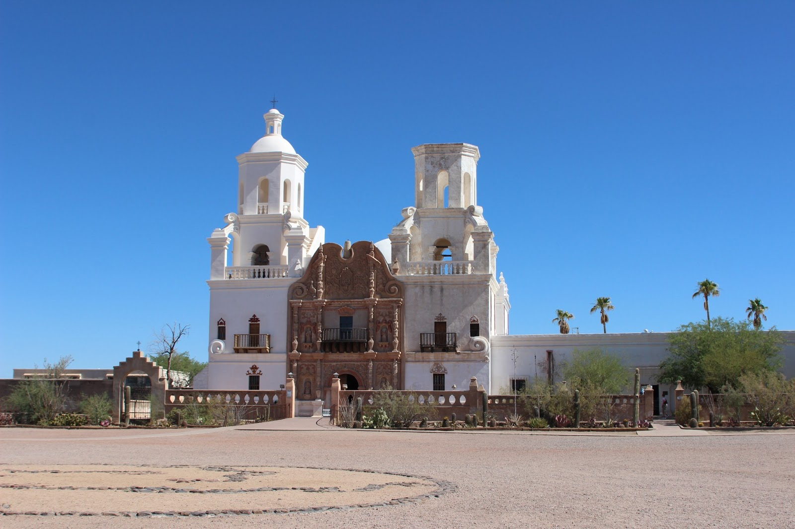
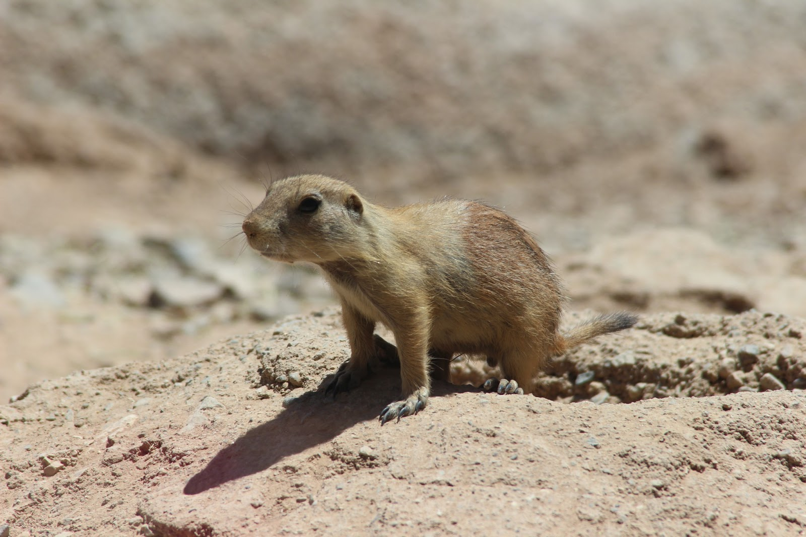
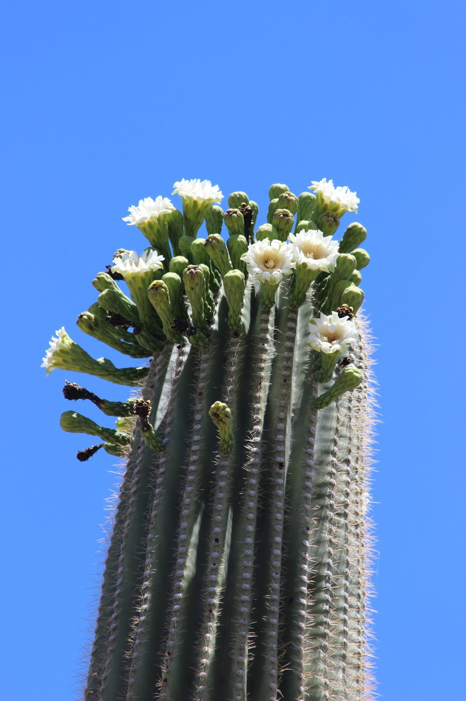
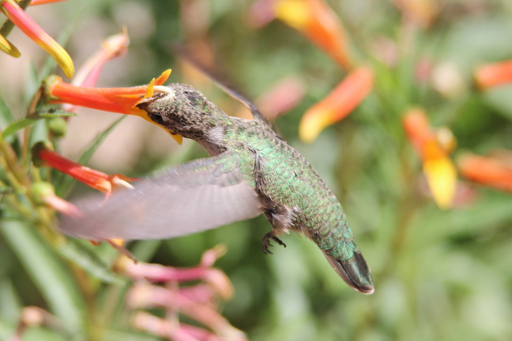
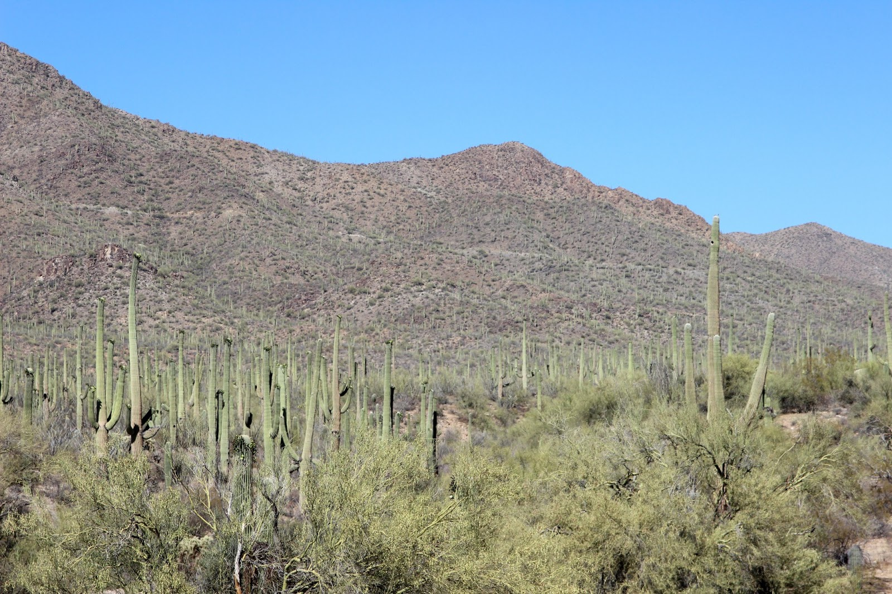
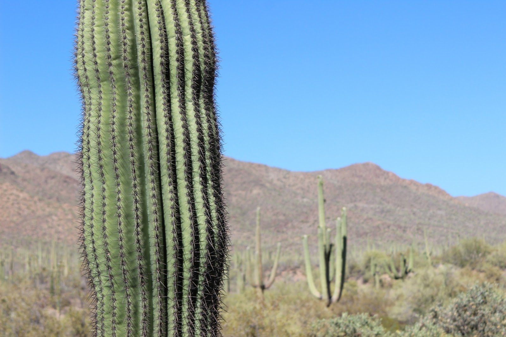
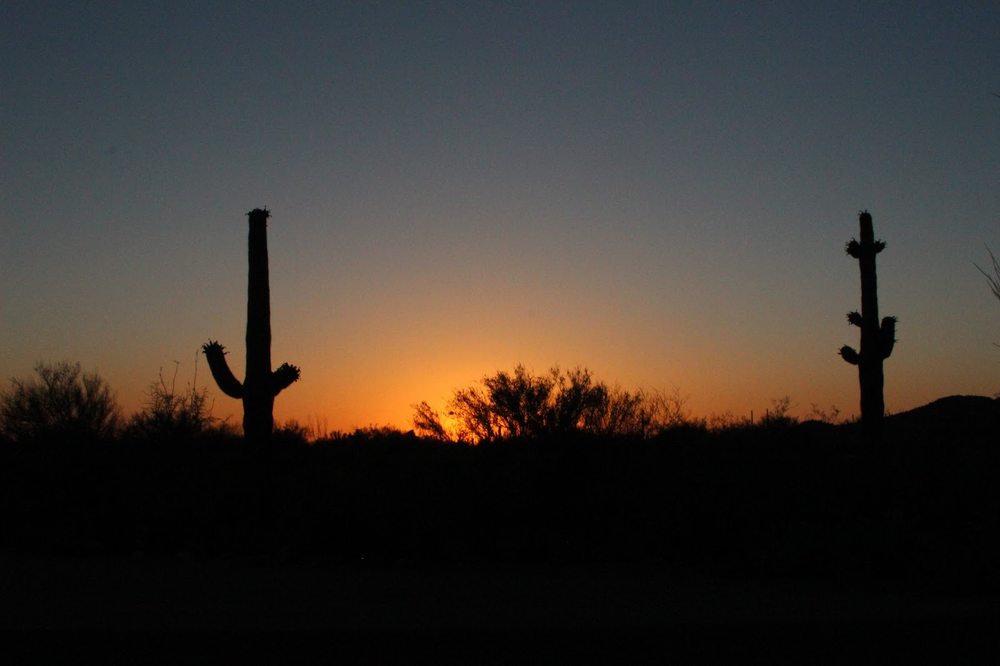

We spraken iemand op de camping die vertelde dat 2012 een recordjaar was waarbij 118 opeenvolgende dagen de temperatuur niet onder de 100 F (38 Celsius) is geweest. Sinds afgelopen zaterdag is de temperatuur enorm gestegen, dus wij hebben mazzel. Vandaag was het 43 graden! Gelukkig is de vochtigheid erg laag, anders is het helemaal niet vol te houden. Maar hoe je het ook wendt of keert, het blijft warm, en de airconditioning blijkt een goede uitvinding geweest te zijn.

Volgens de Lonely Planet is de oude missiepost San Xavier del Bac een van de grootste verrassingen van Tucson. De mission stamt uit het einde van de jaren 1700, is eind vorige eeuw deels gerestaureerd (ze gaan door zodra ze weer geld hebben), en is inderdaad prachtig. De locatie zou zo  gebruikt kunnen worden in een film van Antonio Banderas! Het interieur verwacht je ergens in Spanje, maar niet in de VS. Voordat we naar binnen gingen hebben we eerst nog een ongevraagd gesprek gehad met, excuus voor de Moeder aller Pleonasmen, een dronken indiaan, die een lift van ons wilde. Hebben we maar vriendelijk afgewezen. En geloof het of niet, hij heet Screaming Eagle. Uch (en how) !

Het Arizona Sonora Desert Museum is in een woord prachtig. Het is een museum, dierentuin en kunsthal in een. Mooi aangelegde paden, de verblijven van de dieren zijn mooi en veel informatie wordt op een leuke manier gebracht. We hebben hier een uur of 4 rondgelopen. Het mooiste van het park is dat het deels buiten, deels binnen (airco!) is.

Er is ook een verblijf met verschillende modellen kolibrie. Deze beestjes wegen maar 2.5 gram, en slaan 80 keer per seconde met hun vleugels om zo nectar uit bloemen te kunnen zuigen. Een heel apart gezicht!

Na de lunch in het museum zijn we een klein stukje doorgereden naar het bezoekerscentrum van Saguaro National Park. We kregen veel informatie van de park ranger, die blij was iemand te zien. Het is hier erg rustig, vanwege de warmte is het nu geen hoogseizoen meer. Sterker nog, Old Tucson Studios, een nabijgelegen western themapark is zelfs gesloten.

Een saguaro is een cactussoort die tot 200 jaar oud en 15 meter hoog kan worden. Tegen die tijd wegen ze meer dan 7200 kilogram! Bij een enkele regenbui kunnen de wortels van de saguaro tot 750 liter water opzuigen, wat meer dan genoeg is om een jaar van te kunnen overleven. Het is fascinerend om hier met ons campertje tussendoor te rijden.

Het national park bestaat uit een oostelijk en een westelijk gedeelte, gescheiden door de stad Tucson. We zijn nu dus in het westelijke park, en staan tussen de saguaros op de Gilbert Ray campground, samen met nog een andere camper, alwaar we van de zonsondergang in de woestijn hebben genoten.

