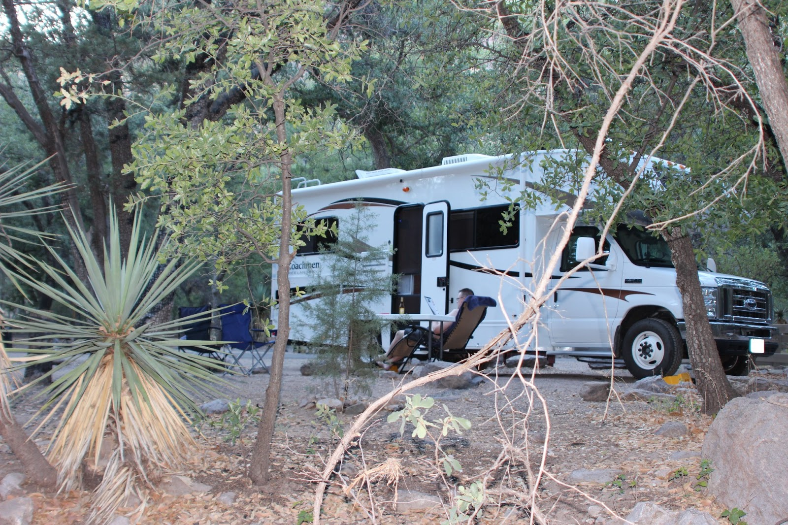
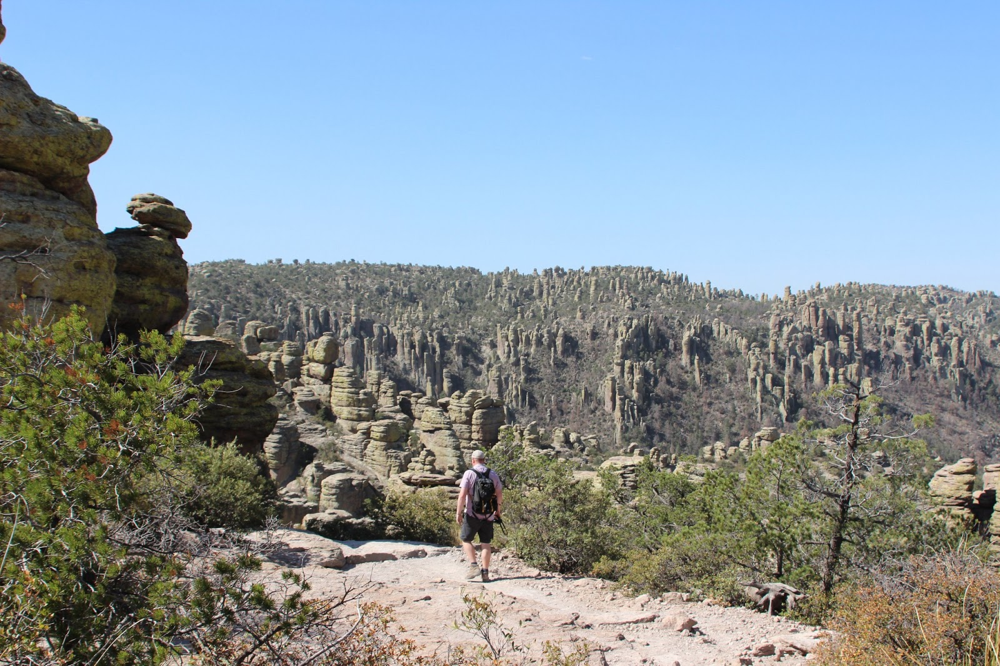
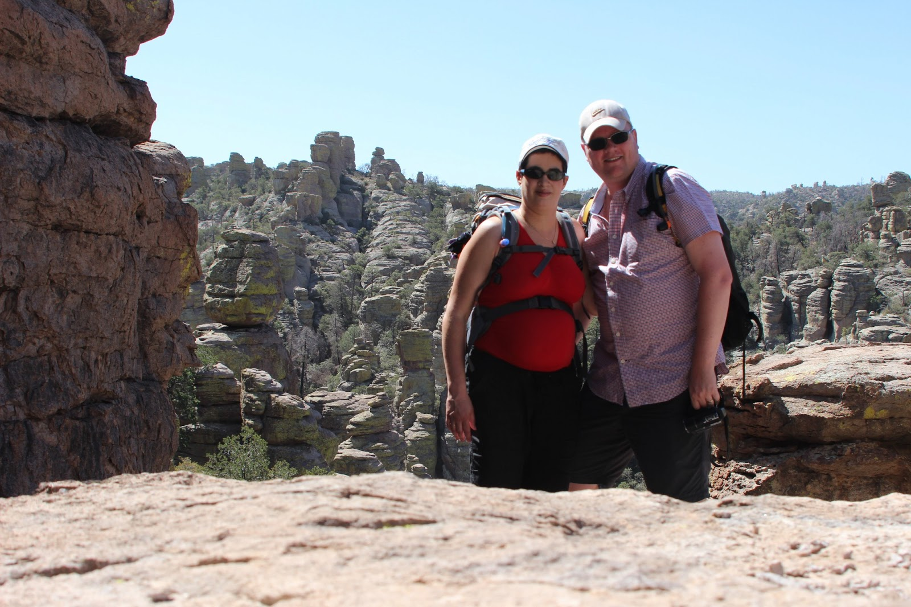
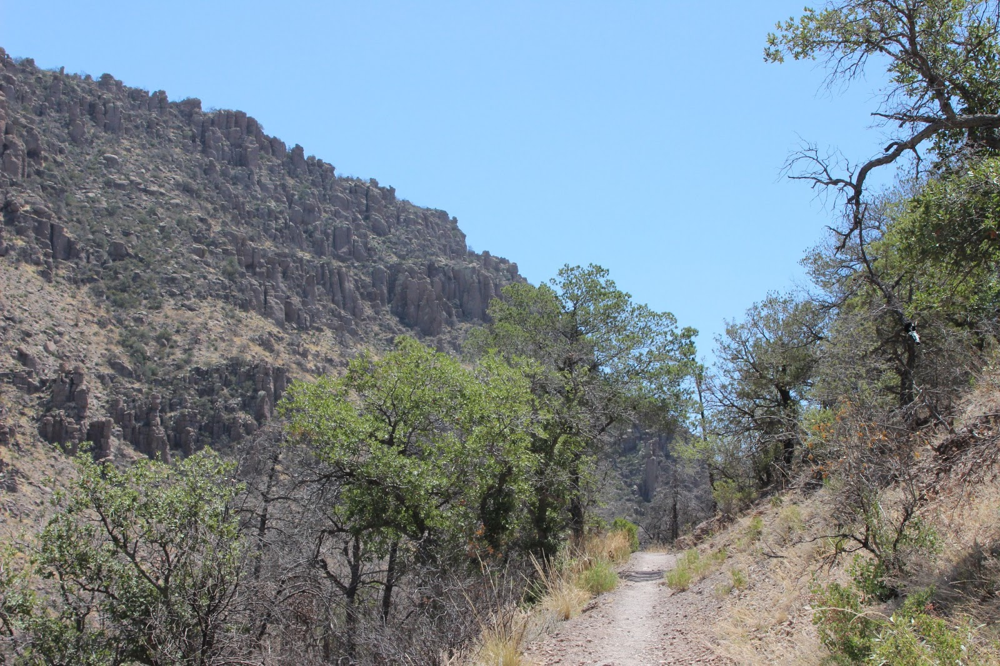
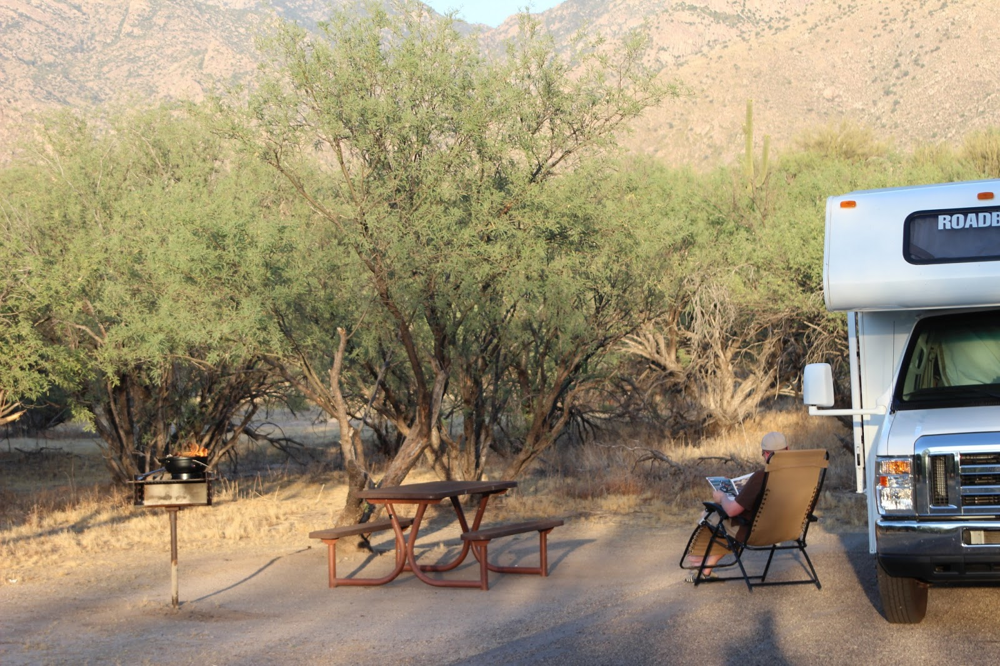

Chiricahua National Monument ligt zo'n 2.5 uur oostelijk van Tucson, helemaal in het meest zuid-oostelijke puntje van Arizona. De Mexicaanse grens is vlakbij, dus onderweg hebben we veel Border Patrol gezien. Niet zozeer om illegale immigranten tegen te houden, maar meer vanwege drugsrunners. We kwamen langs een checkpoint compleet met zo'n spijkermat die ze over de weg kunnen leggen. Net als in de film, zeg maar.

Het Monument heeft slechts een camping (Bonita Canyon) met 25 niet vooraf te reserveren plaatsen, waarvan maar een aantal geschikt voor RV's. Dus zijn we bij aankomst direct naar de camping gereden om een eigen plekje te claimen. Uiteindelijk bleek er plaats genoeg te zijn, er stonden in totaal 5 kampeerders, waarvan 2 camphosts. Dat zijn (meestal) gepensioneerde vrijwilligers die in ruil voor wat klusjes, gratis mogen staan.

Wanneer Arizona niet de Grand Canyon als bekendste trekpleister gehad zou hebben, dan zou dit parkje die eer te beurt vallen. Tenminste, dat vindt de auteur van de Lonely Planet. Ik moet zeggen dat het inderdaad erg mooi is, maar om het nou de toeristische trekpleister na de Grand Canyon te noemen... Daarvoor is het te klein, en ligt het te afgelegen.

Iedere ochtend rijdt een busje van het visitor center naar de top van de berg, waarvandaan je dan weer terug kunt wandelen naar het visitor center. Deze trip gaat dan in 7 km meestal bergafwaarts via de Echo Canyon Trail tussen de rotspartijen door. Het laatste stuk gaat door bosrijk gebied. Om 11 uur vanmorgen was het al 40 graden, dus we waren blij met de schaduw.

Wat wij helemaal niet verwacht hadden in dit droge, woestijnachtige gebied, is dat hier beren leven. Niet heel veel, daarvoor is te weinig voedsel beschikbaar, en wij hebben ze niet gezien.

Na de wandeling zijn we weer terug gereden richting Tucson, en overnachten de komende drie nachten in Catalina State Park. De camping daar heeft weer stroom en water. Vooral de stroom is nodig, want zonder airco word je hier niet gelukkig! Iedere keer wanneer je weer naar buiten gaat, valt er een muur van hitte in je gezicht.

