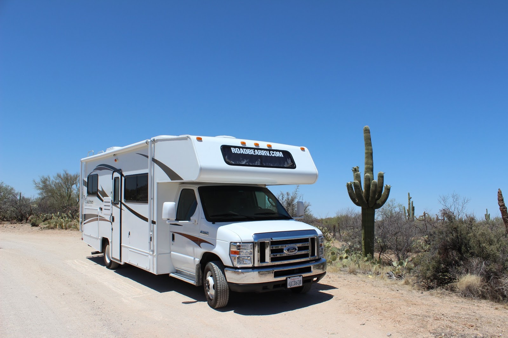
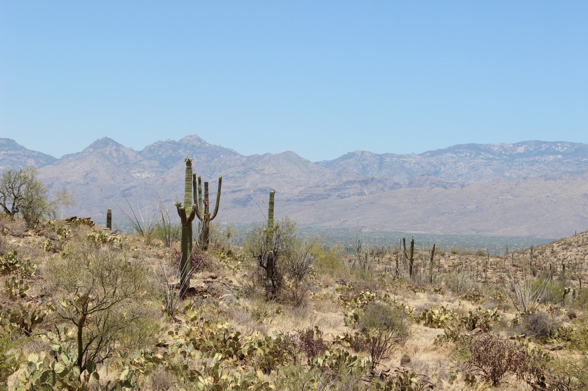
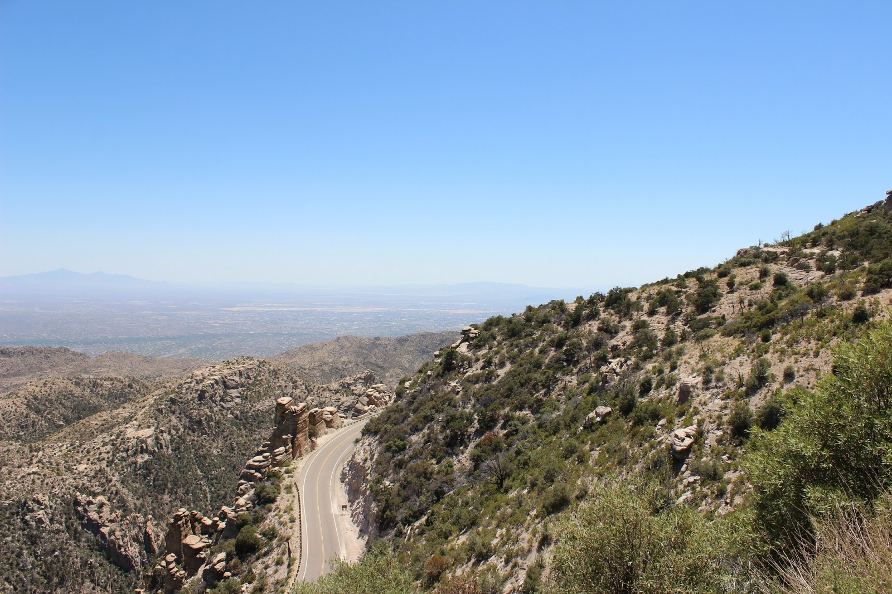

Zoals reeds eerder gemeld, bestaat Saguaro National Park uit een westelijk en oostelijk deel, van elkaar gescheiden door Tucson. Begin deze week waren we al in het westelijk gedeelte, vanmorgen stond het oostelijk deel op het programma. In beide parken is niet veel te wandelen, vooral vanwege de temperatuur. In dit deel van het park heeft men een weggetje aangelegd van 12 kilometer. Volgens de boekjes mag je auto tot 8 voet breed zijn, en de onze is (zonder spiegels) 8 voet en 4 inch. Aangezien de mevrouw bij de ingang niets zei, hebben we de gok genomen. En zoals wel vaker is gebleken, zijn de Amerikanen nogal erg van de veilige kant. We konden het rondje makkelijk rijden! Onderweg veel saguaro's van dichtbij kunnen bekijken, en ze zijn echt enorm groot!

En vandaag zijn we achter de beste uitvinding van Tucson gekomen: Mount Lemmon! Deze berg ligt pal naast de stad, en rijkt tot 3000 meter hoog. En dat betekent dat het er KOEL is! De lokale wegenbouwers hebben hun best gedaan en een prachtige 25 mijl lange weg naar de top aangelegd. Hier kun je zelfs skiën in de winter, niet ieder jaar, maar alle faciliteiten zijn aangelegd.

Langs de weg zijn vele picknickplekken aangelegd. Helaas is het vandaag zaterdag en dus erg druk met lokale gasten die de koelte opzoeken, en was er voor ons mobiele huis geen plek. Maar al met al hebben we toch weer een relaxte dag gehad.

## 1 opmerking

Anoniem14 juni 2013 om 08:32

Leuk hoor om zo jullie ervaringen te lezen! Veel plezier nog daar! Groeten, Hans Geurtsen.
