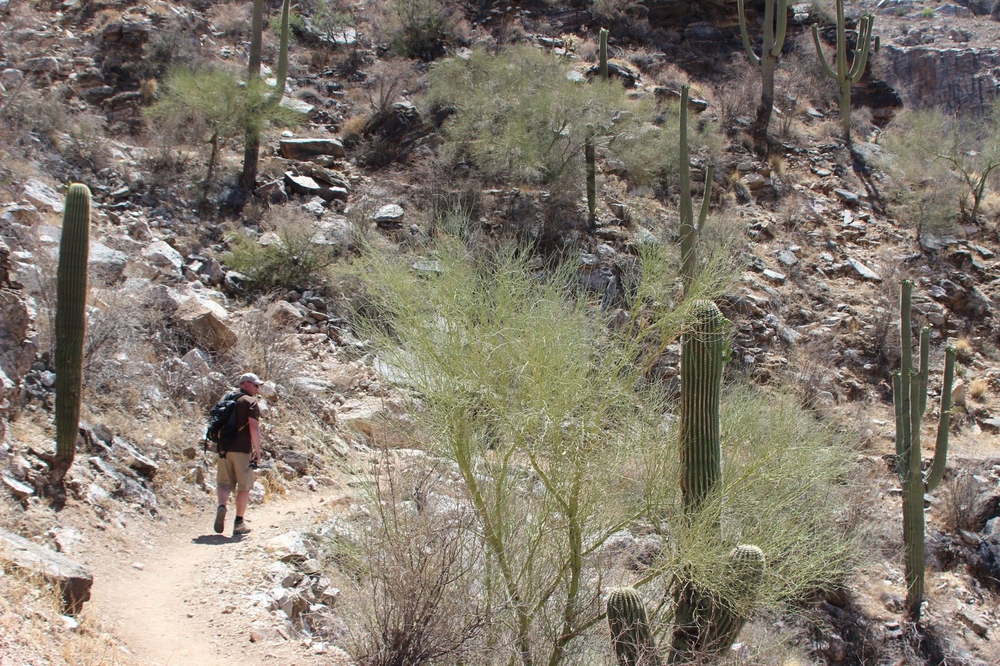
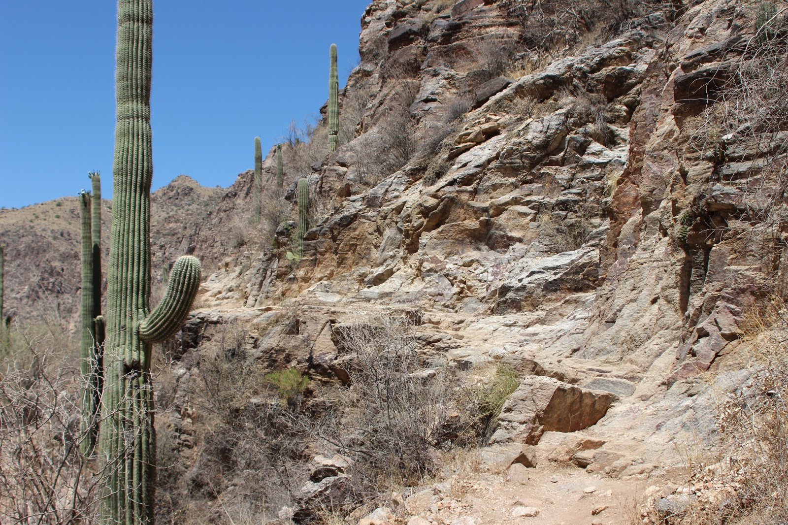
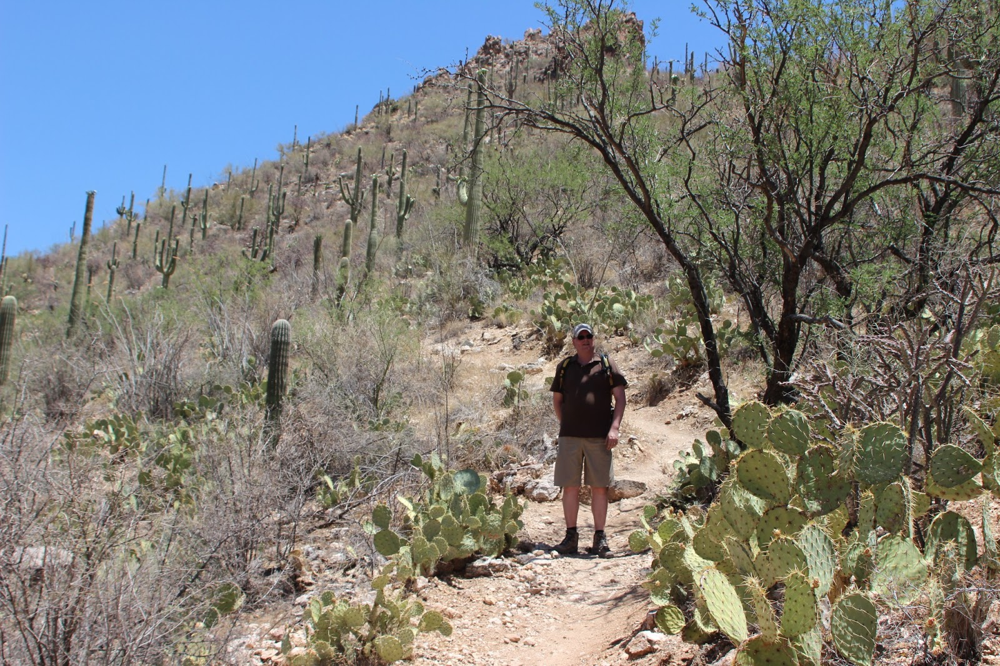

Wat is erger dan een waterval zonder water? Precies, zeven watervallen zonder water! Dus moesten we op zoek naar een andere bestemming in Sabino Canyon. Deze hebben we gevonden in een trammetje welke door de canyon rijdt, en op een negental plekken stopt. Wij zijn helemaal tot aan het eindpunt meegereden, en hebben van daaruit een stuk terug de canyon in gewandeld. Het was erg warm, maar omdat we redelijk hoog zijn, was er een verkoelende wind. Ook hier weer veel saguaro's en ander prikkend (en bijtend) spul. Uiteindelijk hebben we het trammetje weer genomen en teruggereden naar het bezoekerscentrum.

Na de lunch bij Starbucks, zijn we alvast een stuk richting het noorden gereden. De camping die we op het oog hadden iets ten noorden van Phoenix (nog steeds Arizona), bleek gesloten. Uiteindelijk zijn we uitgekomen bij de Pleasant Lake Harbor camping, een kilometer of 20 ten noorden van Phoenix. Een erg mooie camping met zwembad (dat hadden we nodig!) en superschone douche/toilet.

Wat ons iedere keer weer opvalt hier in de VS, is het materiaal wat die gasten allemaal hebben. Een RV van 50 voet, een pickup-truck, boot, quad-bike... Ze hebben het allemaal! En het gaat ook allemaal mee op vakantie. En dat allemaal op de kredietkaart van de lokale Wehkamp. Als je de mensen zelf ziet, dan zou je ze zo een dollar geven.
