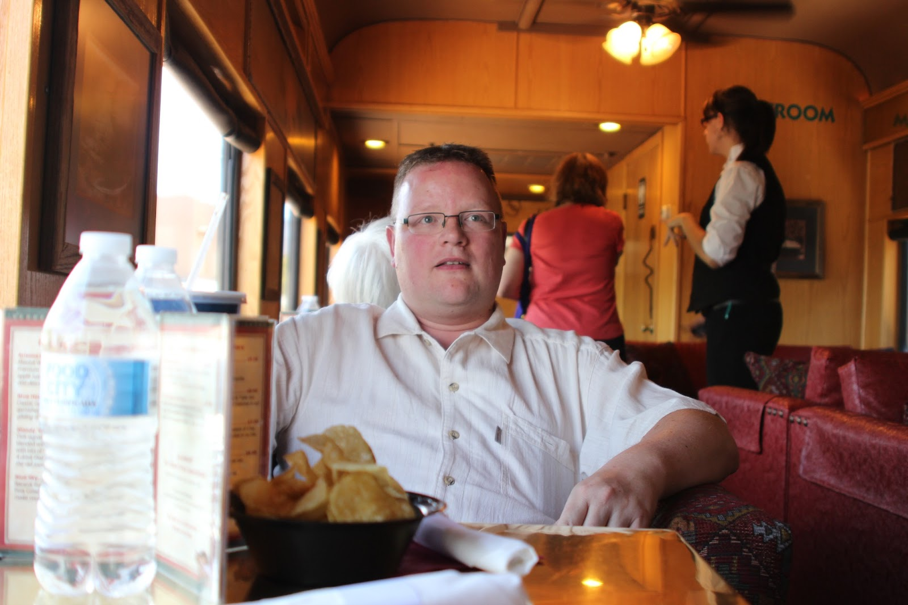
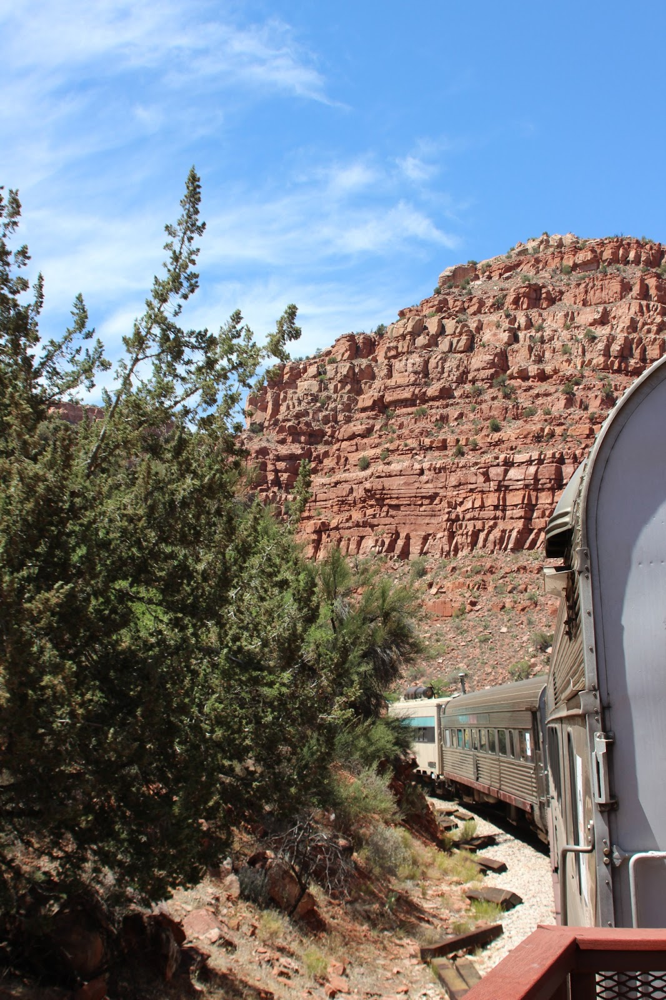
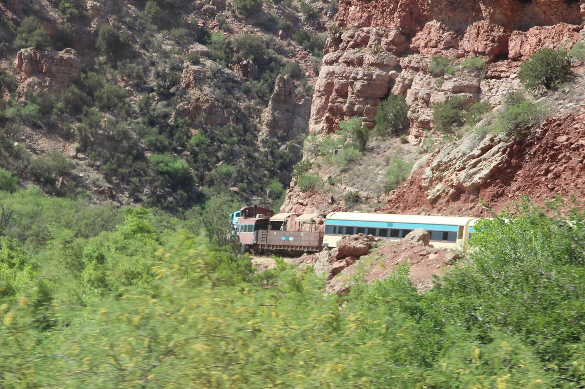

Vandaag was een leuke dag, ik mocht weer eens met de trein! Dit keer was de trein op zichzelf niet zo interessant, een diesel, geen stoomtrein helaas. De bestemming mocht er wel degelijk zijn: de Verde Canyon. Of zoals de lokale toeristische dienst het verkoopt "The Other Canyon".

We hadden first class tickets geboekt, en dus kregen we zeer comfortabele fauteuils, een glaasje champagne bij het vertrek, en een lunch erbij. Het verbaast ons iedere keer weer hoeveel volk op zo'n, op zich suffe, bestemming afkomt. De trein rijdt door de Verde Canyon, en de uitzichten zijn bijzonder mooi!

De rit duurde in totaal 4 uur. We hebben overnacht op camping Distant Drums RV Resort in Camp Verde. Bij het inchecken werden we gewaarschuwd dat zowel de black widow als de tarantula regelmatig worden gespot op de camping. Met name de eerste houdt zich graag op in de paaltjes waar de stroomkabel in moet... Gelukkig was ons paaltje schoon :-) Dus direct de zwembroeken aan en in het zwembad gedoken!
