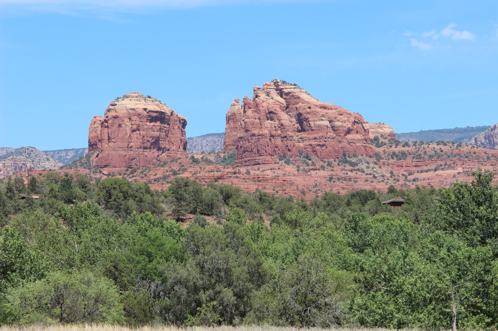
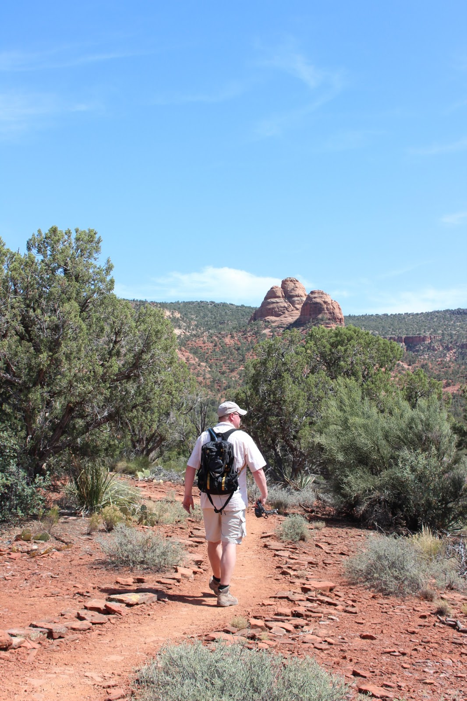
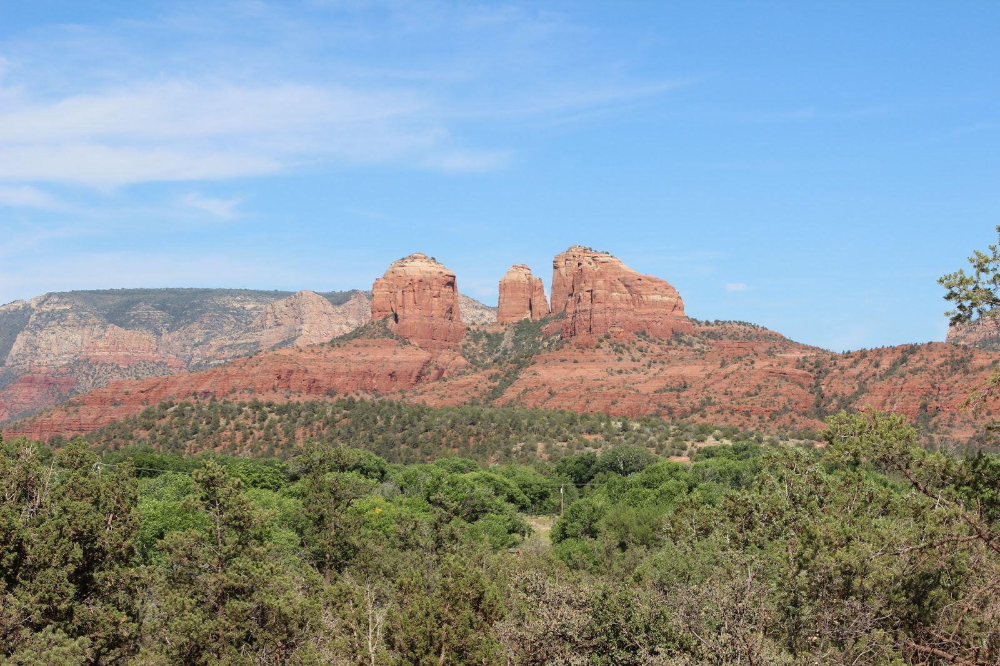
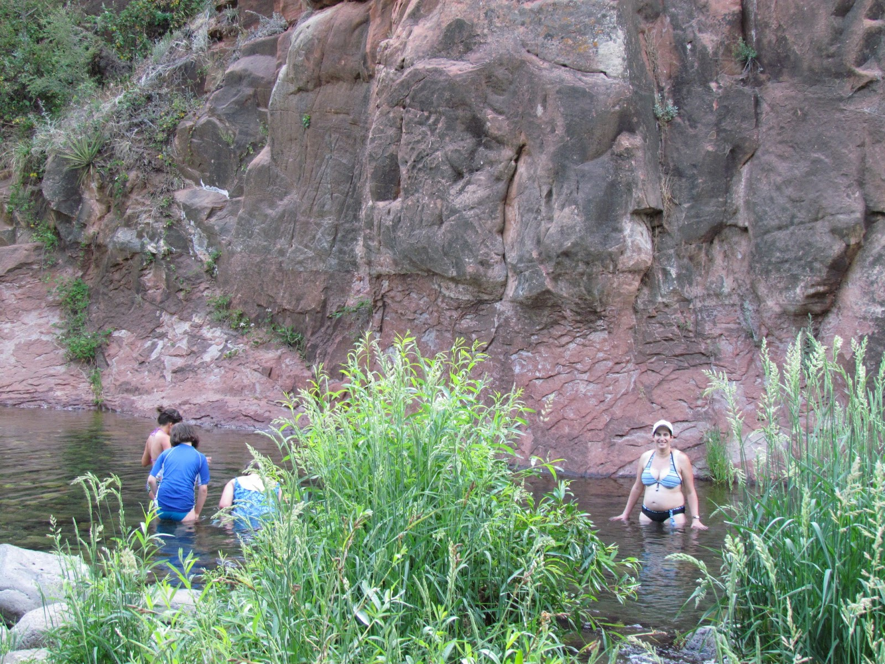

Via route 89 zijn we naar Sedona gereden. Dit is een heel gezellig stadje, of eigenlijk een straat van een kilometer of 5 met allemaal winkeltjes en restaurantjes. De grootste troef van Sedona is de natuur, de meneer van het bezoekerscentrum noemde het een wandel mekka. Dat zal best zo zijn, het wemelt van de wandelpaden, maar het is nu eigenlijk te warm om al te ver te gaan wandelen.

We hebben de middag doorgebracht in Red Rock State Park. Het is er erg rustig, waarschijnlijk vanwege de hitte, maar zeer de moeite waard. Er loopt een aantal wandelingetjes door het park, die je makkelijk aan elkaar kunt knopen, zodat je zo ver kunt wandelen als je wilt.

Sedona zelf ligt al op 1300 meter hoogte, onze camping Cave Spring ligt op 2000 meter hoogte. En dat betekent dat het 's avonds heerlijk afkoelt. Zozeer zelfs dat Chantal een vest aan moest bij het kampvuurtje! Maar het allermooiste aan deze plek is dat er een riviertje langs de camping stroomt waarin je kunt zwemmen. Al is het water wel erg koud...

