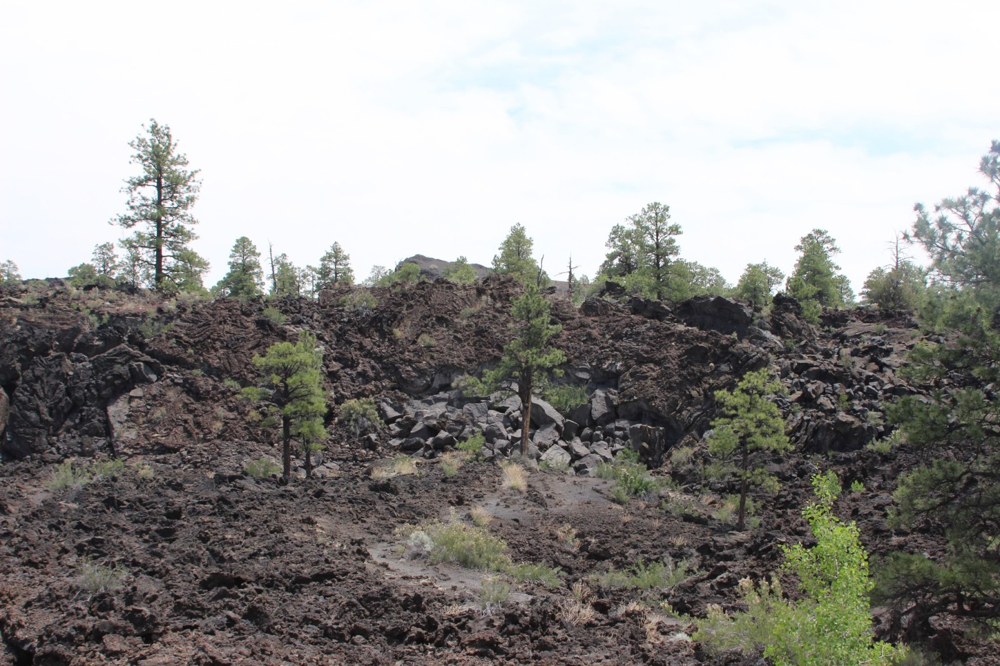
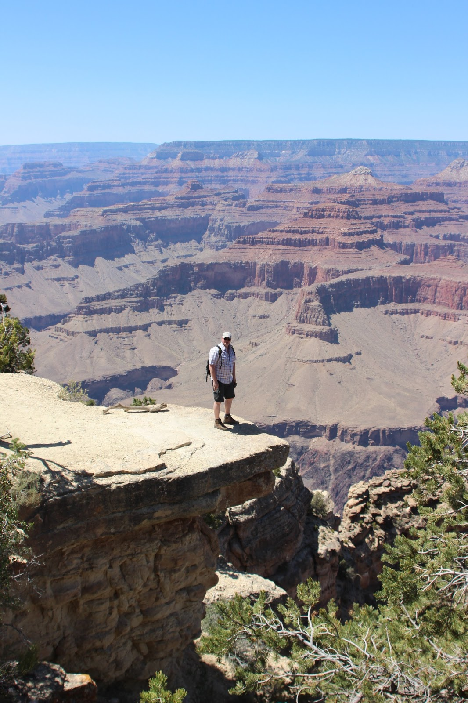
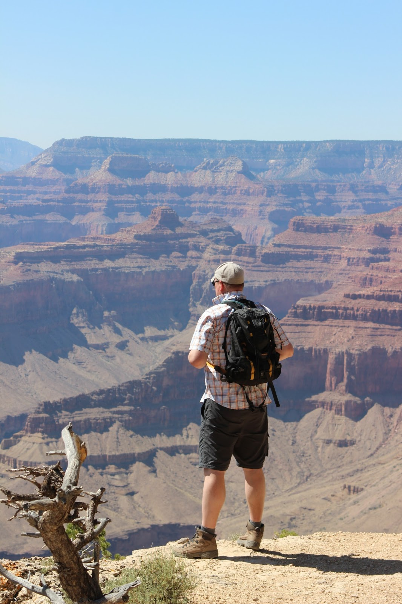
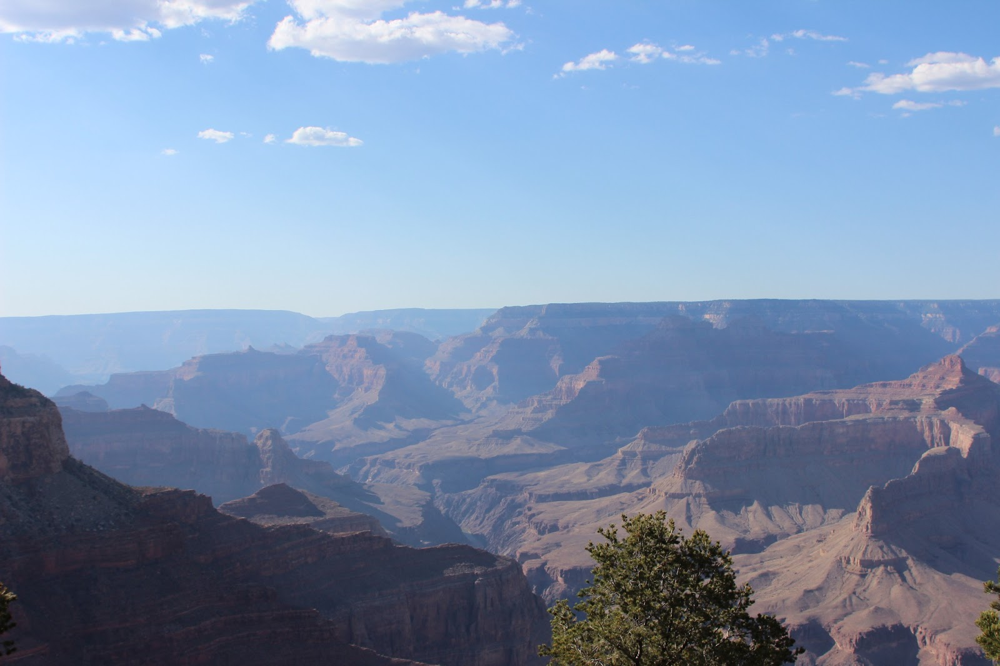

Vanmorgen zijn we op tijd opgestaan, want de Grand Canyon staat vandaag op de planning. Via de 89 naar Flagstaff en Sunset Crater National Monument. Het monument zelf is een vulkaan die in het jaar 1200 voor het laatst is uitgebarsten, en de lavaresten daarvan kun je nu nog aanschouwen. We hebben een klein wandelingetje gemaakt, met uitzicht op Humphreys Peak, met 3850 meter het hoogste punt van Arizona.

Anne, de Park Ranger in Saguaro National Park, attendeerde ons op de Cameron Trading Post en de daar geserveerde Navajo Taco. Dat moest wel iets speciaals zijn, en daar moesten we zeker naar toe als we toch die kant op gingen. Nou wil het toeval dat onze buurman op de camping in Sedona de eigenaar is van van die Trading Post! Voor een lamzak, want dat was het, heeft 'ie het wel mooi voor elkaar, zo bleek bij aankomst in Cameron. Het is een enorme winkel met "Native American Craftswork" en andere lelijke rotzooi, maar dat vindt gretig aftrek bij de (voornamelijk) Aziatische bezoekers. Het restaurant zelf was keurig netjes, met het meest lelijke plafond wat wij ooit gezien hebben. Het leek wel een soort beslagen blik. En dan de Navajo Taco: het is gewoon chili con carne op een pizzadeeg, met sla, tomaat en kaas. En het moet gezegd, het is een stuk smakelijker dan het klinkt (en uitziet).

Daarna zijn we naar de Grand Canyon gereden naar ons vooraf gereserveerde plekje op de Mather Campground, onze uitvalsbasis de komende 3 dagen.

Bij eerdere bezoeken aan de Canyon zijn we nooit toegekomen aan de Hermits Rest trail. Dit pad loopt direct aan de rand van de canyon en volgt min of meer de weg waarover shuttle bussen rijden. Je kunt dus stoppen en beginnen waar je maar wil. Wij hebben vanaf het beginpunt tot The Abyss gelopen, iets van 10 kilometer in totaal. Bij The Abyss is de verticale afgrond het hoogst van de hele canyon (1000 meter!). Spectaculair!

## 1 opmerking

### Gerard 18 juni 2013 om 10:09

Hallo vakantiegangers. Na een weekje Praag heb ik een inhaalslag op de blog gedaan. Ik moet zeggen Praag is mooi, maar tekent schril af tegen wat ik lees en zie op jullie foto's. Veel plezier nog
