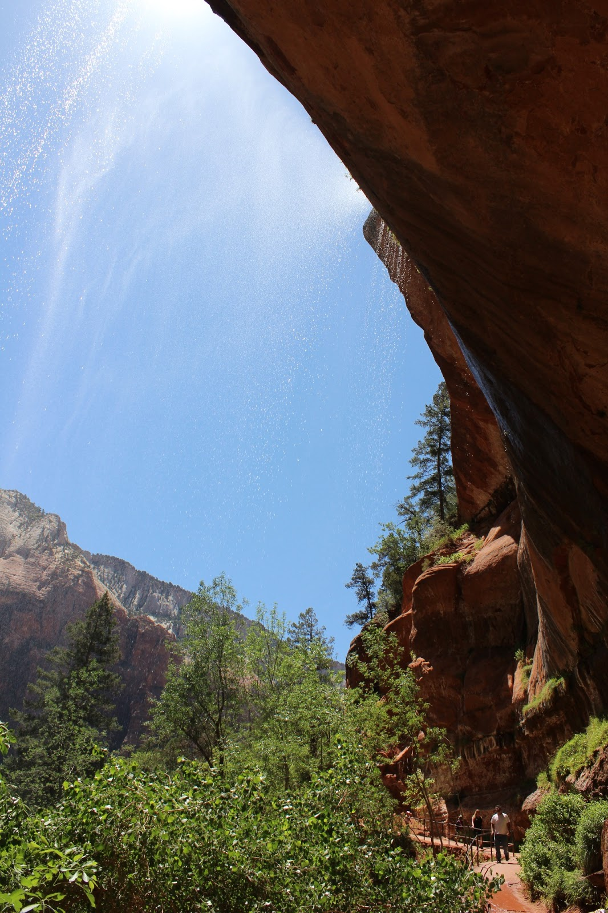
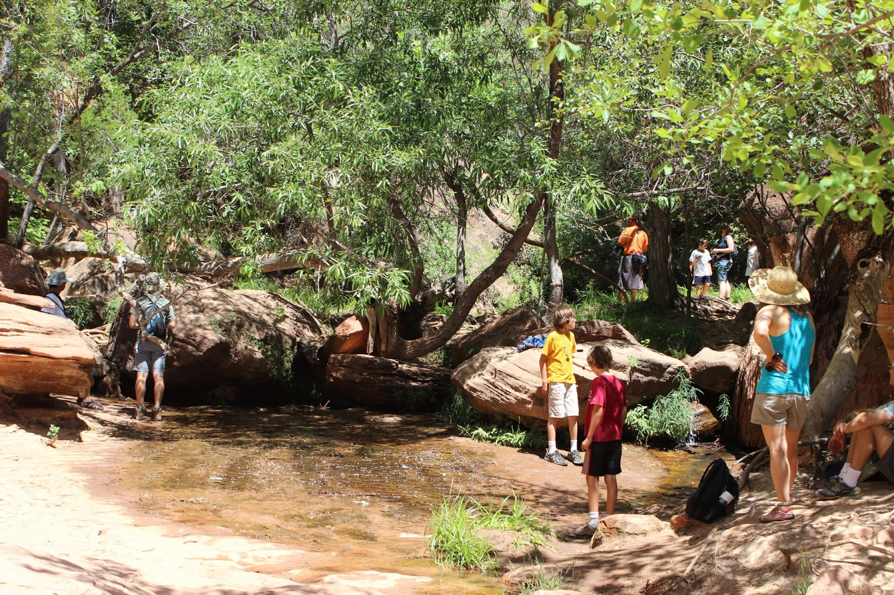
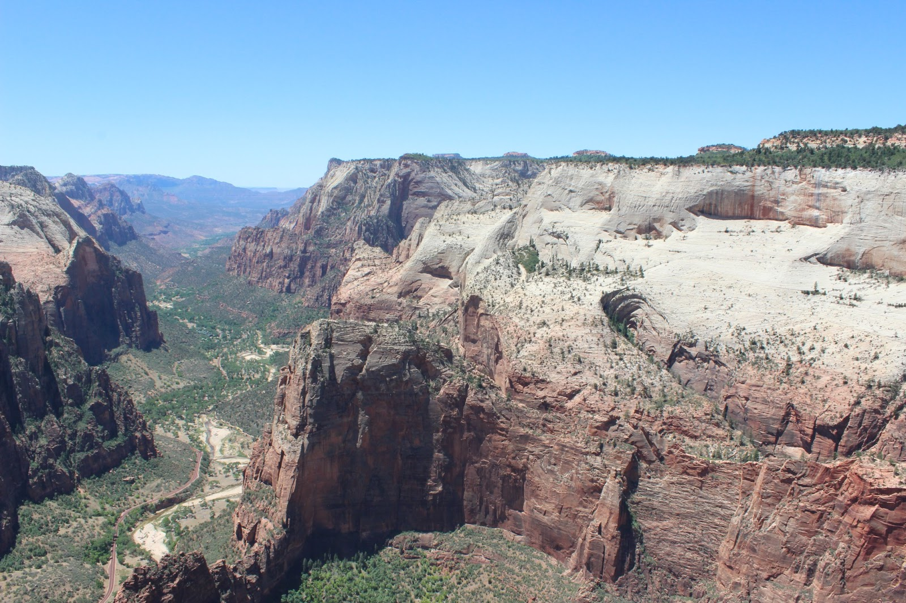
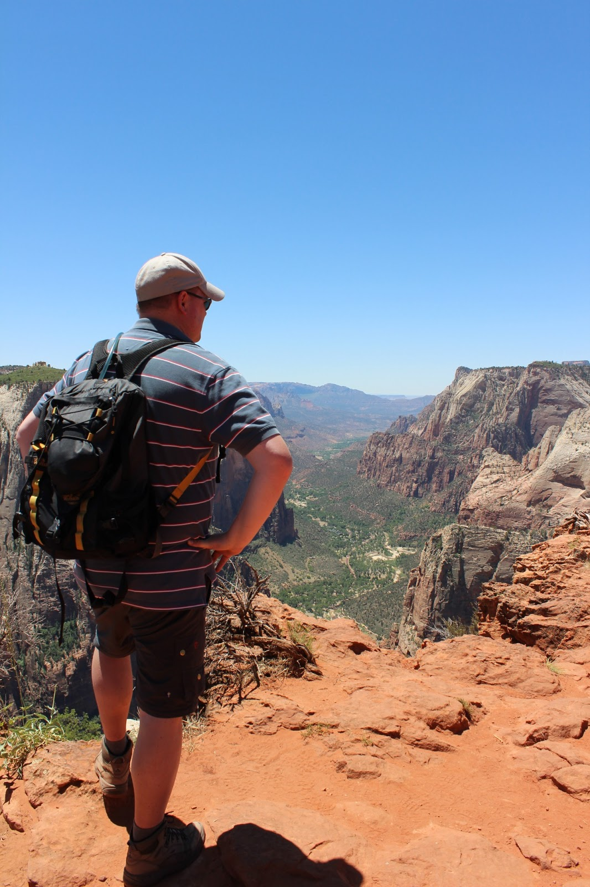
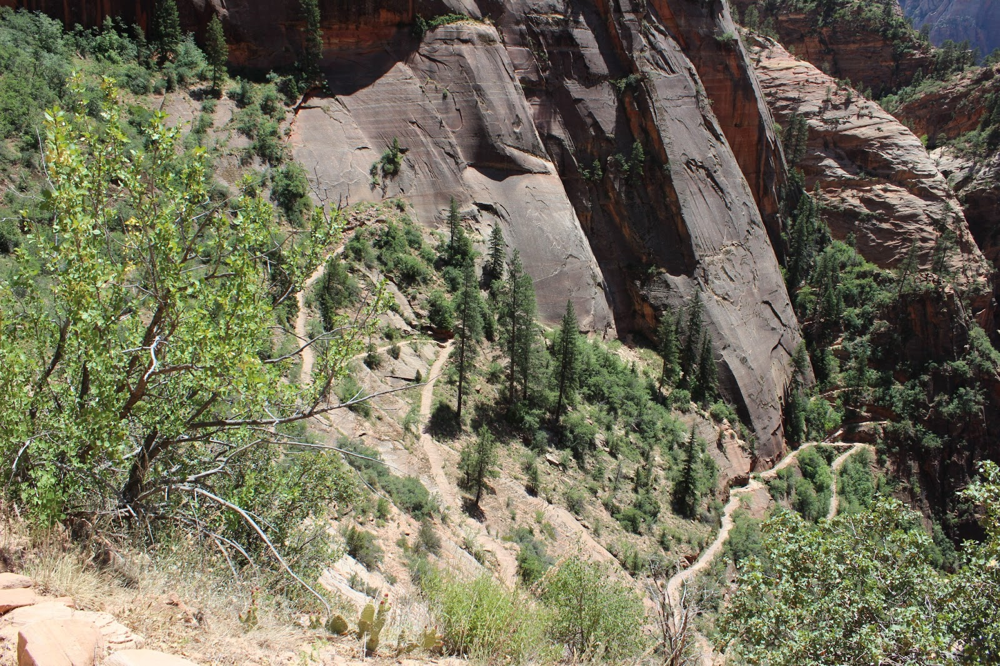

De Grand Canyon heeft een bezoekerscentrum op zowel de zuidelijke, als de  noordelijke rand. Hemelsbreed liggen ze iets van 16 km van elkaar verwijderd. Met de auto is het echter een rit van 340 hele kilometers, en doe je er, zeker met de camper, bijna 5 uur over. We hadden een zeer harde zijwind, en dat rijdt erg vervelend. De camper zwabbert dan van links naar rechts en je moet constant corrigeren, anders lig je in de berm. We hebben heel wat campers en vrachtwagens rare capriolen zien uithalen om op de weg te blijven.

Maar we hebben het gered, en kwamen rond half vier uur aan in Zion National Park. Wanneer je het park vanuit het oosten in rijdt, dan moet je door een tunnel die niet hoog genoeg is voor campers. Je moet dus 15 dollar betalen, zodat een park ranger het tegemoetkomende verkeer tegenhoudt. Je moet vervolgens midden op de weg blijvend door de tunnel rijden. Op de gok zijn we bij de twee campings in het park gaan kijken of er nog plek was. Helaas waren ze beide al vol, dus moesten we uitwijken naar de Zion Canyon Campground in Springdale, het toegangsstadje tot het park. Helemaal geen probleem, het is een leuk stadje met goede restaurants. We hebben gegeten in The Spotted Dog, lekker op het terras met een heel leger aan kolobries om ons hoofd zoemend.

De volgende ochtend vroeg opgestaan om een plekje proberen te bemachtigen op de South Campground in het park zelf. Deze camping is niet reserveerbaar, en biedt plaats op basis van "first come, first serve". We hebben een mooie schaduwrijke site gevonden en maar meteen voor twee nachten geboekt.

's Middags hebben we de Emerald Pools trail gelopen. Deze bestaat uit een drietal pools, waarvan de eerste makkelijk bereikbaar is. Het pad is dan ook helemaal gevuld met families met opa en oma en de kleinkinderen. Het pad naar de Middle pools is al wat lastiger en is dus een stuk rustiger. Daarna gaat het nog verder omhoog naar de Upper pools. Hier was het helemaal rustig.

Na een lichte snack bij de Upper pools zijn we via de Grotto trail teruggelopen naar de weg en hebben de shuttle bus genomen naar de Zion Lodge alwaar we op het buitenterras de lunch genuttigd hebben. Het bier smaakte prima en het uitzicht was verbluffend.

Na een winderige nacht (de hele camper schudde heen en weer), hebben we wederom de shuttle bus genomen. Dit keer naar de Weeping Rock. Van hieruit gaat een pad naar Observation Point. Het pad gaat vanaf het begin straf omhoog, en na heel veel switch backs kom je uiteindelijk na 2 mijl in Echo Canyon. Omdat we vroeg vertrokken zijn, loop je tot hier volledig in de schaduw.

Na Echo Canyon gaat het in nog eens 2 mijl (nog stijler en in de zon!) naar Observation Point. Het uitzicht vanaf hier is overweldigend. Je overziet een groot deel van de Zion Canyon vanaf een hoogte van 7000 voet!

## 1 opmerking

### Gerard21 juni 2013 om 16:05

het zijn toch allemaal schitterende uitzichten
