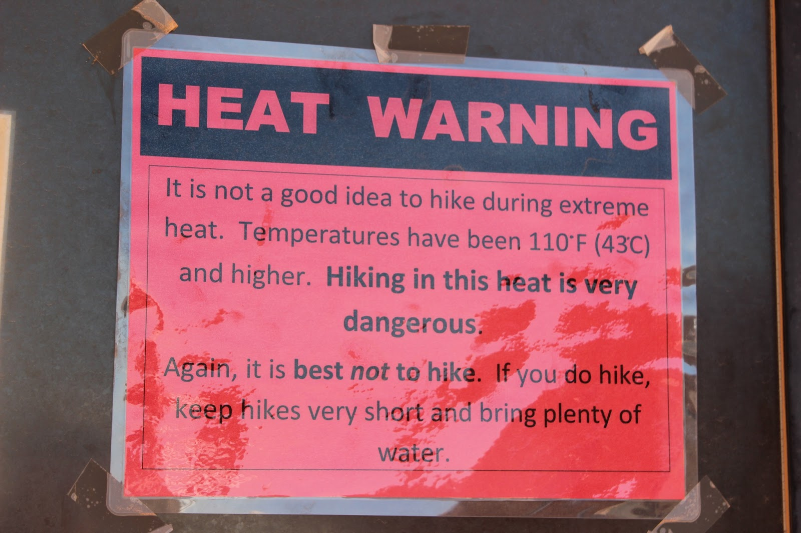
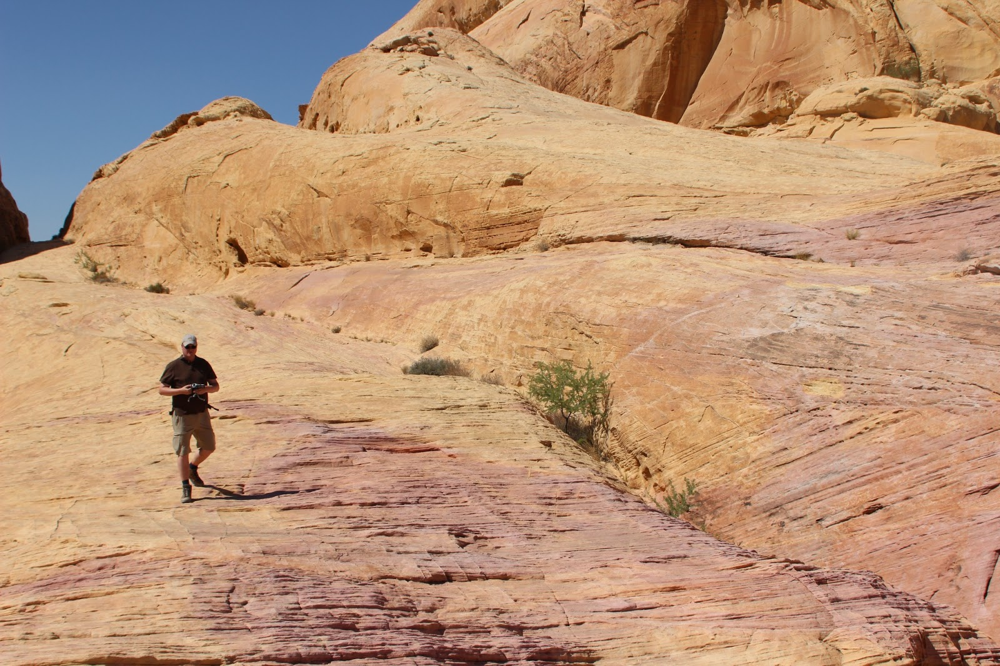

Via Valley of Fire State Park zijn we naar Las Vegas gereden. We waren van plan een kort wandelingetje te doen in dit park, maar zelfs dat werd afgeraden vanwege de temperatuur.

Voor ons was het de eerste keer om te kamperen op Las Vegas Boulevard, oftwel The Strip. Achter Circus Circus, helemaal aan de noordkant van de strip, is een KOA. Toen wij begin deze week online wilden reserveren koste onze site 60 dollar. Wanneer je een stukje gras naast je plek wilde hebben, mocht je daar 30 dollar extra voor neerleggen! Schandalig gewoon! En eigenlijk volledig overbodig, want je zit hier toch niet buiten: wij zijn continu op pad, flaneren over de strip. Beetje casino's bekijken, beetje eten.

Over beetje eten gesproken: onze bezoekjes aan Las Vegas (we zijn hier nu voor de vierde keer) kun je samenvatten met eten. Ieder casino heeft meerdere restaurants, variërend in niveau McDonalds tot meerdere Michelin sterren.

Deze keer hebben wij als volgt gegeten:

- Jaleo in The Cosmopolitan: Spaanse keuken, was stevig aan de prijs, maar voortreffelijk! Redelijk nieuw casino, was nog in aanbouw bij ons laatste bezoek anderhalf jaar geleden.

- Grand Lux in Palazzo: Amerikaanse keuken. Zijn "beroemd" vanwege de grootte van de porties. Ik had Chicken Parmesan, zeer lekker, en van formaat schnitzel in Oostenrijk. Ik heb de serveerster gevraagd hoe groot de kippen zijn in Nevada, het leek wel van een struisvogel te komen. Chantal heeft de helft van haar bord in een doos laten doen, en aan een zwerfster gegeven.

- En gisteravond "for old time's sake" bij de House of Blues in de Mandalay Bay. Hier zijn we al meerdere malen geweest. Is gewoon goed, met iedere avond live muziek.

Na een bezoek aan Red Rock Canyon zijn we uiteindelijk geland op Oasis RV Resort, iets ten zuiden van de Strip. Superdeluxe camping, met vier zwembaden (met een zandstrandje!).

## 2 opmerkingen

### Anoniem 23 juni 2013 om 15:43

Blijft leuk om die mooie natuur ff af te wisselen met Crazy Vegas.
Volgens mij hebben jullie deze reis de zwembaden hard nodig....
Veel plezier nog!
Jullie campermaatjes

### David 24 juni 2013 om 11:29

ach gewoon veel bier voor onderweg meenemen ;-)
