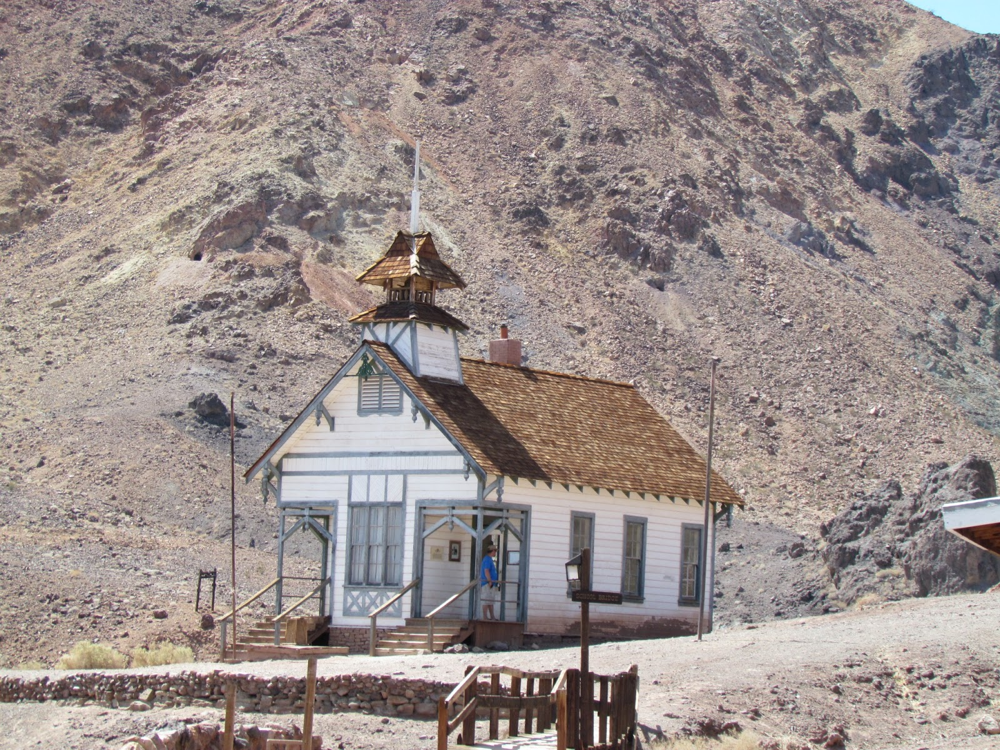
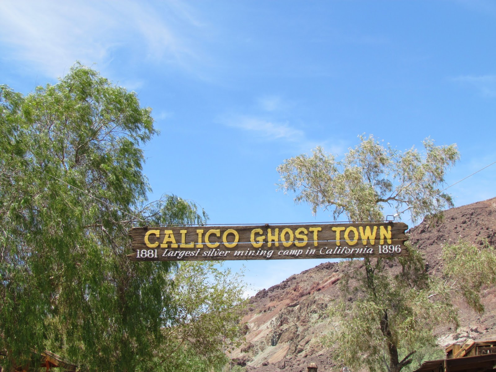
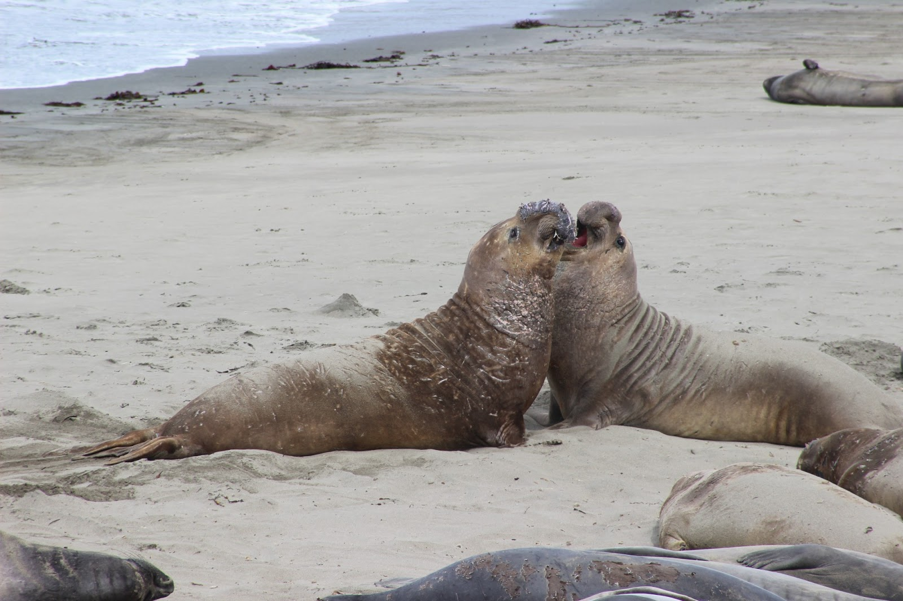
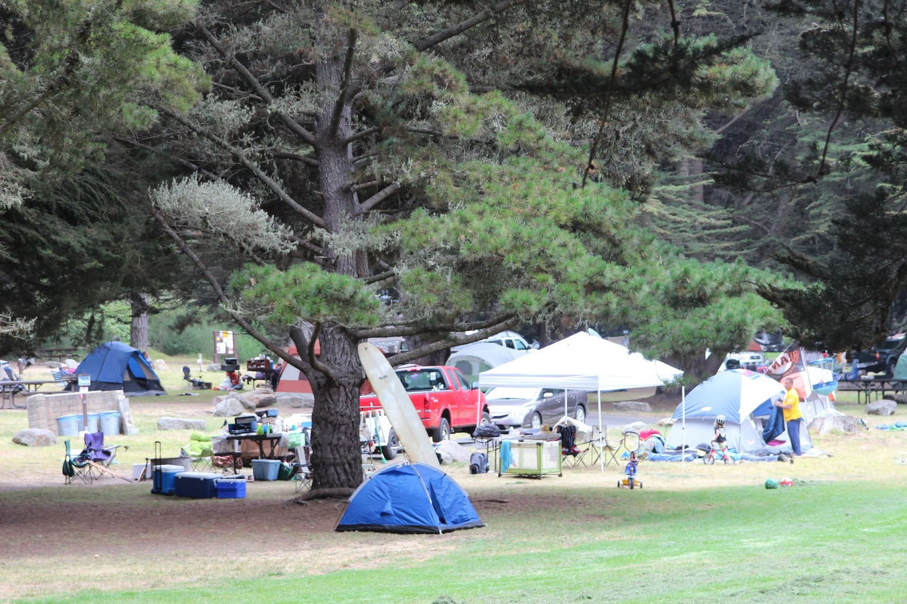
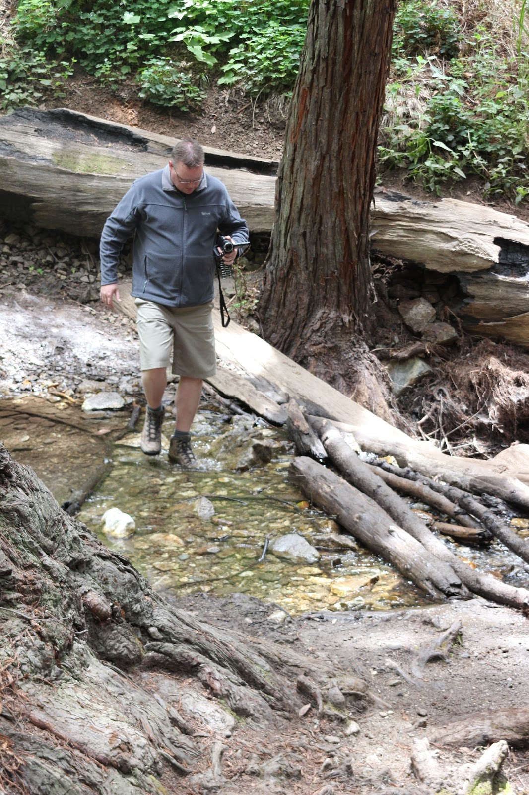
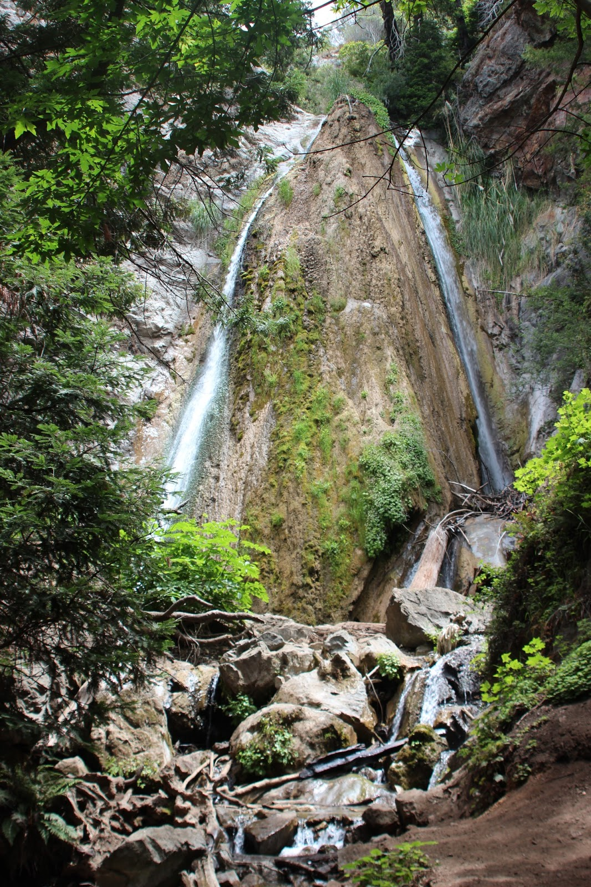
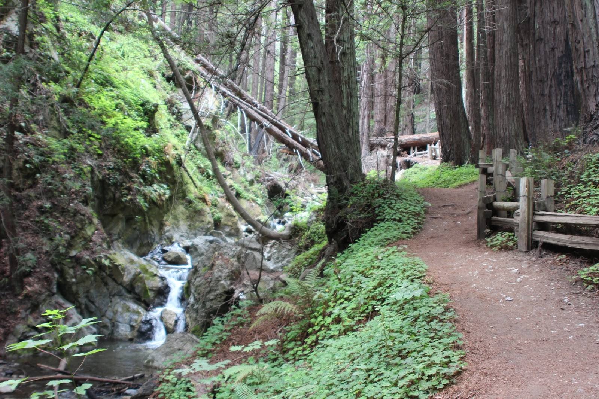

Bah, wat een vervelende rotweg is het toch van Las Vegas via de Interstate 15 naar het westen. Links en rechts alleen maar zand, kaarsrechte weg, af en toe een heuveltje op of af. Na 2 uurtjes rijden kom je bij Calico Ghost Town. Dit stadje was gedurende 1881 - 1896 booming, want in de heuvels werd zilver en mineralen gewonnen. Er rijdt een treintje en je kunt een stukje een echte mijn in. Best leuk om de lange rit vanuit Las Vegas voor een uurtje of zo te onderbreken.

Uiteindelijk hebben we overnacht op het River Run RV Park in Bakersfield, Californië. Zodra je de snelweg afgaat wordt de omgeving een beetje smoezelig, en het industrieterrein waar we op uitkwamen voorspelde al helemaal niet veel goeds. De camping echter ligt er keurig bij, schoon, mooi zwembadje en je merkt niks meer van de omgeving. Toen we aan 't uitbuiken waren van de BBQ, vloog er een hele kudde (of is het een roedel?) vleermuizen over. Zeker een paar duizend! Was een spectaculair gezicht.

Westelijk van Bakersfield ligt het landbouw gebied van Californië, en dat betekent sinaasappelboomgaarden, mais en aardappelen zover je kunt kijken. Ook de bijbehorende Mexicaanse arbeiders (veel borden zijn zowel Engels- als Spaanstalig) en de Rabobank zijn hier ruim vertegenwoordigd. Via de schitterende CA-58 zijn we naar San Luis Obispo  aan de Stille Oceaan gereden. Van hieruit was het nog een klein stukje naar onze camping San Simeon Creek Campground. En wat doe je als echte Amerikaan wanneer je geen stroom op de camping hebt? Dan zet je lekker de hele dag je generator aan om toch Dr Phil te kunnen kijken. Echt heel irritant, continue zo'n brommend ding bij je buren!

Het was trouwens wel een schok voor ons: na drie weken (erg) warm weer, hebben we vanmiddag de stoelen in de zon moeten zetten om wat warmte te krijgen. Het was bij aankomst iets van 20 graden, en dat is heel wat anders dan 35+.

Na het ontbijt aan de zee, hebben we de zee-olifanten kolonie bezocht. Iets ten noorden van San Simeon liggen er honderden op het strand.

Hierna zijn we snel op zoek gegaan naar een camping voor de komende nacht. Er is een aantal campings met "first come, first serve", en we hadden gelukkig al bij de eerste prijs. We hebben als enige niet-hippie een plekje bemachtigd op Plastekk Creek. We staan aan zee, mooi tussen de bomen, maar wat hebben ze er een zooi van gemaakt zeg.

Limekiln State Park blijkt weer eens zo'n klein en voor ons onbekend pareltje te zijn. Het pad naar de gebruikelijke waterval was erg mooi, af en toe kregen we natte voeten wanneer we rivier moesten oversteken.

