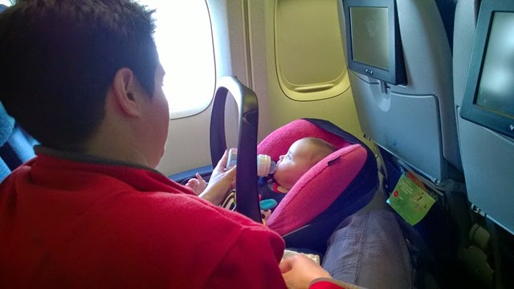
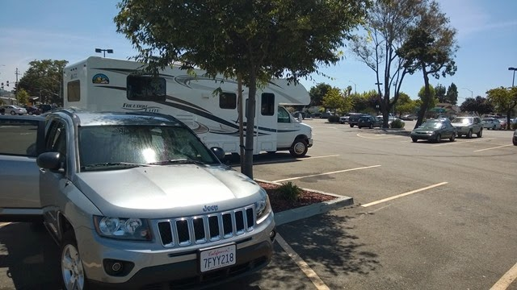

De vlucht van Amsterdam naar San Francisco duurt iets langer dan 10 uur, maar die gingen eigenlijk redelijk vlot voorbij. Sofie deed het heel erg goed, en niet alleen bij de stewardessen. Af en toe moest ze op de arm en hebben we wat op en neer gelopen in het gangpad, maar in het algemeen heeft ze zich keurig gedragen. Gelukkig maar, ik was al bang dat ik een groot deel van de vlucht te voet zou gaan afleggen.

We hadden van te voren een auto gereserveerd om in San Francisco naar het hotel te kunnen rijden en de volgende dag naar het verhuurstation van Moturis. Dus wij dachten dat we die "even" gingen ophalen bij Avis…. Na bijna anderhalf uur wachten kregen we een Jeep Compass mee, zogenaamd met meer bagageruimte dan de door mij bestelde Chrystler, maar niets bleek minder waar. Dus dat was even vloeken en tieren op het parkeerterrein, maar na wat passen en meten (en een opgevouwen Chantal op de achterbank) konden we op weg naar het Hilton Garden Inn hotel in South San Francisco. Keurig hotel. Bij aankomst waren we allemaal uitgeteld, het was een lange en enerverende dag geweest.

De volgende morgen zijn we de camper gaan ophalen. Het ging allemaal wat traaaag, maar ons rijdende huis voor de komende maand ziet er nog redelijk fris uit. Na de verplichte tussenstop bij Walmart voor de grote spullen als BBQ en tuinstoelen en Safeway voor de innerlijke mens, konden we de huurauto terugbrengen bij Avis op het vliegveld van Oakland (was binnen 1 minuut geregeld, dus ze kunnen het wel!) en kon het camperavontuur echt gaan beginnen.

De eerste nacht hebben we geslapen in Brannan Island State Recreational Area. Dat is een hele mond vol voor een aardige camping met vooral lokale gasten, er was geen enkele huurcamper te zien.
