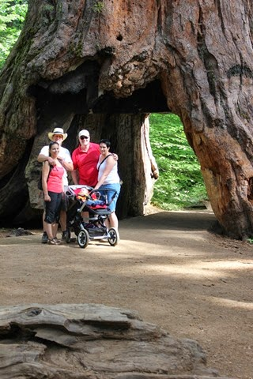
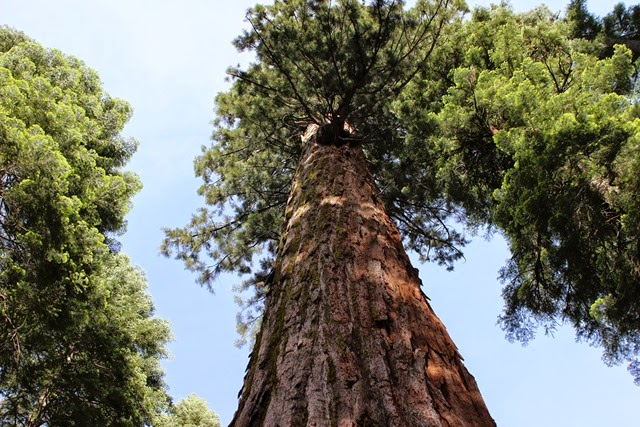

Het ritje van Brannan Island naar de volgende overnachtingsplaats leek in eerste instantie wat saai omdat we door kilometerslange fruitboomgaarden moesten, maar naar mate we meer richting Calaveras Big Trees State Park kwamen, werd de weg kronkeliger en ging het meer en meer op en neer. Zo kwamen we door het plaatsje Angels Camp, home of the frogs! Hier wordt jaarlijks een wedstrijd gehouden waarbij kikkers zo ver mogelijk moeten springen. Ik begreep van onze buurman op de vorige camping dat het er nogal heel erg serieus aan toegaat, en dat de wedstrijdkikkers vertroeteld worden.

Gisteren kregen we een SMS van onze vrienden dat zij waarschijnlijk ook naar dezelde camping zouden komen. Nadat we de camper op ons plekkie op de North Grove camping hadden geinstalleerd, ben ik teruggelopen naar de receptie om te vragen of zij al waren gearriveerd. Op de lijst met ingeschreven gasten stonden ze niet en terwijl ik een post-it kreeg om hun achternaam op te kunnen schrijven, schoof er een camper voorbij met daarin onze vrienden! Over toeval gesproken!

We hebben met hen een wandelingetje gemaakt door een sequoia bos (de Big Trees uit de naam van het park) en ‘s avonds bij het kampvuur een bier gedronken. Was heel erg leuk om elkaar zo aan de andere kan van de wereld te ontmoeten. Het was feitelijk een herhaling van onze ontmoeting in Death Valley een paar jaar geleden.

