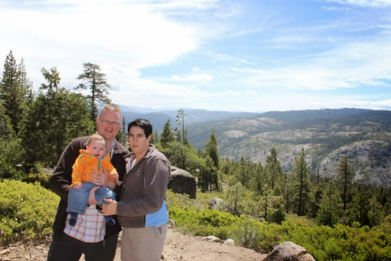
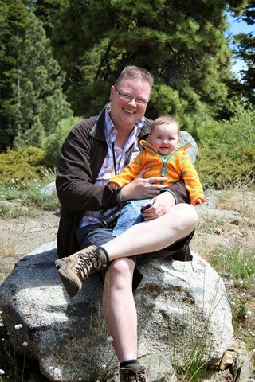
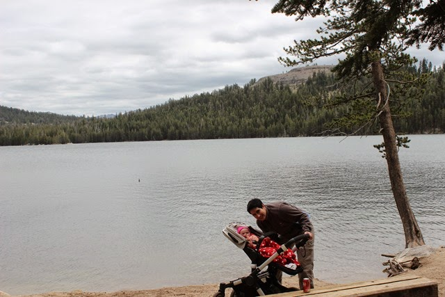
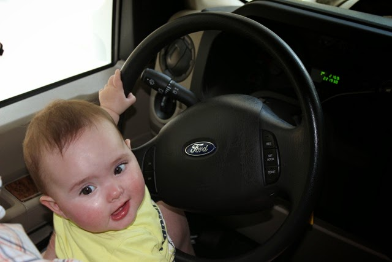
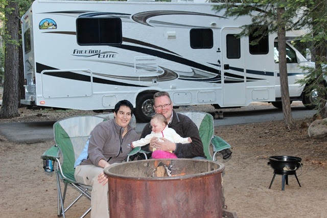
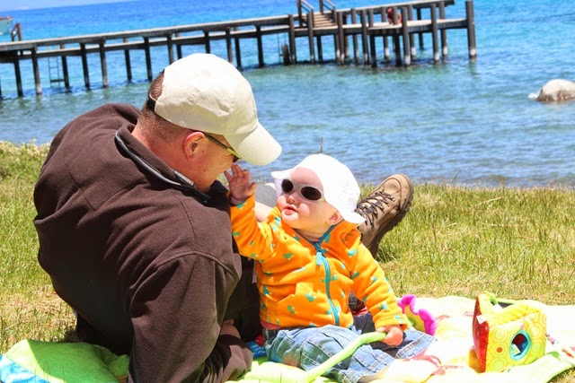
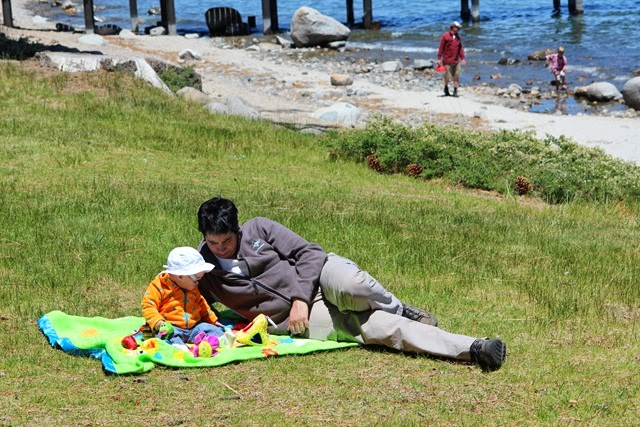
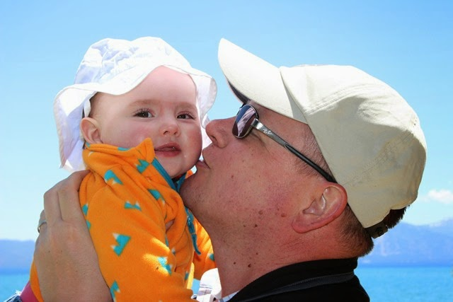

Op Travel Channel is een programma van een of andere Brit die op zoek is naar 's werelds mooiste motorroutes en vervolgens rijdt hij van de ene interstate naar de andere. Misschien een idee om de mooiste camperroutes en campings te gaan maken? 

Vandaag reden we van de Calaveras Big Trees via highway 4 over Ebbets Pass (hoogste punt ligt op 2600 meter) naar Lake Tahoe. In het bezoekerscentrum in Arnold en het tankstation net buiten het plaatsje werd ons stellig afgeraden om deze weg te gaan rijden, omdat het erg smal en steil zou zijn ("You could get stuck!"). Nou, steil was het zeker wel op sommige stukken, maar heel erg smal werd het eigenlijk nergens. Onderweg hebben we nog een stukje gewandeld bij Lake Alpine.

Na Lake Alpine werd de weg aanzienlijk smaller, maar ondanks de waarschuwing dat voertuigen langer dan 25 voet niet geadviseerd werd om verder te rijden hebben we het toch gewoon gedaan (onze camper is 27 voet). Zoals gezegd, het ging prima. Wel af en toe in de laagste versnelling de berg af (24% afdaling!) om de remmen te sparen.

Uiteindelijk zijn we beland op de camping in Sugar Pine Point State Park aan Lake Tahoe. We hebben een mooi plekje, en hebben lekker gegeten van de BBQ en bij het kampvuur gezeten. De wind is hier wel koud, maar in de zon is het best lekker.

De volgende morgen zijn we eens gaan kijken bij Lake Tahoe. Het was mooi weer en met het speelkleed in de wandelwagen gingen we op pad.

## 2 opmerkingen

### Gerard19 juni 2014 om 23:49

Hallo vakantiegangers. Het gaat jullie, met z'n drieën zo, te zien erg goed. Ook Sofie geniet zeker met big Daddy en Mom at Lake Tahoe. Oma en Opa genieten daarvan op afstand.

### Anoniem22 juni 2014 om 04:06

Ha globetrotters, ziet er allemaal goed uit. Vonden jullie Lassen Volcanic ook prachtig? Waar spreken we de volgende keer af? Have fun!
