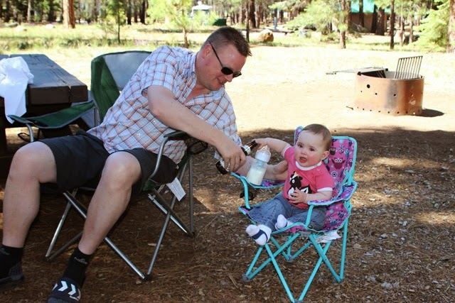
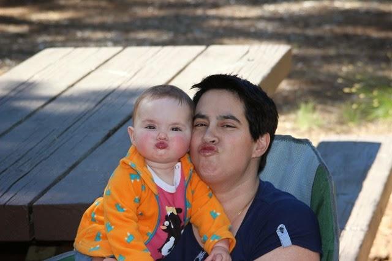
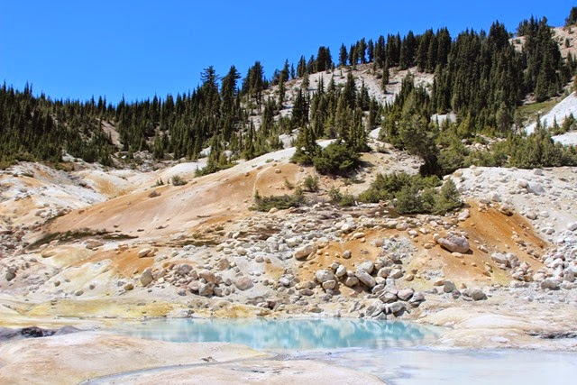
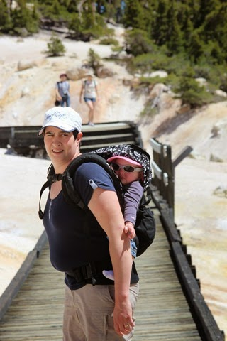
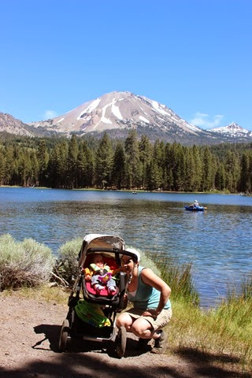
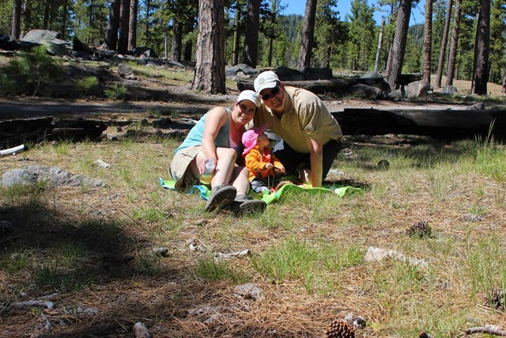

Aangezien we met Sofie niet te ver willen rijden op een dag, hebben we de rit van Lake Tahoe naar Lassen Volcanic National Park in tweeën geknipt. De tussenstop was de zeer aangename Merrill Campground aan Eagle Lake, iets ten westen van Susanville in Californie. Al met al is het toch nog een lange dag geworden, en dus hadden vader en dochter DORST bij aankomst!

Na een kort wandelingetje langs de oever van het meer waren beide dames in een jolige bui, en dat zonder enige druppel alcohol...

De volgende dag zijn we weer op tijd vertrokken richting Lassen Volcanic NP. Bij ons vorige bezoek was de weg door het park nog lang niet sneeuwvrij, en konden we alleen vanuit de noordkant het park in. Nu was de weg gelukkig helemaal begaanbaar, hoewel enkele wandelpaden nog bedekt zijn met sneeuw. Maar met Sofie kunnen we natuurlijk nog niet de hele dag wandelen, dus hebben we gekozen voor de Bumpass Hell wandeling. Deze is bijna 5 kilometer lang, en niet al te veel stijgen en dalen. Dus Sofie heeft lekker in de rugdrager gezeten op weg naar de hydrothermale uitspattingen, zeg maar een ieniemini Yellowstone. Het wandelingetje was leuk, en net lang genoeg voor Sofie.

We zijn uiteindelijk twee nachtjes op de Manzanita Lake Campground gebleven. Na de drukke eerste dag, hebben we de tweede dag rustig aan gedaan en zijn we de hele ochtend bij de camper gebleven. 's Middags hebben we een wandelingetje gemaakt langs Manzanita Lake.

