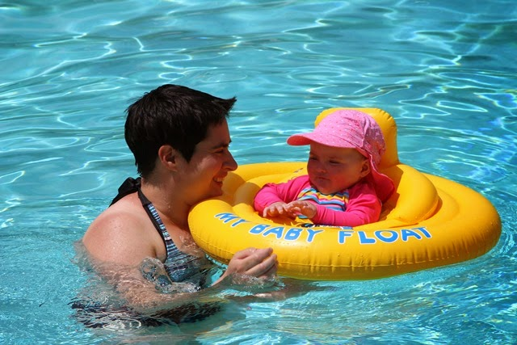
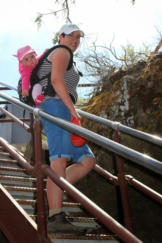
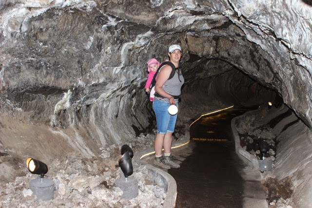

Na alle "primitieve" overnachtingen zonder water en stroom, hadden we behoefte aan een full hookup (en een wasmachine/droger). Die hebben we gevonden bij de KOA in Klamath Falls net over de grens in Oregon. Het is zeker niet de beste KOA die we tot nu toe gezien hebben, maar ook zeker niet de slechtste. KOA campings hebben normaal gesproken alle faciliteiten en zijn goed bereikbaar (lees: liggen aan doorgaande (snel)wegen). Deze KOA echter ligt net aan de rand van de stad, en ze hebben in ieder geval een zwembad en een grasveldje waar Sofie lekker op kan spelen.

Vanuit Klamath Falls is het een uurtje rijden naar Lava Beds National Monument. Dit is een park met allemaal lava grotten waar je doorheen kunt lopen danwel kruipen. Dat laatste is voor ons wat te avontuurlijk, dus we hebben voor de eenvoudige Mushpot gekozen. Bij het visitor center kregen we uitgebreide uitleg over alle mogelijkheden in het park. Marybeth had dan ook werkelijk alle tijd voor ons, er was verder nagenoeg niemand. Van haar kregen we twee zaklampen waarmee we ons begaven naar het ondergrondse.

Op de meeste plekken kon je gewoon staan, maar je moest altijd op je hoede zijn voor headache rock, dus op een enkele plek moest je behoorlijk door de knietjes om je hoofd niet te stoten.

Als je ervan houdt is het ongetwijfeld een mooi park, maar het was niet helemaal ons ding. Toch hebben we ons een paar uurtjes vermaakt. Na al dit geklauter hebben we wat boodschappen gedaan bij de Walmart en de Safeway, want morgen gaan we weer de rimboe in: Crater Lake staat op het programma.

## 1 opmerking

### Gerard24 juni 2014 om 02:02

He vakantiegangers, jullie volgen via de blog is erg leuk en ik geniet ook van de leuke dingen die jullie meemaken. Ik zie ook dat Sofie een leuke dimensie geeft aan jullie vakantieactiviteiten. Veel plezier nog samen.
