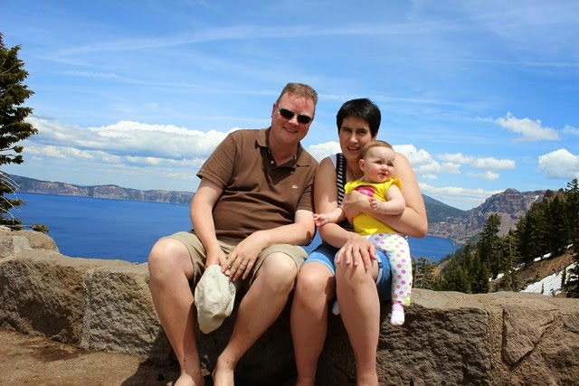
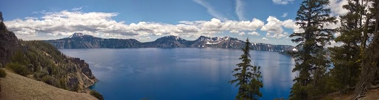

In Australië hebben ze zoiets als de Outback Salute: wanneer je iemand gedag zegt dan gaat dat vaak gepaard met een heftig op en neer bewegen van een of meer armen om de vliegen uit je gezicht te houden. In Crater Lake hebben ze een vergelijkbaar iets (een Crater Salute?), maar dan om de muggen van je al dan niet goddelijk lijf te houden. We hadden van te voren al twee nachten gereserveerd op de Mazama Village Campground, aan de zuidelijke kant van het meer waarnaar het park is vernoemd. Zo te zien is de camping net open, want ze zijn nog erg druk bezig om bomen te snoeien. Overal liggen boomstronken en takken, dus het is uitkijken geblazen met de camper om er tussendoor te laveren.

Crater Lake is met 592 meter het diepste meer van de VS en meet iets van 9 bij 7 km. Het wordt niet gevoed door rivieren of beken, maar enkel en alleen door regen en smeltwater van sneeuw. De kleur van het water is echt heel erg blauw! Er is rondom een weg aangelegd, maar vanwege de sneeuw is de oostelijke helft nog niet open.

's Avonds hadden we een luie bui en dus zijn we gaan eten in het Annie Creek restaurant. Volledig in Amerikaanse stijl, dus met de camper de 500 meter vanaf onze site al rijdend afgelegd :-)

De volgende dag hebben we een beetje rondgereden naar de noordelijke helft van het meer. Er lag in de berm op sommige plekken nog enkele meters sneeuw. Maar dat maakte het plaatje wel extra mooi :-)

## 1 opmerking

### Gerard 28 juni 2014 om 10:07

Hallo Vakantiegangers
Het blijven mooie plaatjes en plaatsjes. En Sofie, ben je aan het afkijken hoe je een zwaar hoofd kunt ondersteunen........
Veel plezier nog samen.
