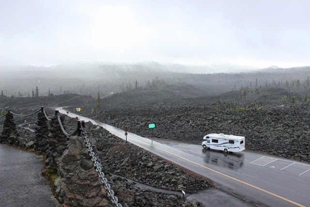

Vanuit Crater Lake NP zijn we via Oakridge via OR19 (wow) en de McKenzie Pass (WOW!!!) naar Sisters gereden. De McKenzie Pass slingert dat het een lieve lust is over de Cascade Range en bereikt een hoogte van 1800 meter. Bovenop kom je terecht in een enorm lavabed van 50 vierkante mijl. Dat is dus veel groter dan het lavabedje in Lava Beds National Monument...

We hebben zo mooi gereden en vaak gestopt dat we pas laat op camping Bend Sisters Garden RV in Sisters aankwamen. Deze camping heeft volgens de Good Sam Club de hoogst mogelijke rating die mogelijk is (3 keer een 10). Van de ene kant betekent dat dat de douches en toiletten schoner en mooier zijn dan in menig hotel, van de andere kant betekent het ook dat dit campings zijn voor de mensen met Grote Campers. Je zou er bijna een minderwaardigheidscomplex van krijgen zeg: wij met onze 27 voet tussen alle 40+ voeters. Een snelle blik over het veld leverde op dat wij zo'n beetje de enige huurcamper zijn. Sisters zelf is erg klein en helemaal in de steil van de jaren 1880, het ziet er heel leuk uit allemaal.

Na de drukke reisdag hebben we de volgende dag rustig aan gedaan. Zijn naar Bend geweest om wat boodschappen te doen, en hebben 's avonds daar verrukkelijk gegeten bij Greg’s Grill.

## 1 opmerking

### Anoniem30 juni 2014 om 22:08

Willen toch even reageren op het minderwaardigheidscomplex.
Wij hebben 'n caravannetje van 4 meter en je hebt geen idee waar de Engelsen mee komen. Dan valt jullie camper best wel mee. Veel plezier nog en de groeten uit de Loirestreek.
