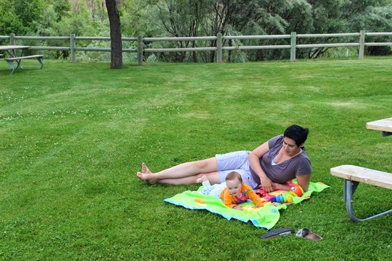
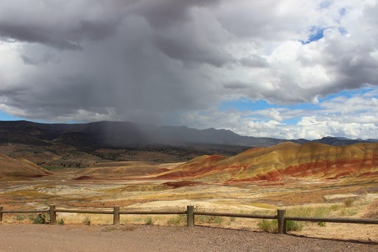
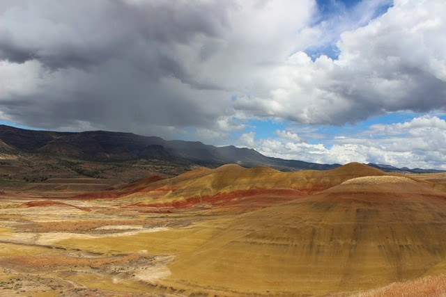
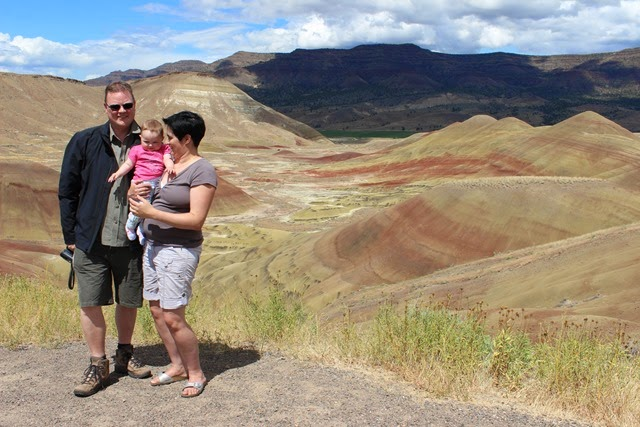
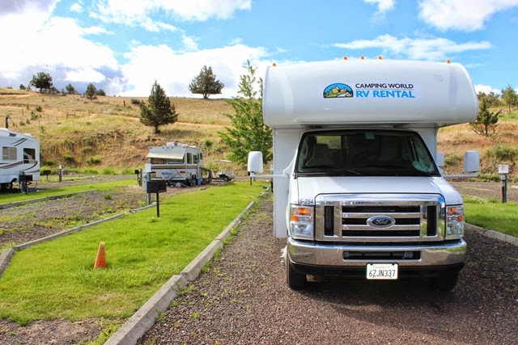
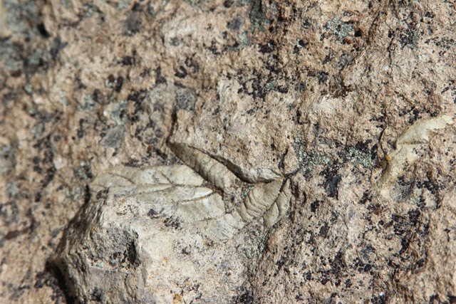
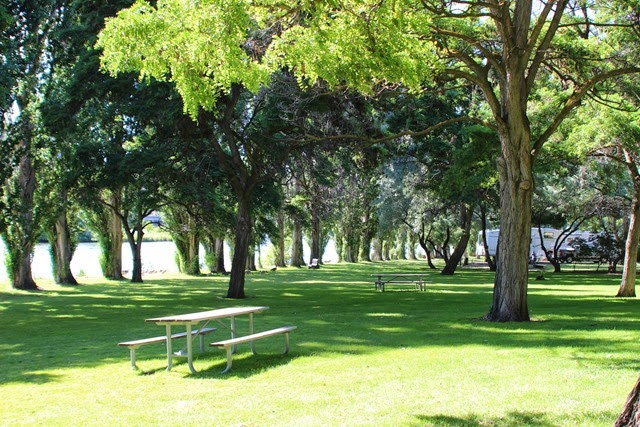

Dit National Monument bestaat uit een drietal gebieden die behoorlijk ver uit elkaar liggen en die verder ook weinig met elkaar te maken hebben, buiten dan dat ze dezelfde naam dragen. In de Painted Hills Unit hebben we eerst gelunched en daarna zijn we eens naar de heuvels gaan kijken.

Het was een beetje twijfelachtig weer de hele dag, af een toe een (hoos)bui, dan weer zonnig. Maar dat zorgde er wel voor dat de foto's mooi dramatisch zijn geworden.

We wisten al dat er in dit gebied weinig campings zijn, en de campings die we tegenkwamen stonden ons niet helemaal aan. Dus uiteindelijk zijn we terecht gekomen in het gehucht Fossil. Het enige bestaansrecht van dit gat is het feit dat ze precies op de 45e graad ligt, en dus precies halverwege de evenaar en de noordpool. Oh, en de fantastische camping op de County Fairground (waar eens per jaar een rodeo wordt gehouden). Het contrast met de vorige camping kon niet groter zijn :-)

De volgende dag zijn we naar de Clarno Unit van John Day Fossil Beds gereden. Hier loop je via korte wandelingetjes langs allerlei fossielen. Een jaar of 10 geleden hebben ze tussen al die fossielen een groot aantal MacBook’s opgegraven die Apple nu nog steeds voor veel geld verkoopt.

Hierna zijn we doorgereden naar de grens tussen Oregon en Washington. In Biggs staan we op de camping van het Deschutes River State Recreational Area.

Note to self: volgende keer checken of er niet een trein naast de camping rijdt...
