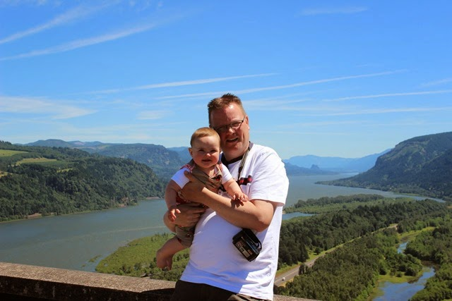
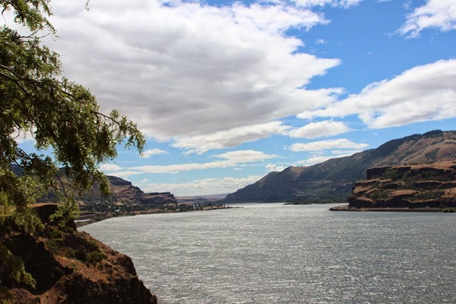
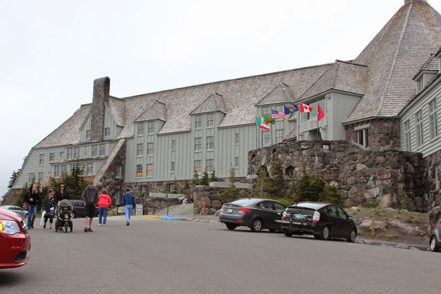
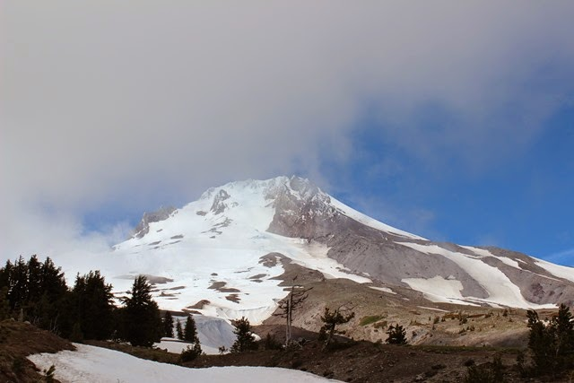
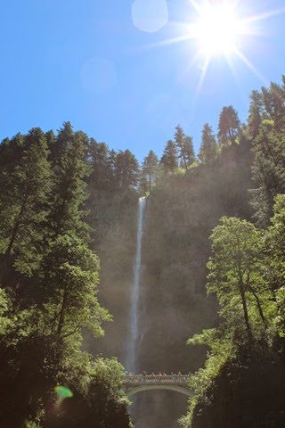
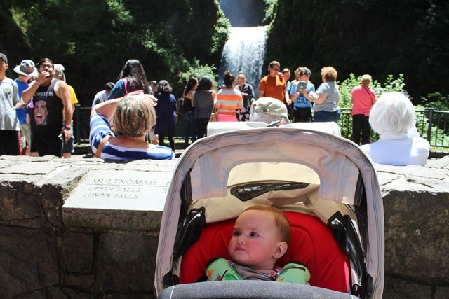

Vanuit Biggs zijn we via wat scenic routes langs de Columbia River gereden, die voor een groot deel de natuurlijke grens vormt tussen Oregon en Washington.

Onderweg zijn we nog bij de Timberline Lodge gaan kijken. Dit is een enorm groot hotel bovenop een berg gebouwd ergens in de jaren 30. En wat bleek, daar werd nog deftig geskied! Met bussen tegelijk werd het skivolk aangevoerd vanuit Portland, wat hier helemaal niet zo ver vandaan ligt. Hier hebben we dus voor het eerst in drie weken de lange broek aan gemoeten en een dubbel fleecevest.

Uiteindelijk zijn we beland in Troutdale. Hebben verrassend lekker gegeten (en lokaal bier gedronken) in de lokale pub. De volgende morgen hebben nog de Multnomah Falls bezocht. Hier zijn we twee jaar geleden ook al eens geweest in oktober, en toen waren we er alleen. Nu, vlak voor 4th of july weekend, was het er erg druk, en daar zijn de wegen hier niet zo op voorzien. We konden gelukkig net de camper parkeren!

Sofie had zo haar bedenkingen bij al die drukte...

Na de drukte bij de Falls hebben we heel even de drukte op de interstates rond Portland op moeten zoeken om bij de volgende bestemming te geraken: Cape Lookout aan de Oregon Coast!

## 1 opmerking

### Gerard7 juli 2014 om 10:06

Hallo Vakantiegangers,
Ik denk als ik alle foto's zie dat de bedenkingen van Sofie wel meevallen. Ik denk eerder dat ze aandachtig al het nieuwe aan het opnemen is. Zo klein en zoveel nieuwe indrukken is toch wel heel bijzonder. Jullie genieten in volle teugen al de derde week.
