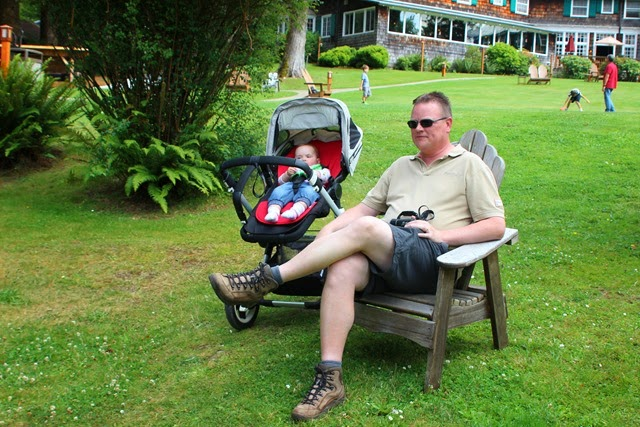
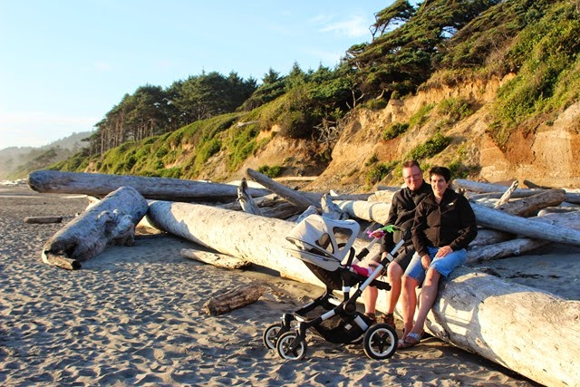
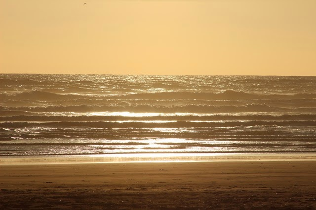
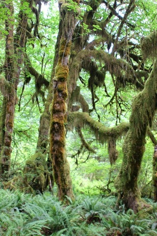
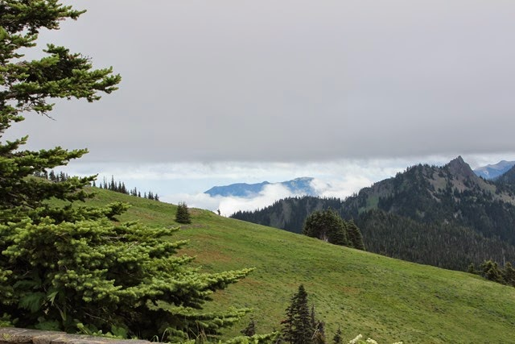
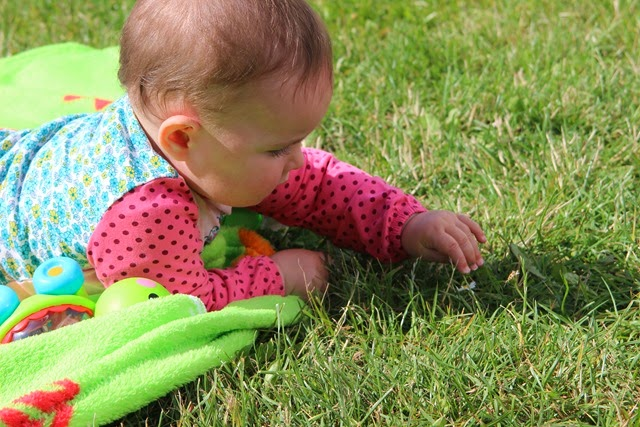
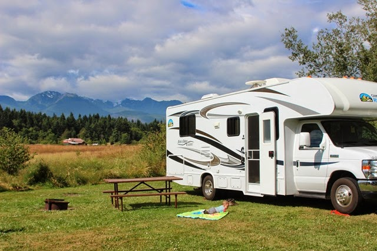
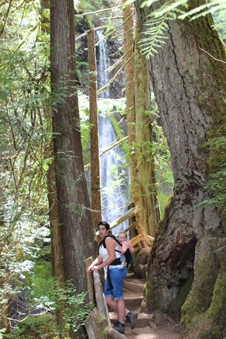
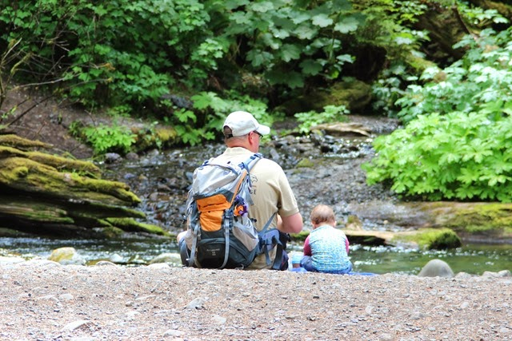
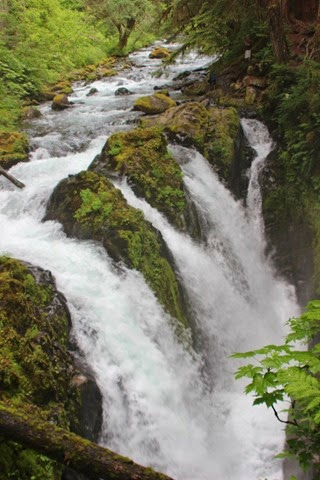

Lake Quinault, vernoemd naar de wereldberoemde Franse oud-wielrenner, ligt helemaal in het zuiden van Olympic. Bij de lodge hebben we even de benen gestrekt en wat gerust.

Na de rustpauze was het nog iets van een uurtje rijden naar onze camping Kalaloch. Ook deze camping ligt aan het strand en we zijn naar de zonsondergang gaan kijken.

De volgende dag zijn we naar het Hoh Rain Forest gaan kijken. Hier hebben we een leuk wandelingetje gemaakt door het Enchanted Forest. Over de bomen hangen dikke lagen mos, een heel spectaculair gezicht.

Omdat het dit weekend 4th of july was, hebben we drie nachten geboekt op de KOA in Port Angeles. Van hieruit hebben we uitstapjes gedaan naar Olympic.

De eerste dag zijn we naar Hurricane Ridge gereden, vanwaar je prachtige uitzichten hebt over de omringende bergen.

Terug op de camping heeft Sofie nog even lekker in het gras kunnen spelen.

De laatste dag hebben we gewandeld naar twee watervallen. De eerste was Marymere Falls.

Daarna zijn we nog bij de Sol Duc Falls geweest. Dit is een makkelijk wandelingetje en dus was het hier (irritant) druk!

