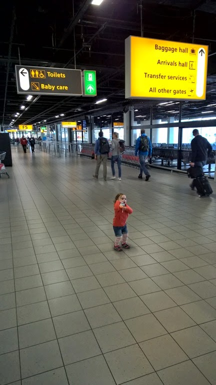
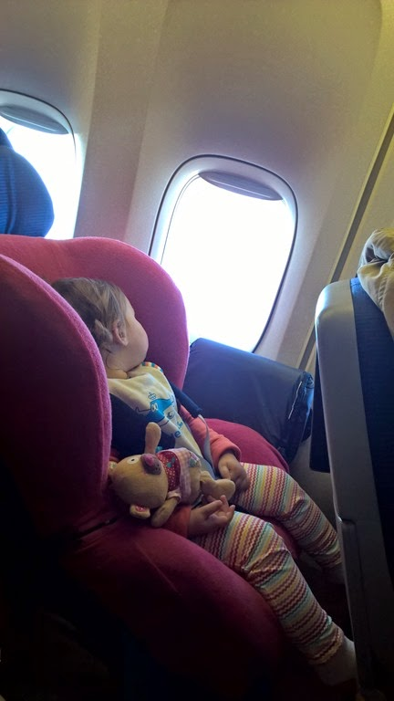
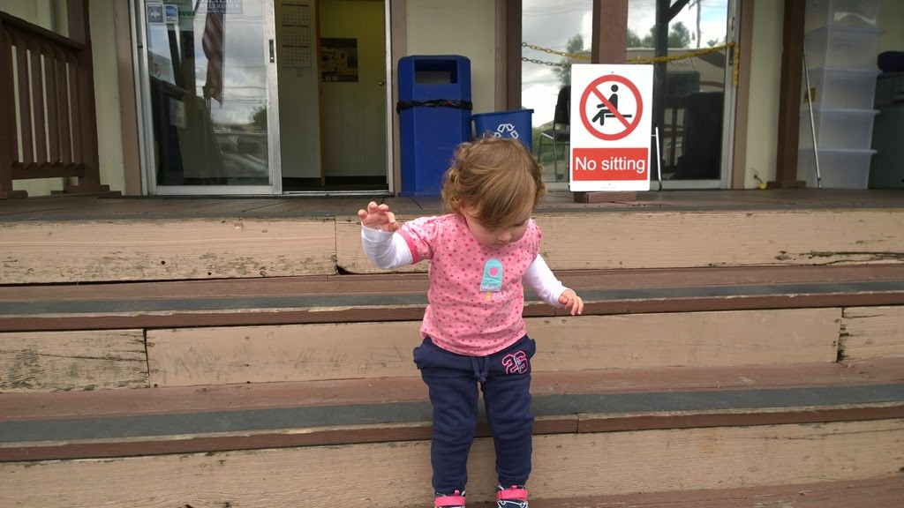
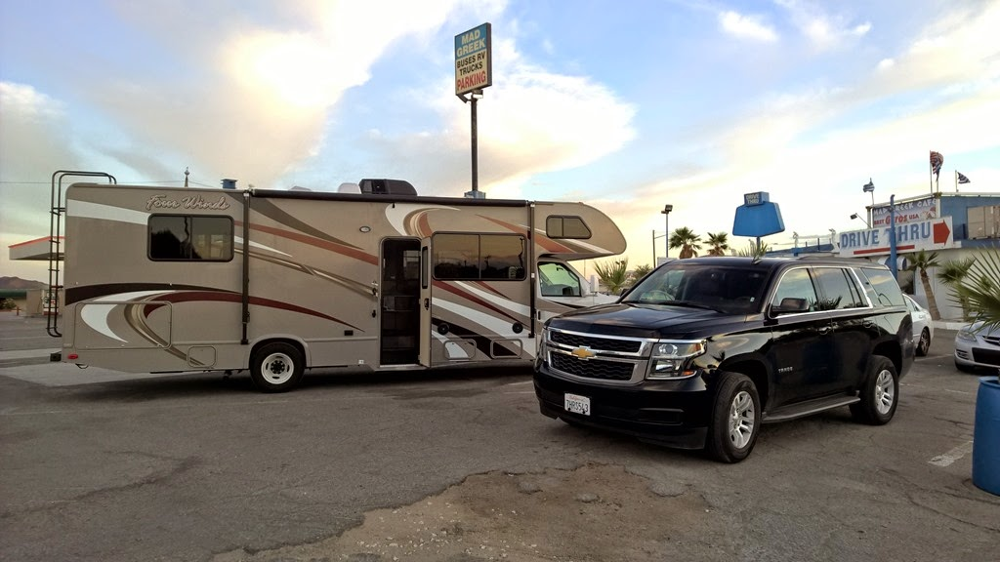
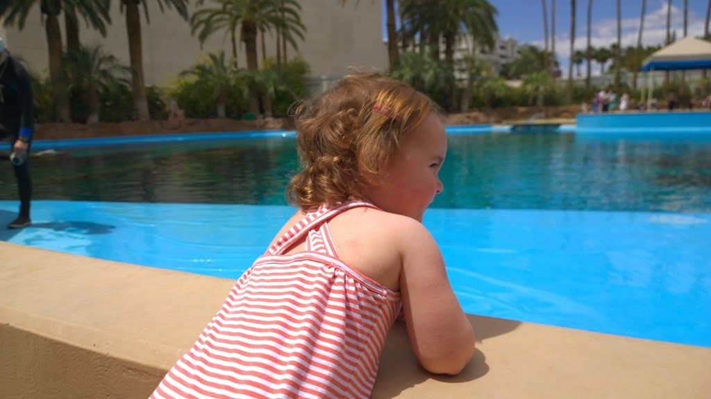
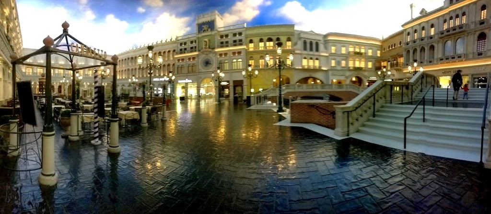
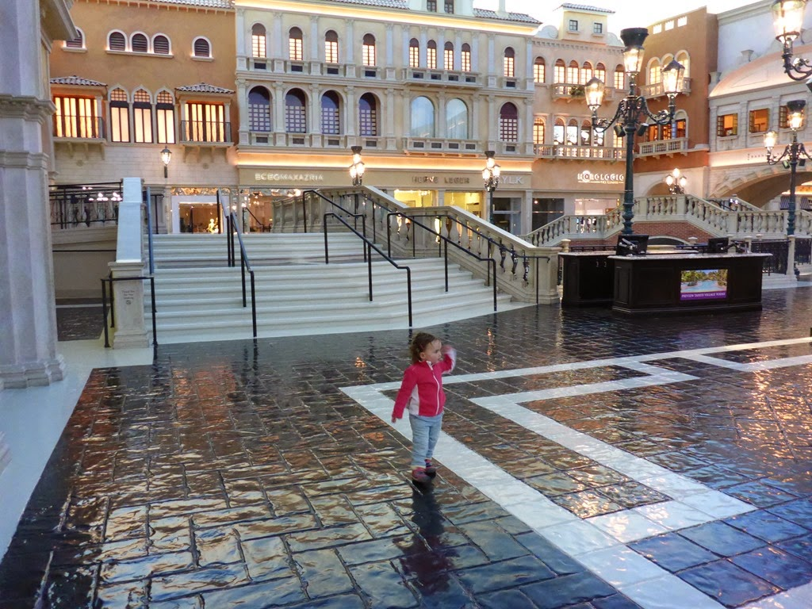
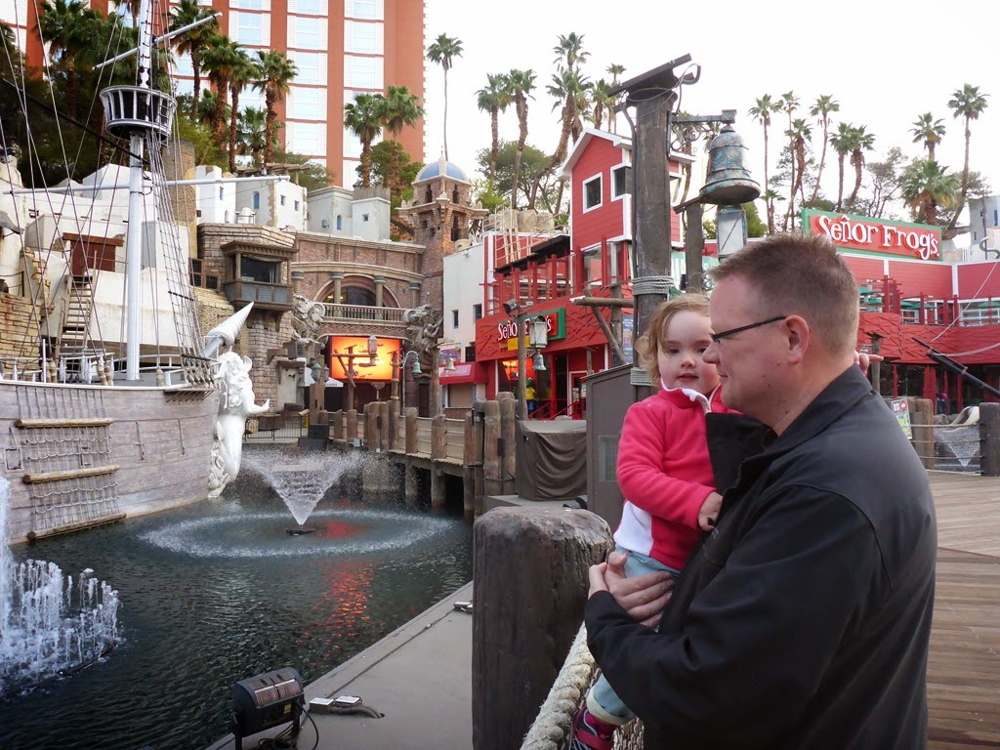
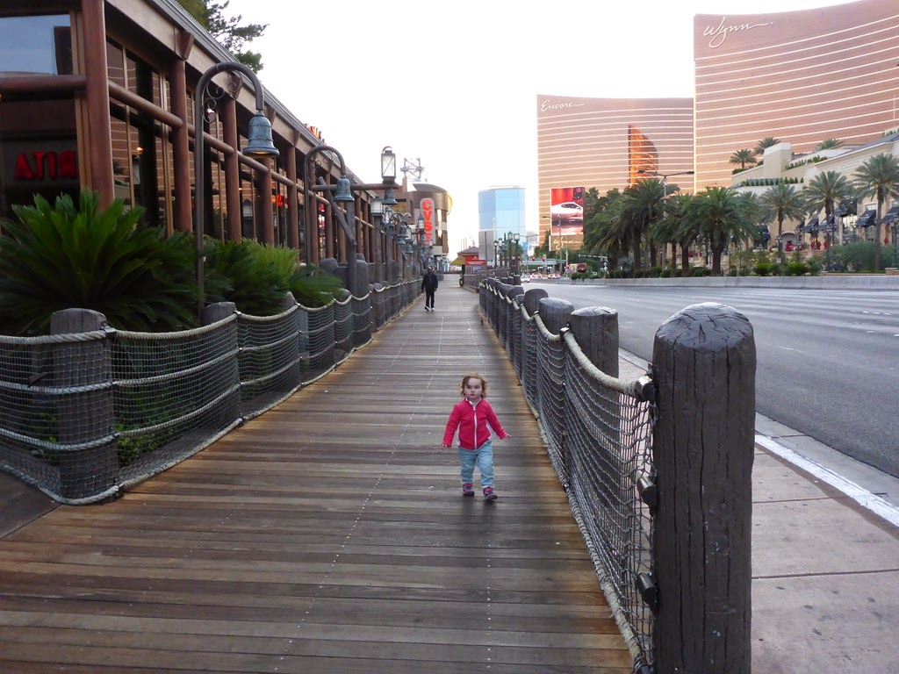

Sofie keek haar ogen uit op Schiphol en eigenlijk de hele vlucht van tien uur en een kwartier gedraagde ze zich keurig. We hadden haar autostoel mee aan boord genomen, zodat ze goed kon zitten, en een hele hoop speeltjes en kadootjes om haar bezig te houden.

Het vliegen met een kleintje heeft een heel groot voordeel, en dat is dat je bij de douane en de security checks in een aparte rij mag en dat betekende dat we binnen drie kwartier na het landen in LA al bij Alamo stonden om de Chevy Tahoe op te halen. Met de Tahoe op zak zijn we naar ons hotel Hampton Inn & Suites in Agoura Hills gereden. De ontvangst daar en de kamer waren prima in orde. We hebben hier verder niet al te veel gedaan, op een snelle douche en een power nap na. Sofie was klokslag 2 uur in de nacht klaarwakker, dat is dan weer minder leuk. We (of eigenlijk  Chantal, ik mocht nog even doorslapen) hebben Sofie bezig gehouden tot een uur of 5 in de ochtend, waarna we maar zijn gaan aankleden om naar de Walmart en Safeway in Oxnard te gaan voor wat eerste boodschappen. Vanuit Oxnard zijn we richting Malibu gereden om toch nog even een stukje highway one mee te pikken. Meer van de Pacific zullen we niet gaan zien deze trip, behalve op de allerlaatste dag in San Francisco.

Om 12 uur konden we de camper ophalen bij Roadbear. We waren de eerste, en dus waren we ook hier binnen 3 kwartier weer weg.

Omdat het vrijdag is, en er dus veel weekendverkeer van LA naar Las Vegas zal zijn, zijn we maar direct vertrokken: Roger in de camper voorop, gevolgd door Chantal en Sofie in de Chevy. Het verkeer zat behoorlijk tegen tot we op de I-15 aankwamen. Onderweg hebben we nog een snelle hap gedaan bij een soort Griekse McDonalds (de gyros en soevlaki waren erg lekker trouwens!) en uiteindelijk kwamen we om 9 uur 's avonds aan op Oasis RV Resort in Las Vegas.

De volgende morgen zijn we naar de dolfijnen gaan kijken in de Mirage. Sofie genoot overduidelijk!

Na de lunch hebben we bij Walmart twee fietsen gekocht (80 dollar per stuk, met 18 versnellingen) en een gas-BBQ voor nog geen 20 dollar. Hoe kunnen ze het ervoor doen!

Het was een drukke dag geweest, en dus hoopten we een beetje dat Sofie niet weer zo vroeg wakker zou zijn… maar helaas, om 4 uur klaarwakker. En dat betekende dus dat we om 6 uur maar naar de Strip zijn gereden om naar de lampjes te gaan kijken. Ik voelde me toen wel oud, tussen al het uitgaanspubliek wat (van redelijk tot uitermate dronken/ordinair) op weg was naar hun hotel om hun roes uit te slapen, liepen wij met een wandelwagen…

Maar goed, het San Marcoplein in de Venetian lag er volledig verlaten bij, dus Sofie kon naar hartenlust rondrennen en trapje op, trapje af, trapje op, trapje af. Ontbijt hebben we dan ook maar meteen in de Venetian gedaan: Chantal een spiegelei, Roger wentelteefjes, een pannenkoek voor Sofie en de mevrouw naast ons een Luikse wafel met gefrituurde kip (!).

