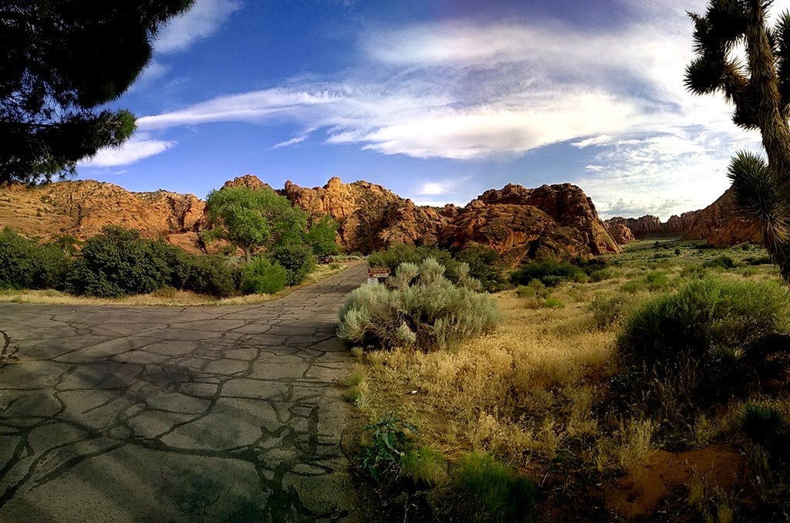
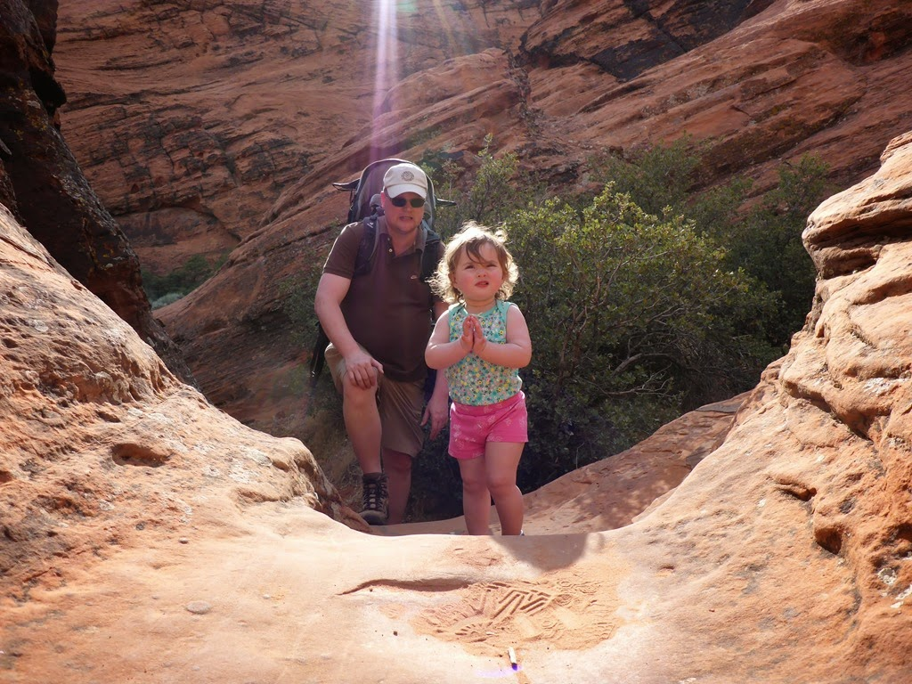
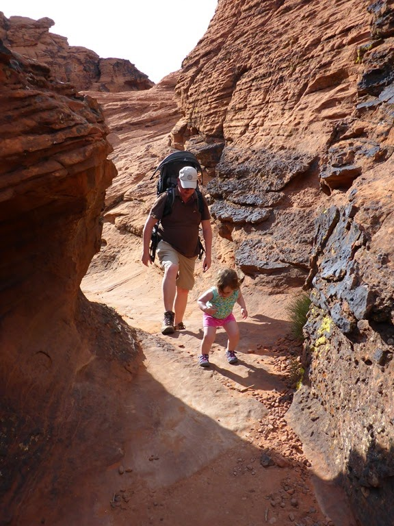
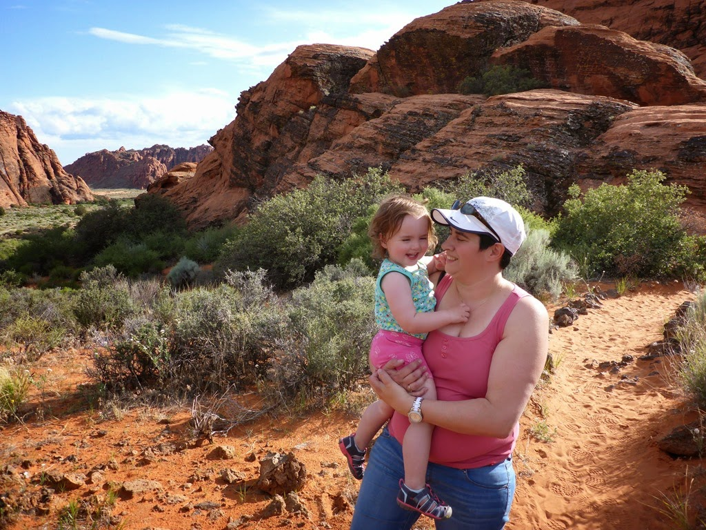
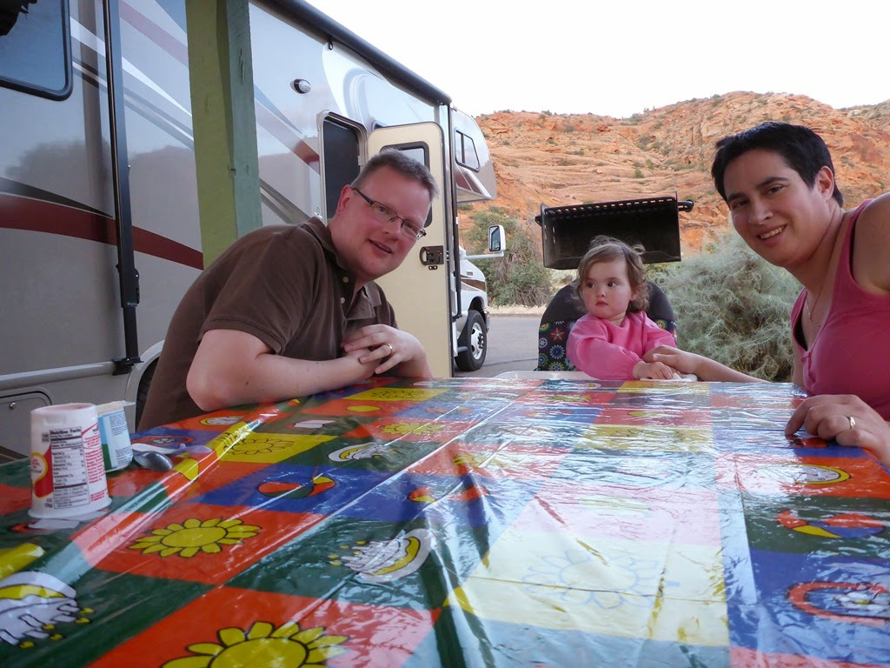
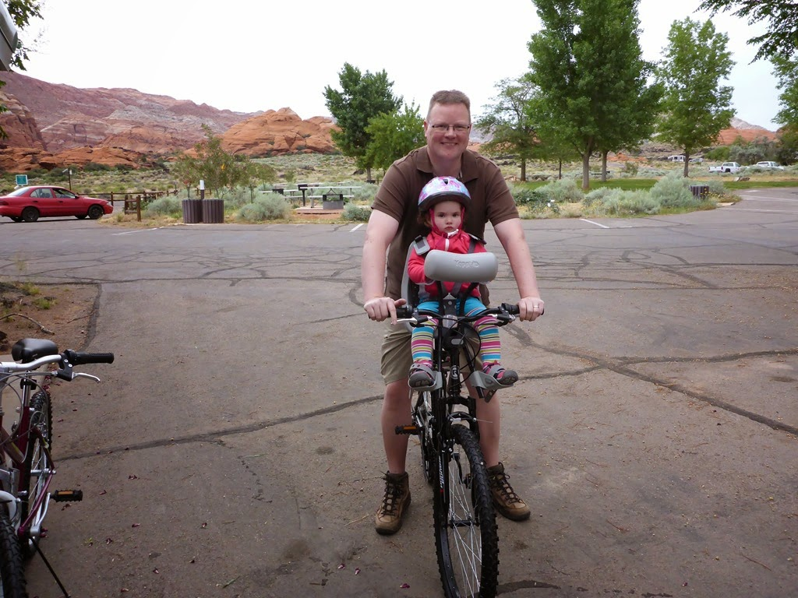
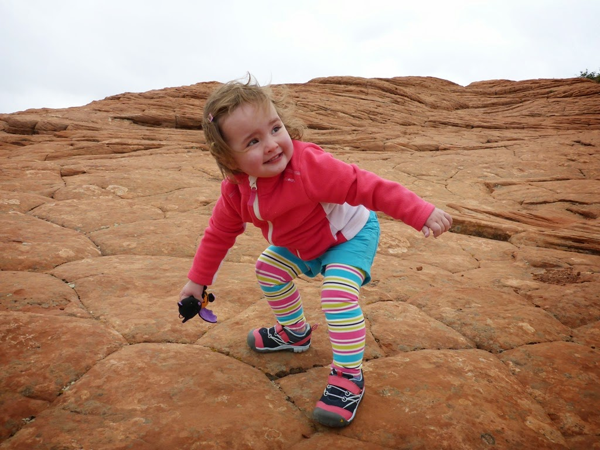
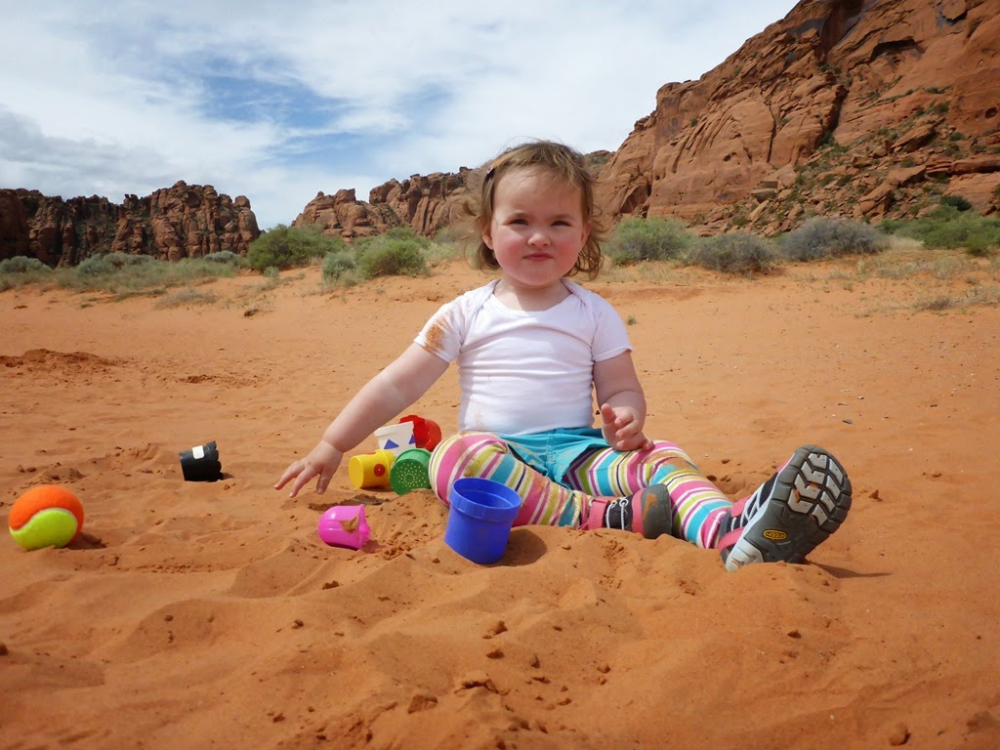
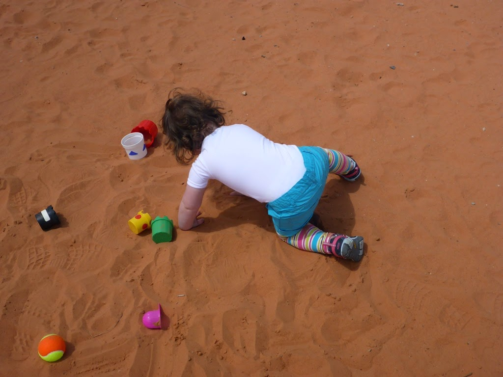
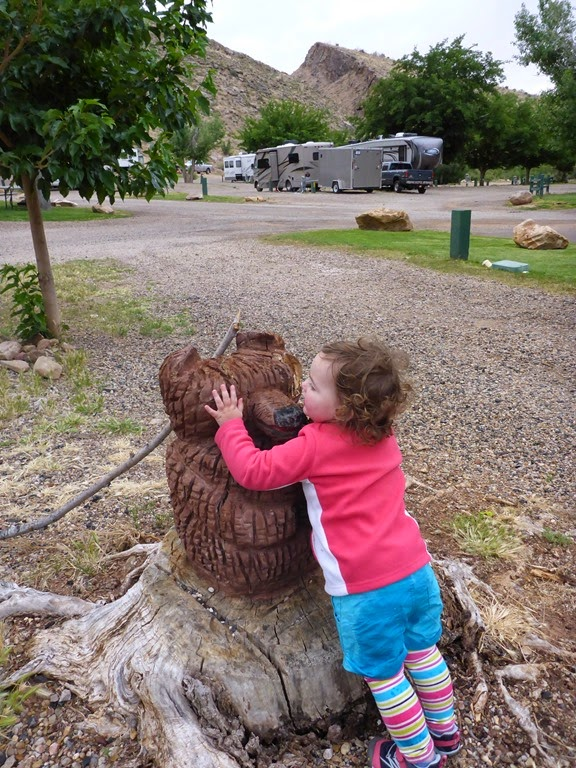

Of eigenlijk Rain Canyon...

De campground in Snow Canyon State Park, net over de grens in Utah, ligt mooi, maar ons plekje is erg smal. Gelukkig staat er niemand naast ons, anders hadden we de buren door het raam de handen kunnen schudden.

We hebben direct na aankomst een klein wandelingetje gemaakt, waarbij Sofie deels in de rugdrager moest, deels ook zelf kon klimmen.

We hebben allemaal goed geslapen, en de volgende ochtend zijn we voor het eerst met de fiets op pad gegaan. Het eerste stuk ging behoorlijk omhoog, maar daarna was het redelijk ontspannen fietsen. Het weer valt wat tegen, er staat een harde koude wind en af en toe viel er een behoorlijke bui. Gelukkig het meeste tijdens het middagslaapje van Sofie.

Tegen haar zin in moet Sofie op de fiets een helm op...

Gelukkig klaarde het vlak voor de lunch even op zodat Sofie lekker in de zand duinen kon spelen terwijl ik de camper ben gaan halen.

Halverwege de middag sloeg het weer helemaal om en kwam het met bakken uit de lucht. Geen lol aan, dus zijn we maar snel naar de volgende camping gereden. Ditmaal de KOA in Hurricane, Utah. Op de camping staat een houten beer en die vindt Sofie erg lief...

