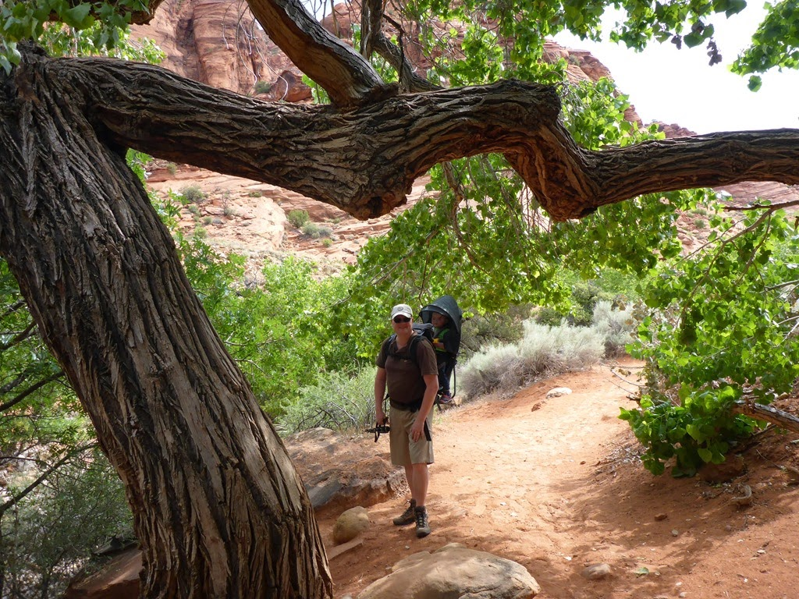
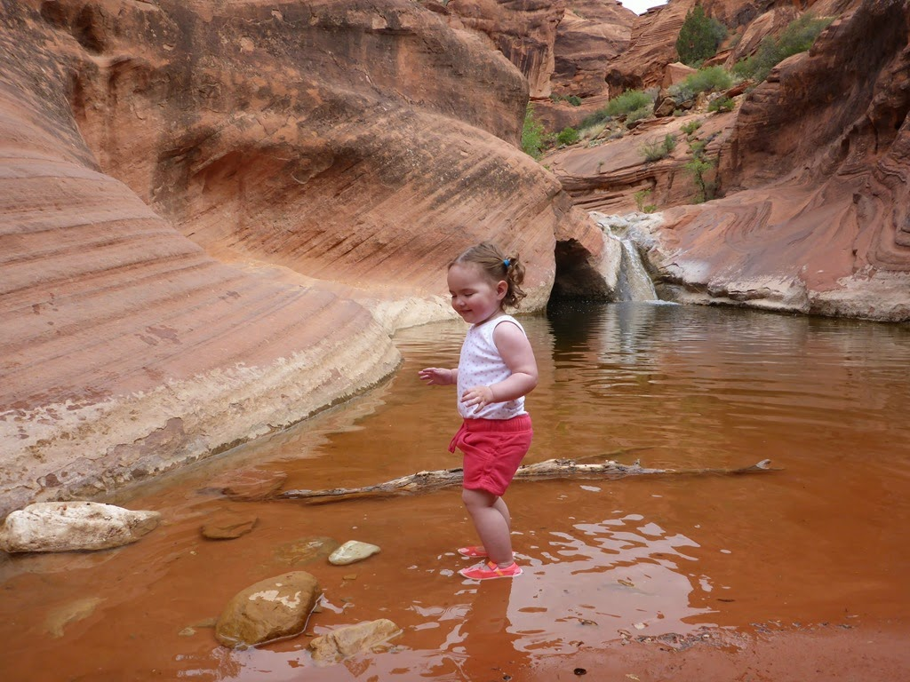
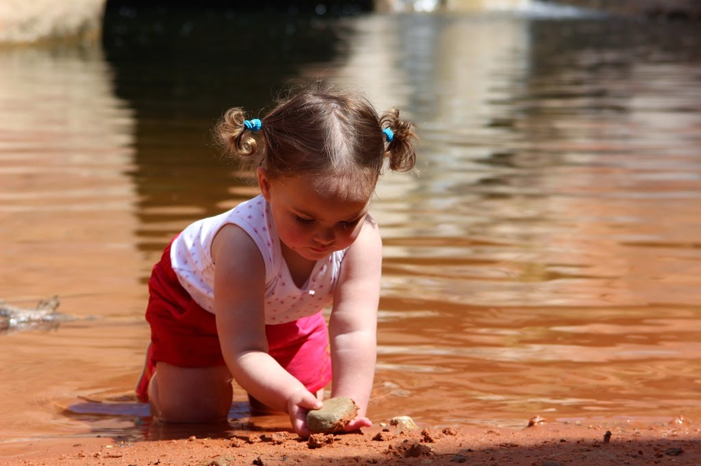
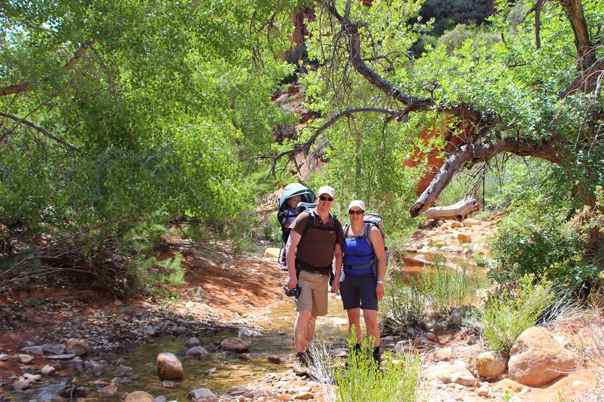
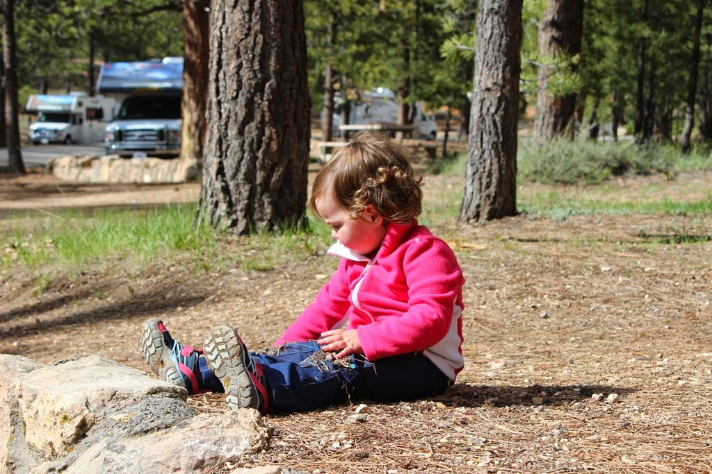

We hebben erg wisselende ervaringen met KOA campings. De ene is super en gelegen op een mooie plek, terwijl in onze beleving de meeste een vervallen indruk maken en "comfortabel bereikbaar" pal naast een snelweg of spoorbaan liggen. De enige reden waarom wij eigenlijk naar KOA's gaan, is vanwege de (was-) faciliteiten en de internet verbinding. Ook de KOA waar we overnacht hebben in Hurricane is niet bijzonder, en de beloofde wifi was ruk en volledig onbruikbaar. Tip voor de volgende keer: in het aan de andere kant van de I-15 gelegen Red Cliffs Recreation Area is een bijzonder leuke camping met ook nog eens een erg leuke wandeling. We hebben Sofie weer in de rugdrager geladen en zijn op pad gegaan.

Na een kleine kilometer kom je bij een waterval en een poeltje waarin je heerlijk door het water kan stappen en spelen.

Na al dit spektakel zijn we via de SR-14 (wow!) en de SR-89 naar Bryce Canyon gereden waar we de komende nacht bivakkeren op de Campground North. Het is zonnig, maar wel fris.

## 1 opmerking

### 2-op-reis24 mei 2015 om 10:05

Wat een gave foto's! Echte hike schoenen voor een dappere stapper. A bientot, maar niet al te vite.
