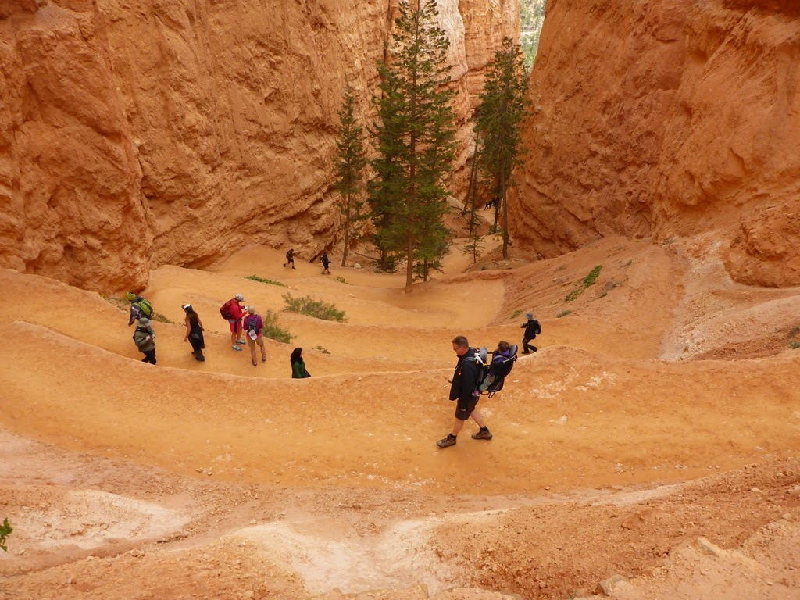
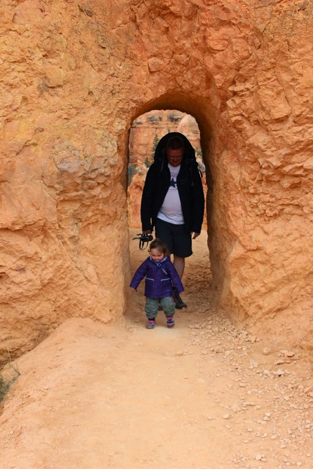
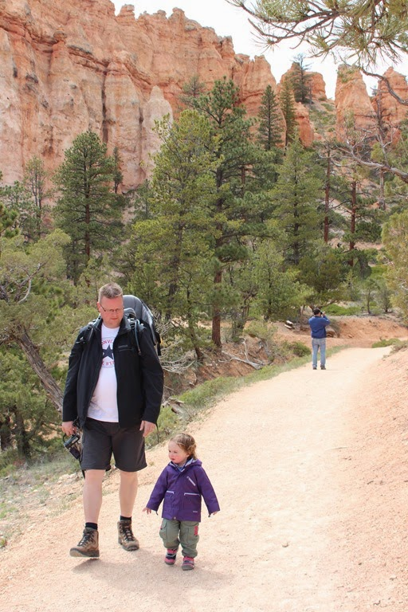
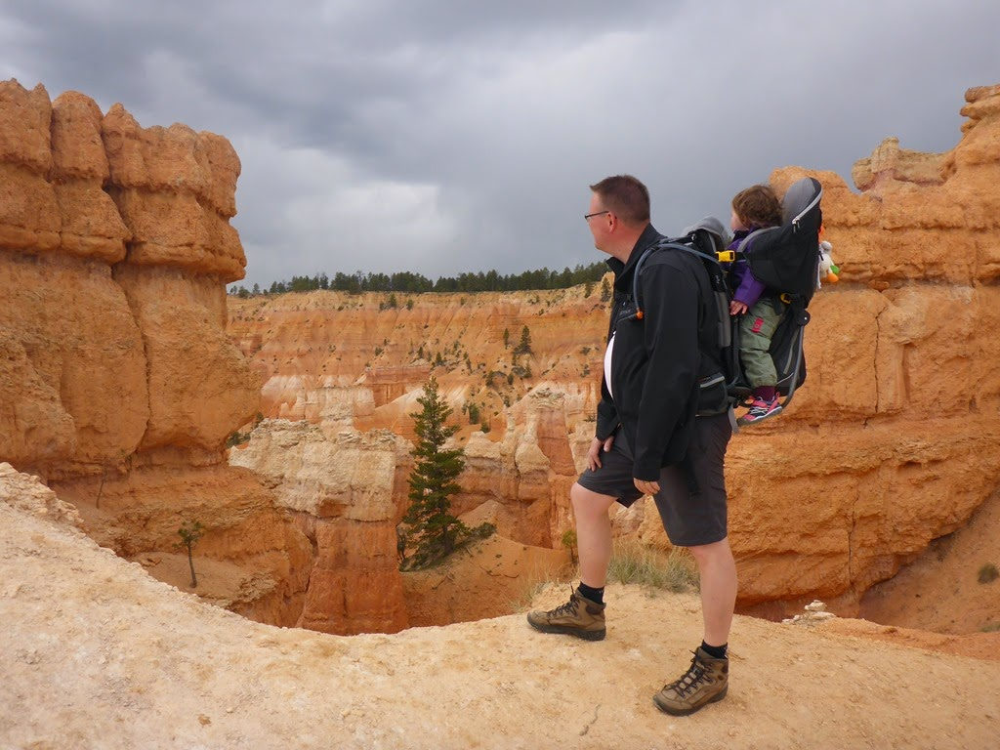
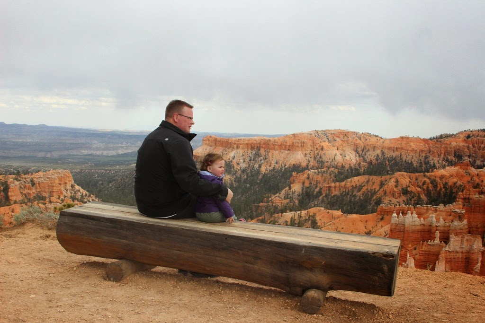

Vanmorgen zijn we verhuisd van de North Campground naar de Sunset Campground. We hebben een erg mooi plekje aan de rand gevonden waar Sofie alle ruimte heeft om te spelen. Na de lunch en het middagslaapje zijn we de canyon in gewandeld. De afdaling via de Navajo Loop trail is erg steil en, zeker met Sofie achter op m'n rug, een behoorlijke inspanning voor de bovenbenen. Maar het is wel een erg mooi deel van de canyon en dat maakt veel goed.

Wanneer je eenmaal beneden bent, is het allemaal redelijk vlak en dus kon Sofie ook zelf lopen.

Via de Queens Gardens zijn we terug naar boven geklommen. Halverwege verschenen donkere wolken aan de hemel, en werd het behoorlijk koud. Ook viel er een aantal druppels regen, maar het zette gelukkig niet door. We zijn dus droog boven gekomen, op wat zweetplekken hier en daar na.

