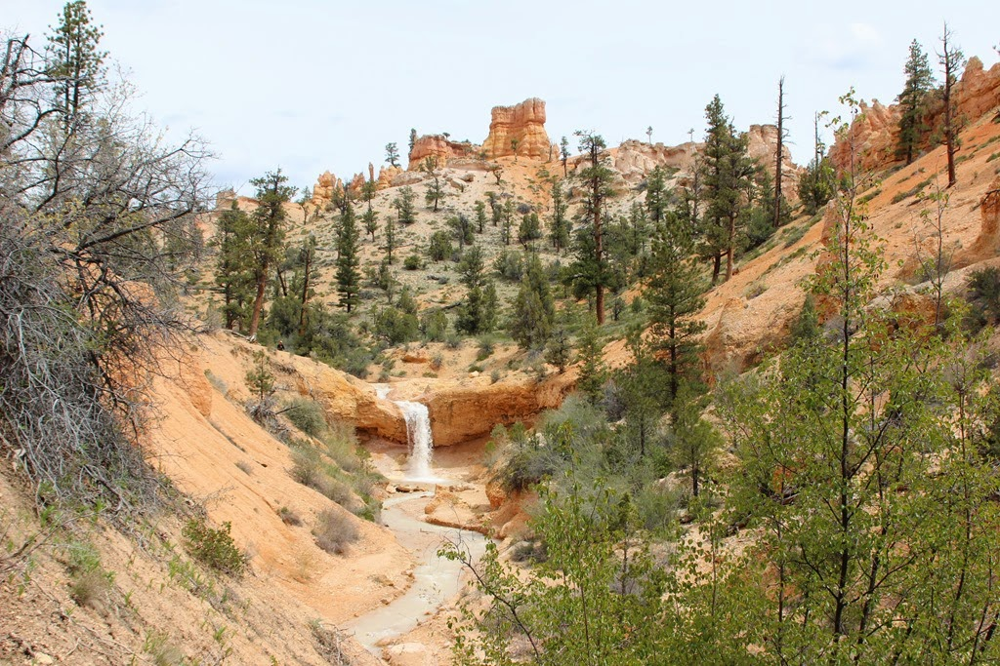
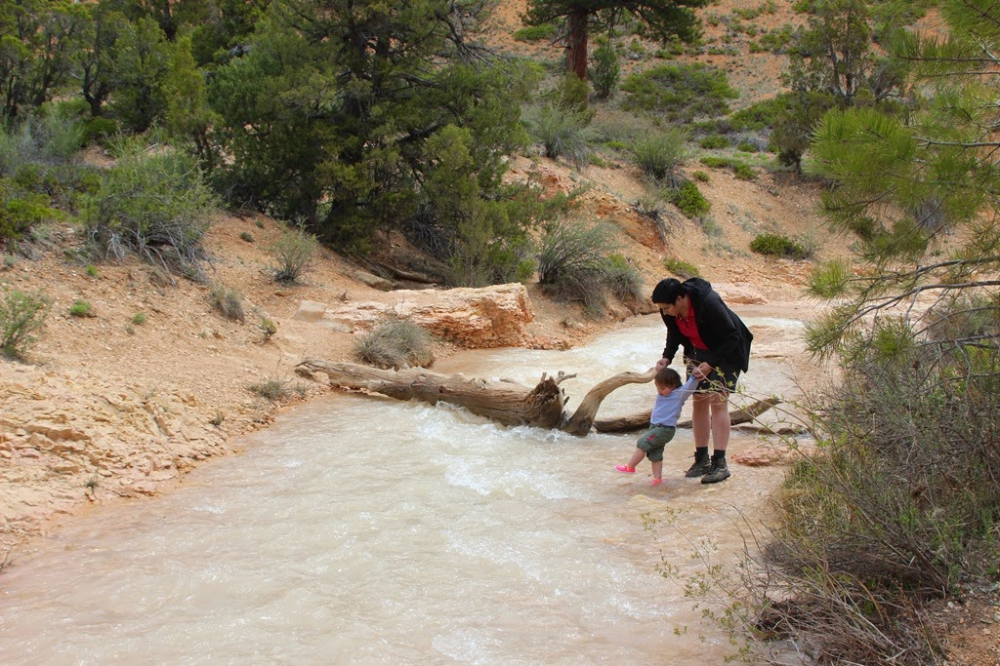
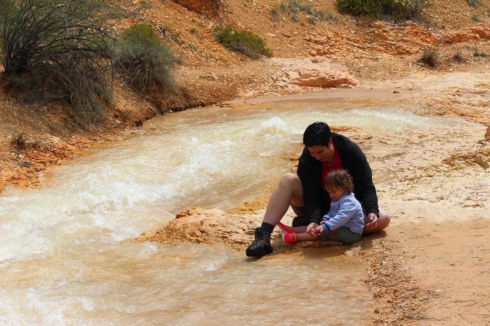
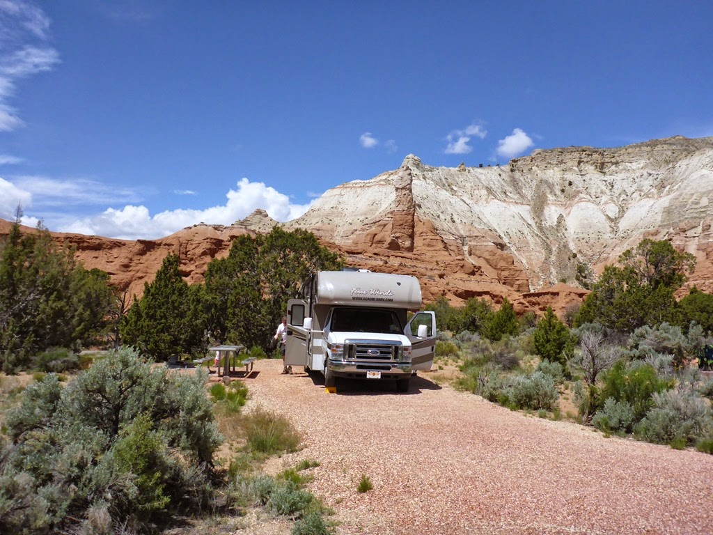
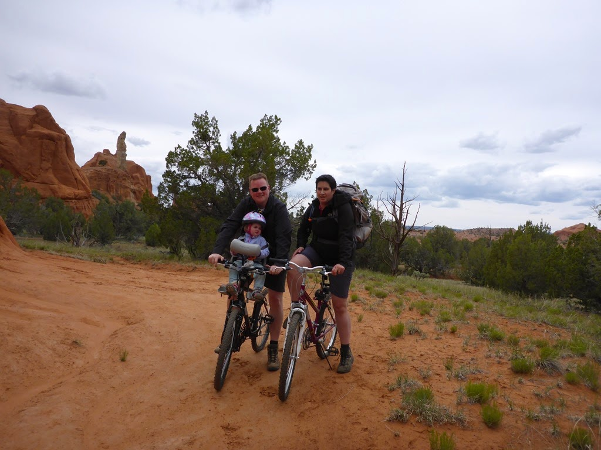
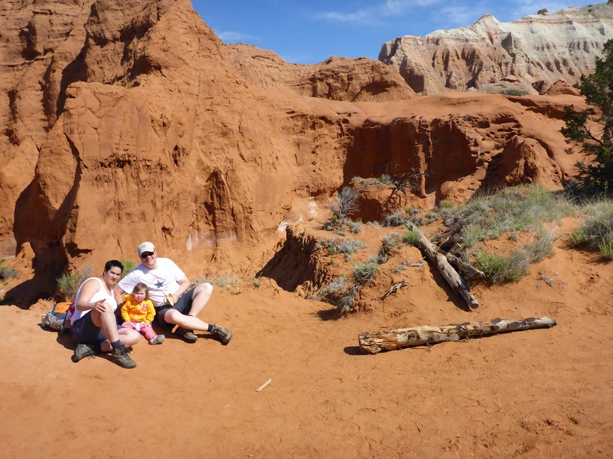
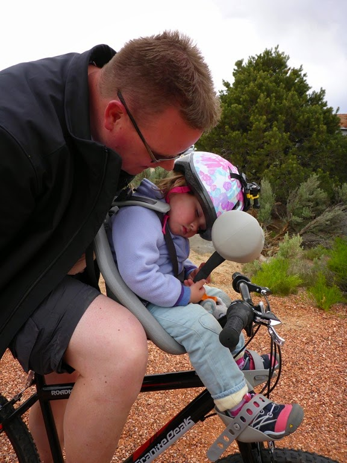

Iets buiten Bryce Canyon ligt Mossy Cave. Van een eerder bezoek wisten we dat de cave zelf niet al te veel voorstelt, maar dat de waterval best de moeite waard is, en dat het stroompje een leuk speelplekje is voor Sofie. Dus de waterschoentjes in de rugzak, en op pad!

Om van Bryce Canyon naar Kodachrome Basin State Park (en verder naar Capitol Reef National Park, onze volgende bestemming) te komen, nemen we SR-12 oostwaards. Volgens de Lonely Planet is deze 125 mijl lange weg een van de mooiste wegen van heel de VS. En het moet gezegd, het landschap is spectaculair! Van rotsen in alle mogelijke kleuren tot uitgestrekte bossen, en ook nog eens tot een hoogte van 9600 voet.

Kodachrome Basin SP zelf is klein, maar heeft een erg leuke camping. We verblijven hier twee nachten, dus we hebben alle tijd voor ontspanning en wat activiteit.

Bovendien kun je er leuk wandelen en fietsen. Wij hebben twee mountainbike routes gedaan, de Grand Parade en de Panorama trail. We hebben de action camera voor het eerst gemonteerd op de fiets van Chantal, en de resultaten zijn best goed. Hier gaan we dus meer gebruik van maken!

Van al dat fietsen word je wel een beetje moe...

