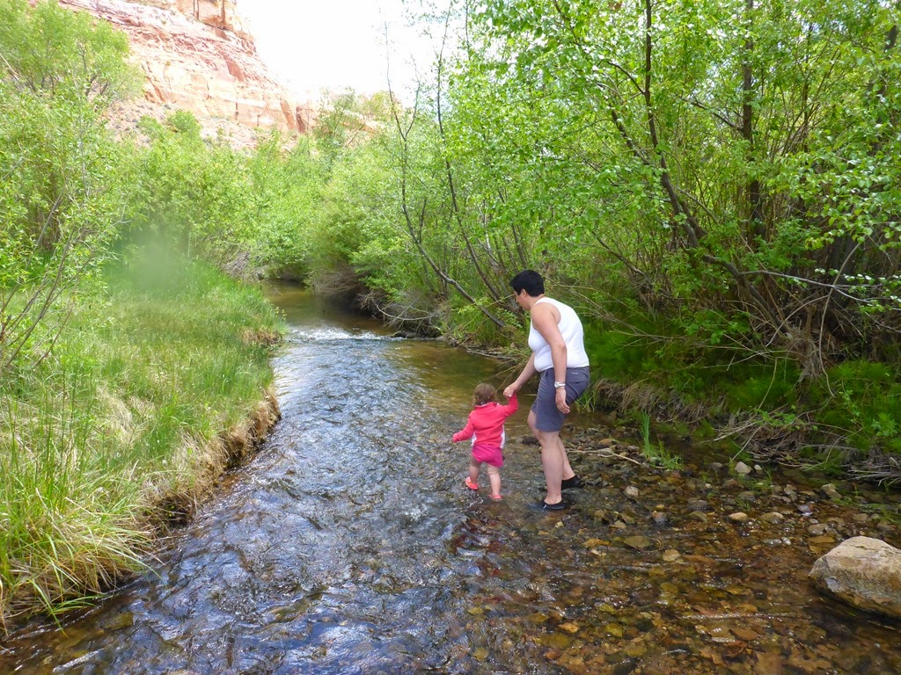
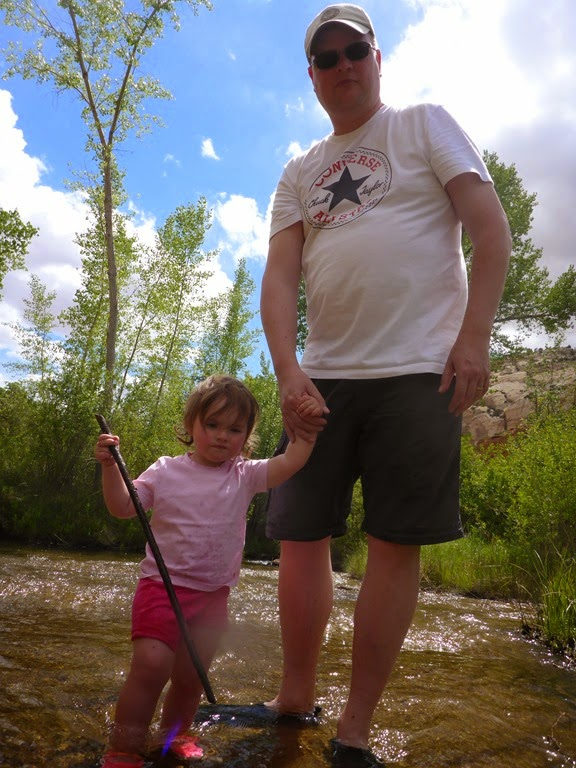
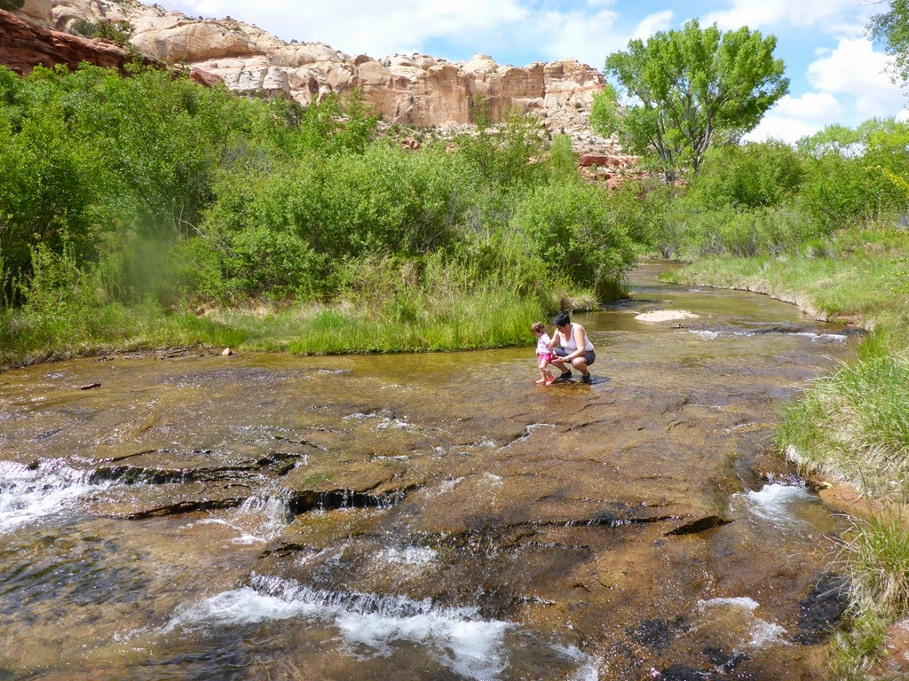
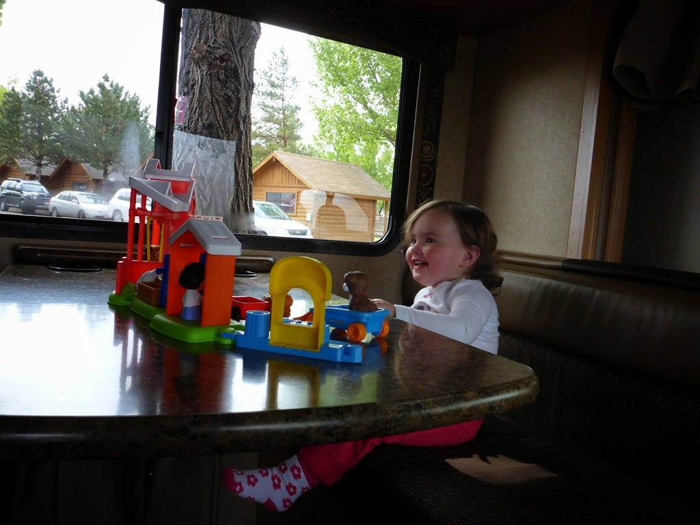
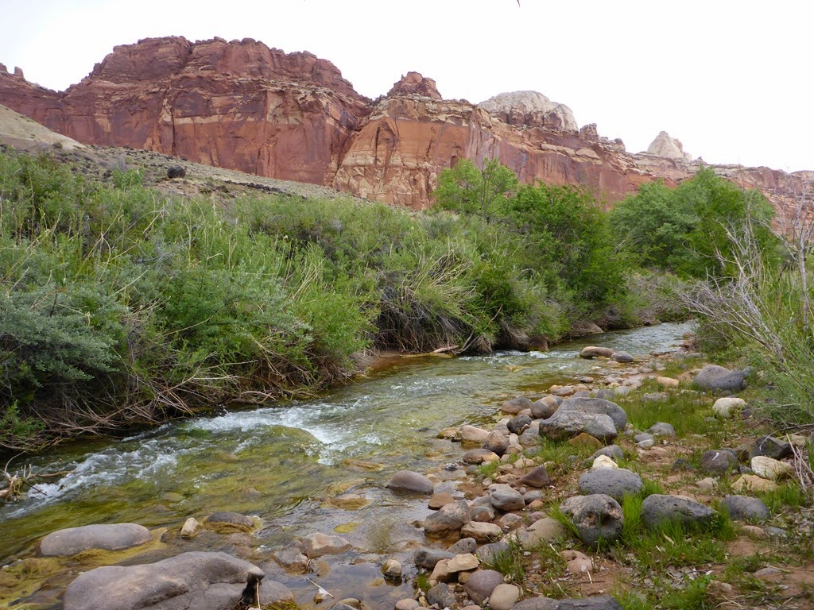
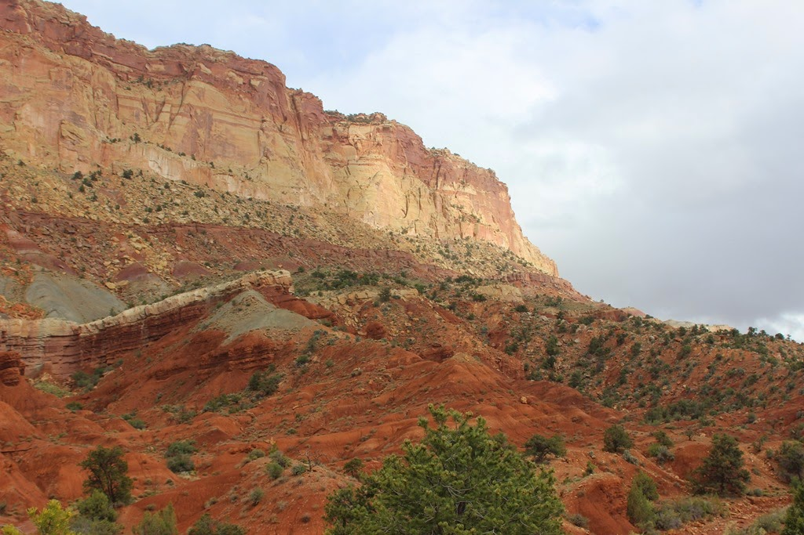
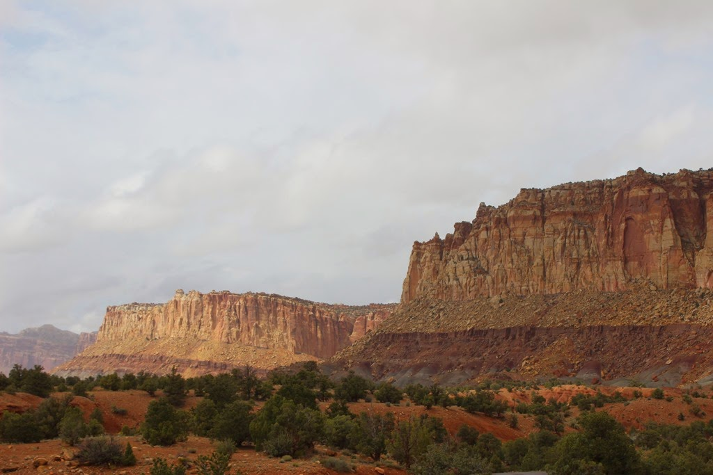

Om de rit van Kodachrome naar Capitol Reef voor Sofie een beetje leuker te maken, stoppen we halverwege bij Calf Creek Campground. Hier gaan we niet overnachten, maar pootje baden in het lokale stroompje. Sofie is niet uit het water te slaan!

Nadat we de voeten weer afgedroogd hadden, zijn we doorgereden naar de 1000 Lakes campground in Torrey, nog steeds in Utah, onze standplaats voor de komende twee nachten. Het is Memorial Day weekend, en dat betekent dat het druk is, want alle Amerikanen zijn maandag vrij. Van hieruit gaan we Capitol Reef National Park ontdekken. 's Avonds hebben we gebruik gemaakt van het Western Style diner op de camping. Een halve kip en een Western Bratwurst: beide waren boven verwachting goed. Boven de camping en omringende bergen hangen donkere wolken en in de verte hoor je af en toe een donderklap. Na het eten ging het regenen, en dat heeft eigenlijk de hele nacht en ochtend aangehouden. Bovendien moesten we wat kleren wassen, en dat betekende dat we het binnenprogramma in werking moesten laten treden.

De lunch hebben we gebruikt op de picknick area in het National Park. Op een kleedje onder de bomen hebben we een broodje gegeten. Daarna ging Sofie op jacht om vogeltjes te vangen. Ze rent er naar toe en roept "Kom maar" en "knuffel". Ze is vervolgens oprecht teleurgesteld wanneer het vogeltje eieren voor z'n geld kiest en wegvliegt. Na de lunch hebben we een klein stukje gewandeld, maar na een paar honderd meter zijn we vanwege de te harde regen omgedraaid en teruggekeerd naar de camper.

Uiteindelijk hebben we maar de scenic drive gereden, en die is erg de moeite waard. De weg slingert tussen alle rotsen door en biedt vele mooi uitzichten.

Om de dag feestelijk af te sluiten zijn we gaan eten bij het Red Cliffs restaurant in Torrey.

## 1 opmerking

### Gerard 25 mei 2015 om 00:37

Hallo Vakantiegangers,

Wij hebben genoten van jullie eerste reisverhalen en de bijbehorende beelden. Wat heeft Sofie een blije uitstraling.
Zij geniet zo te zien van alles en is natuurlijk erg blij met papa en mama de hele dag om haar heen, dus papa en mama genieten ook.
Sofie voelt zich, net als de ouders, al thuis in USA. Leuke camper zo te zien en prima fietsen voor dat geld.
En als het Sofie even te veel is geworden legt ze haar hoofdje even te rusten.....
Geniet er samen maar lekker van, veel liefs en kusjes en knuffels voor Sofie.

Mams en Paps
