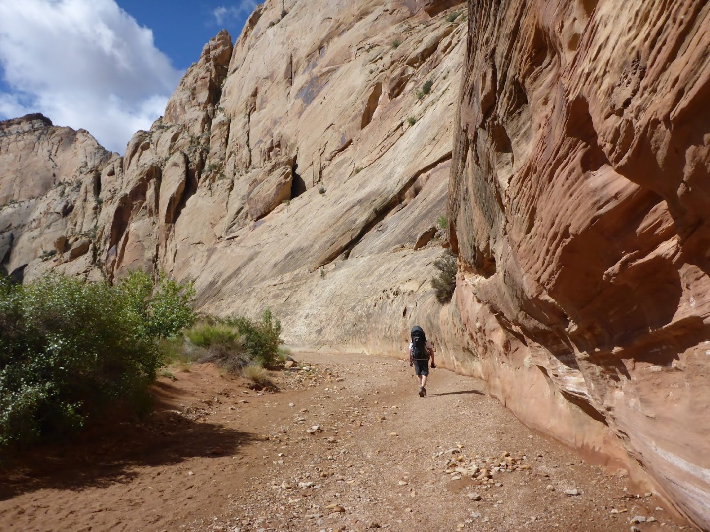
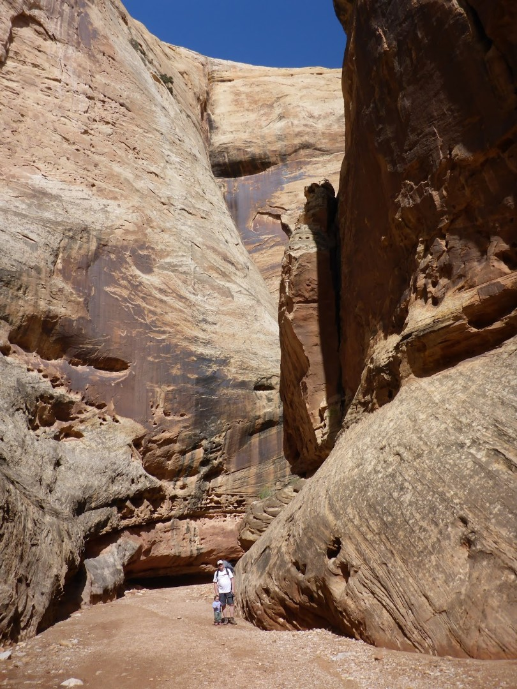
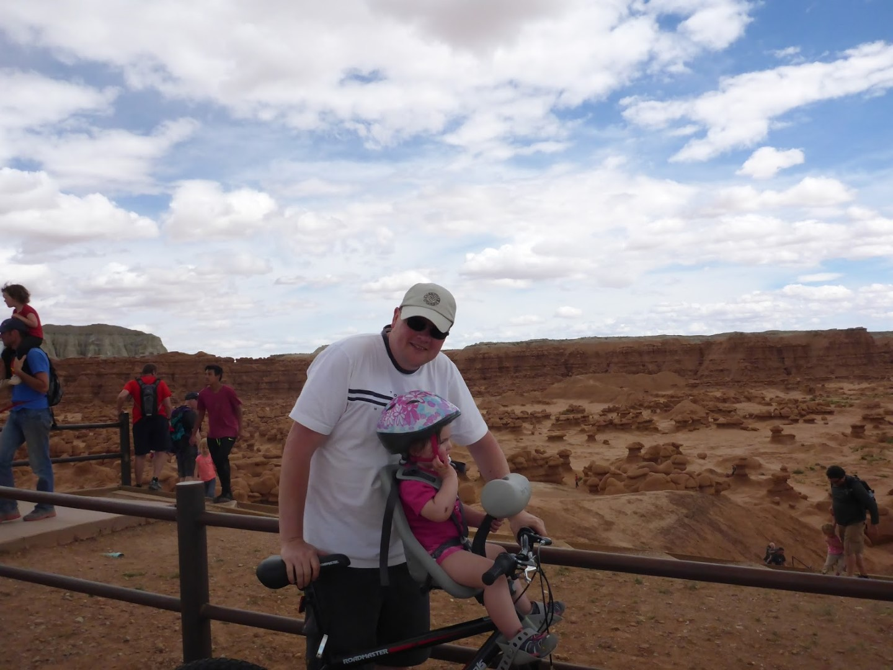
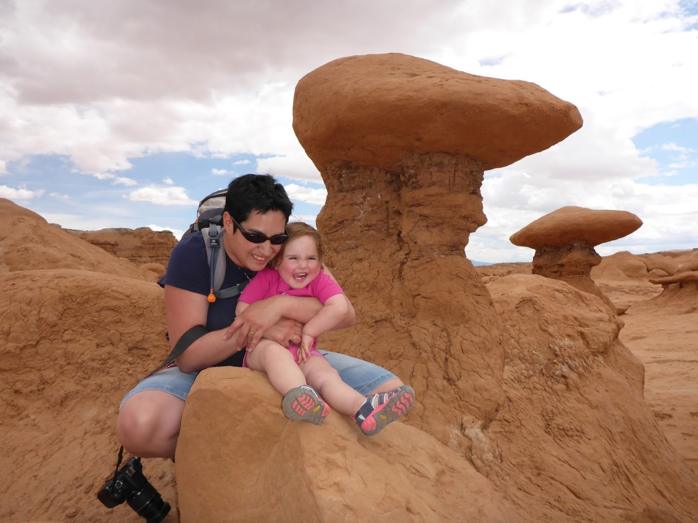
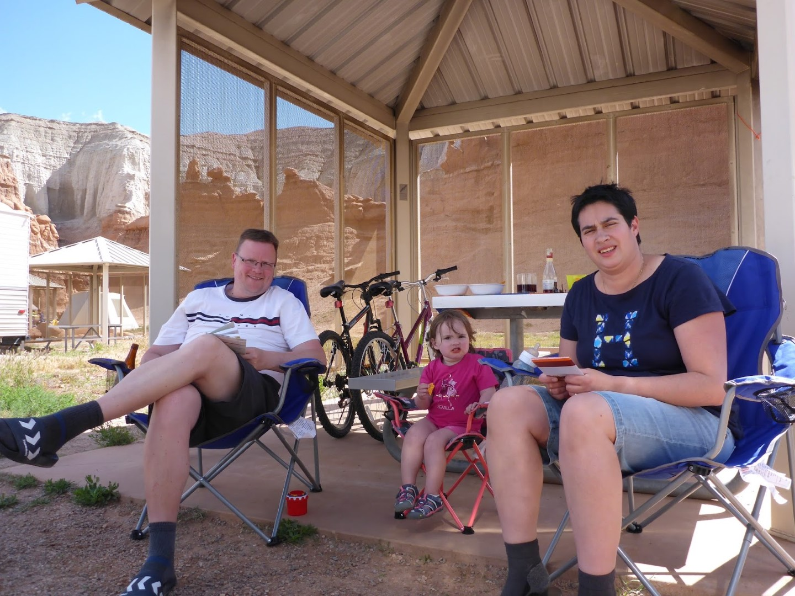
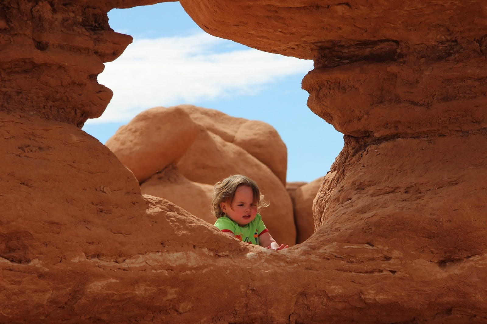
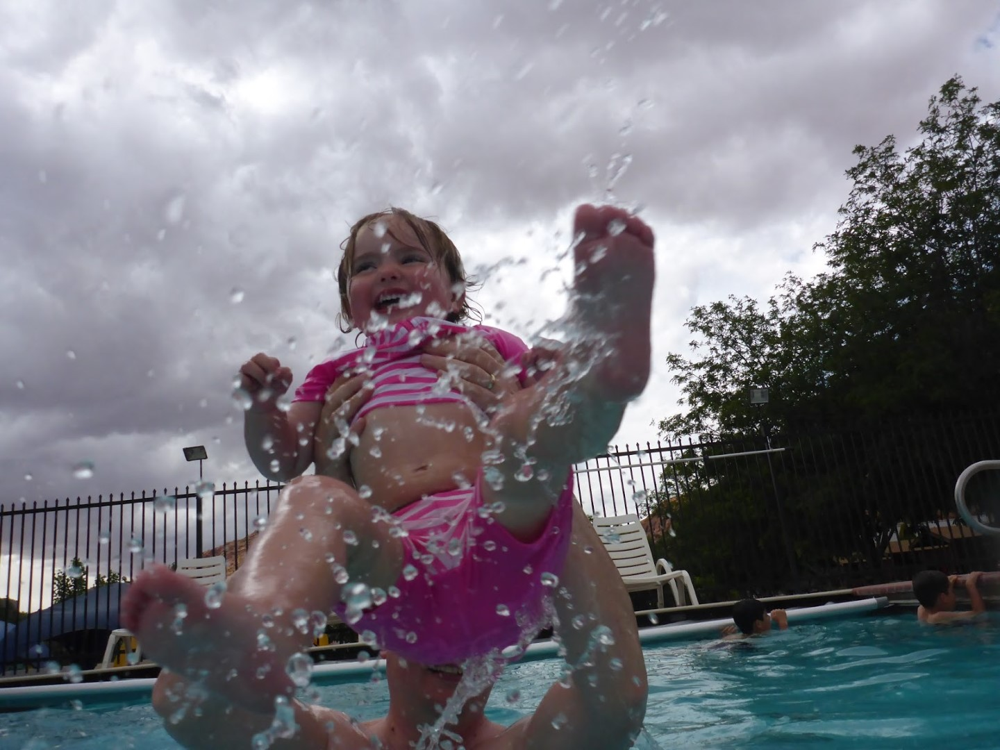
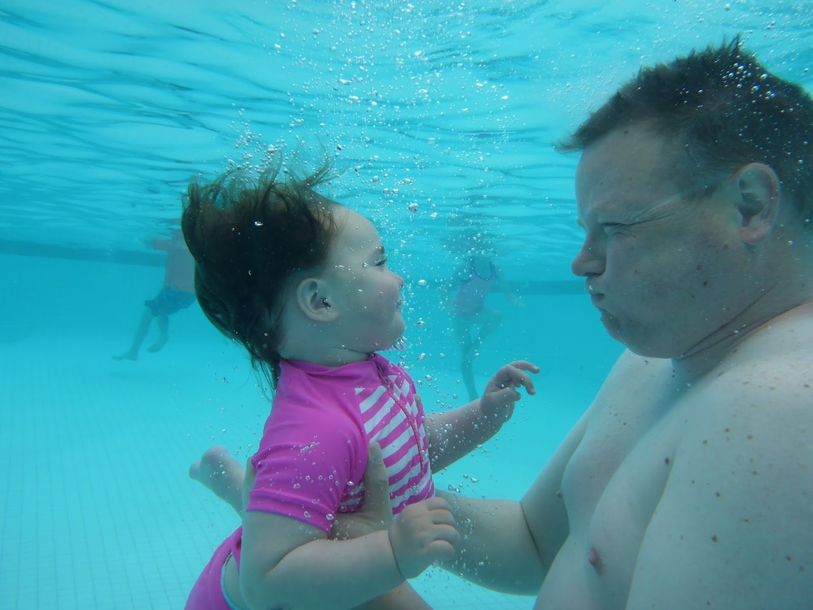

Vanmorgen toen we Capitol Reef NP verlieten, kwamen we langs een van de top wandelingen in het park, dus die hebben we maar meteen meegepikt: de Grand Wash. Bij deze 3.5 km lange wandeling loop je door een droge rivierbedding met als hoogtepunt The Narrows. De rivierbedding is hier nog maar 5 meter breed en de wanden links en rechts torenen zo’n 80 verdiepingen de hoogte in. Erg indrukwekkend!

Daarna hebben we een uurtje gereden naar het volgende state park op onze lijst: Goblin Valley State Park. Hier hebben we de stalen rossen weer uit de garage gehaald, en zijn we die Goblins eens gaan bekijken. Goblins zijn gesmolten rotsformaties uit een Salvador Dali fantasie die een vallei vullen in de vorm van het Coliseum. Je mag hier als bezoeker vrijelijk tussen de champignon-achtige structuren wandelen, wat een heel apart gezicht is.

Na dit alles hebben we lekker de BBQ en het kampvuur aangestoken.

Omdat Sofie zoveel plezier had bij de goblins zijn we de volgende ochtend weer teruggegaan en hebben we tussen de goblins (en Chinezen) gewandeld.

Na de lunch hebben we het state park verlaten en zijn we naar Moab Valley RV Resort gereden in, jawel, Moab. Moab is de toegangspoort tot Arches en Canyonlands National Park. We verblijven twee nachten op deze camping. Na aankomst zijn we meteen het zwembad in gedoken.

's Avonds hebben we geheel in Yankee style een pizza laten bezorgen die bijzonder goed smaakte.
