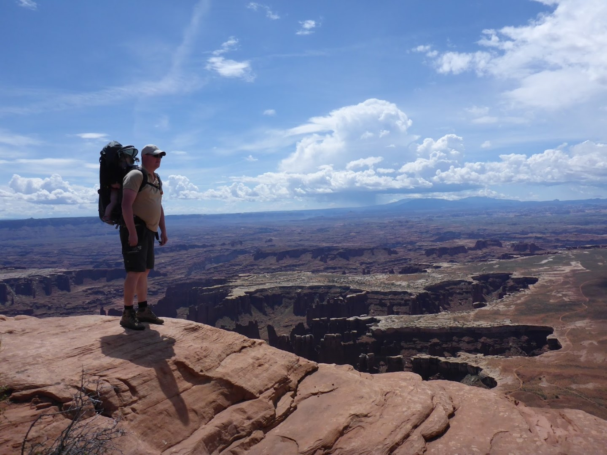
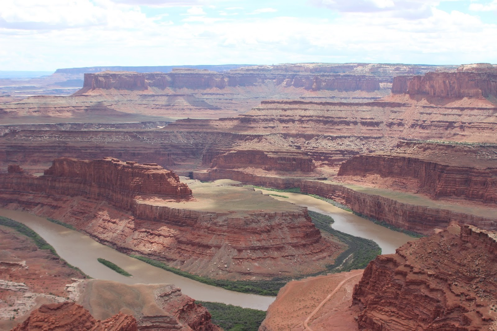
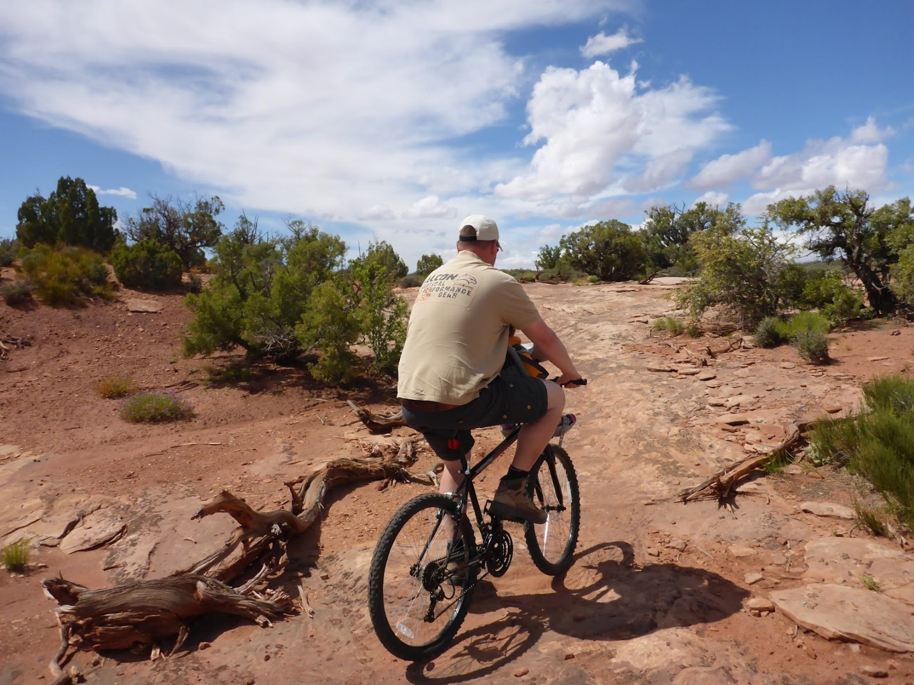
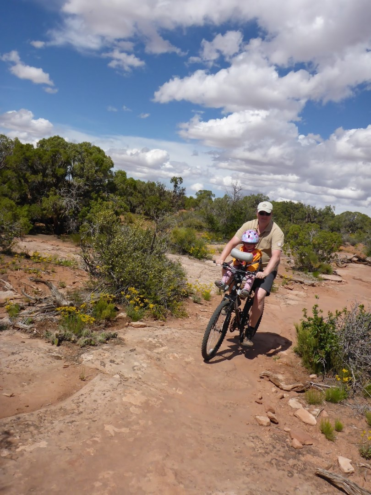
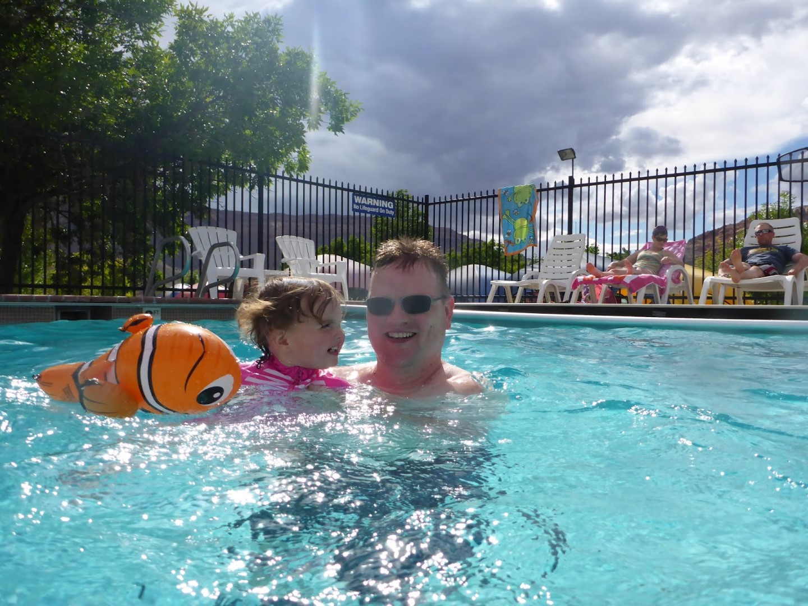

We waren even vergeten dat het vanuit Moab nog altijd zo'n 60 kilometer rijden is naar Canyonlands en dus kwamen we wat later dan gepland in het park aan. Het is vandaag eigenlijk voor het eerst deze trip warm, maar er hangen nog altijd dreigende wolken in de lucht.

Canyonlands is min of meer vergelijkbaar met de Grand Canyon maar eigenlijk mooier omdat het allemaal wat toegankelijker is, of in ieder geval lijkt. Het park biedt vele 4x4 off-road mogelijkheden, maar met Sofie erbij lijkt het ons niet zo verstandig dit avontuur nogmaals op te zoeken. We hebben dit bij ons eerdere bezoek in 2008 al een keer met een gehuurde Jeep gedaan en dat was wel heel erg leuk om te doen. Moeten we maar even wachten tot Sofie wat ouder is... hebben we meteen een excuus om nog een keer hierheen te komen. Qua wandelen zijn de mogelijkheden hier wat beperkter, ook al omdat het in de zomer makkelijk 40+ graden kan worden. Het landschap hier is opzienbarend door de werking van de Green en Colorado River, die hier samenkomen en verder doorgaan als de Colorado River, die een stuk verderop heeft huisgehouden in de Grand Canyon.

We zijn helemaal naar het einde van de weg in Canyonlands gereden en hebben daar de Rim walk gewandeld. De uitzichten zijn adembenemend, ook al door de afgronden waarlangs je moet lopen.

Na dit wandelingetje zijn we naar Dead Horse State Park gereden, waar de Colorado River een mooie kronkel maakt.

Na de lunch zijn we vanuit het Visitor Center een stukje gaan fietsen (de Entrepid trail). Het padje was leuk en goed te doen op onze bikes van 80 dollar.

Sofie vindt al dat gehobbel erg leuk en het kan niet hard genoeg gaan, dan gilt ze van plezier. We zijn trouwens erg blij met het kinderzitje dat we van huis hebben meegenomen. Hier kennen ze alleen kinderzitjes die achterop moeten, en dat is voor Sofie natuurlijk een stuk minder leuk omdat ze dan niet veel kan zien.

Om af te koelen van al dat spektakel zijn we op de camping weer direct, inclusief Nemo, het zwembad ingedoken.

's Avonds zijn we Moab ingereden en hebben gegeten bij de Moab Brewery die naast een bijzonder lekkere Red Rye IPA ook lekkere chicken wings en ribs in huis hadden.

## 1 opmerking

### Gerard 3 juni 2015 om 23:59

Hallo Vakantiegangers,

Wat lijkt Sofie toch groot en wat heeft zij een plezier. Ik zou wel eens willen weten wat in haar hoofdje omgaat bij alles wat zij beleeft. En, met zo'n gezellige spruit in jullie midden hebben jullie natuurlijk ook de tijd van je leven.
Geniet er samen nog maar lekker van. Dikke knuffel voor Sofie
