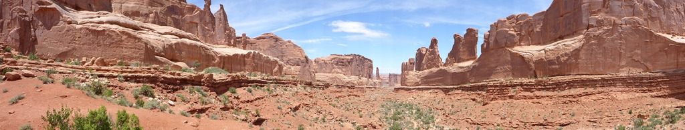
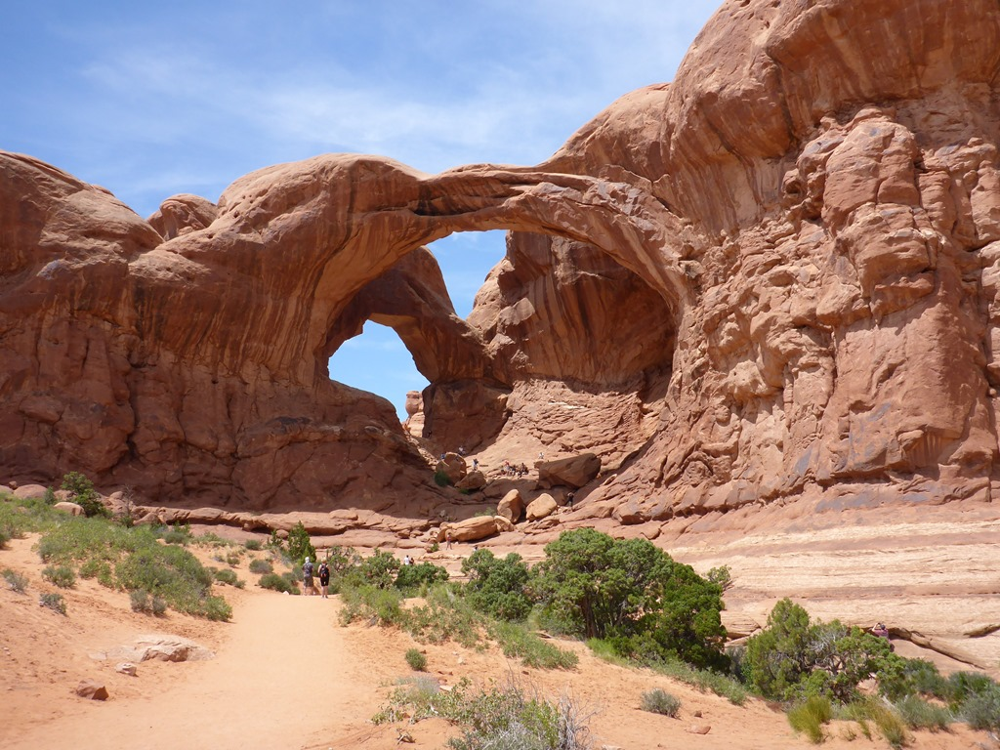
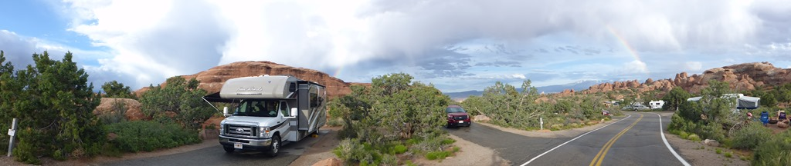
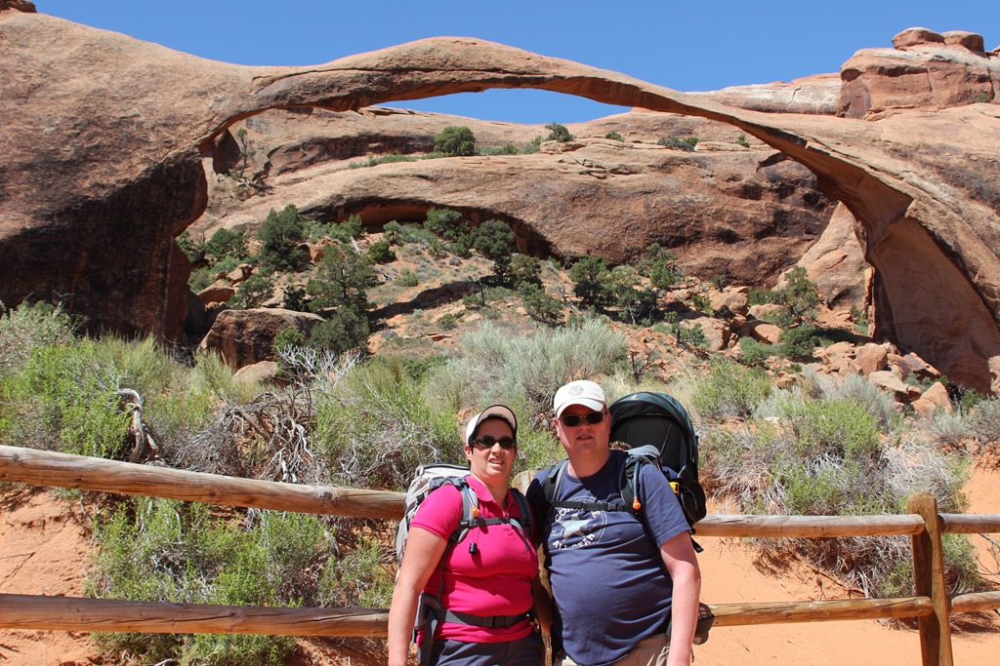
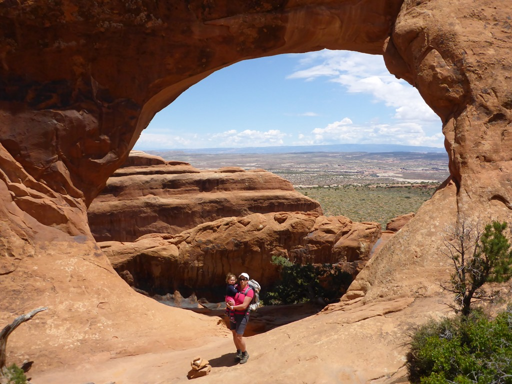
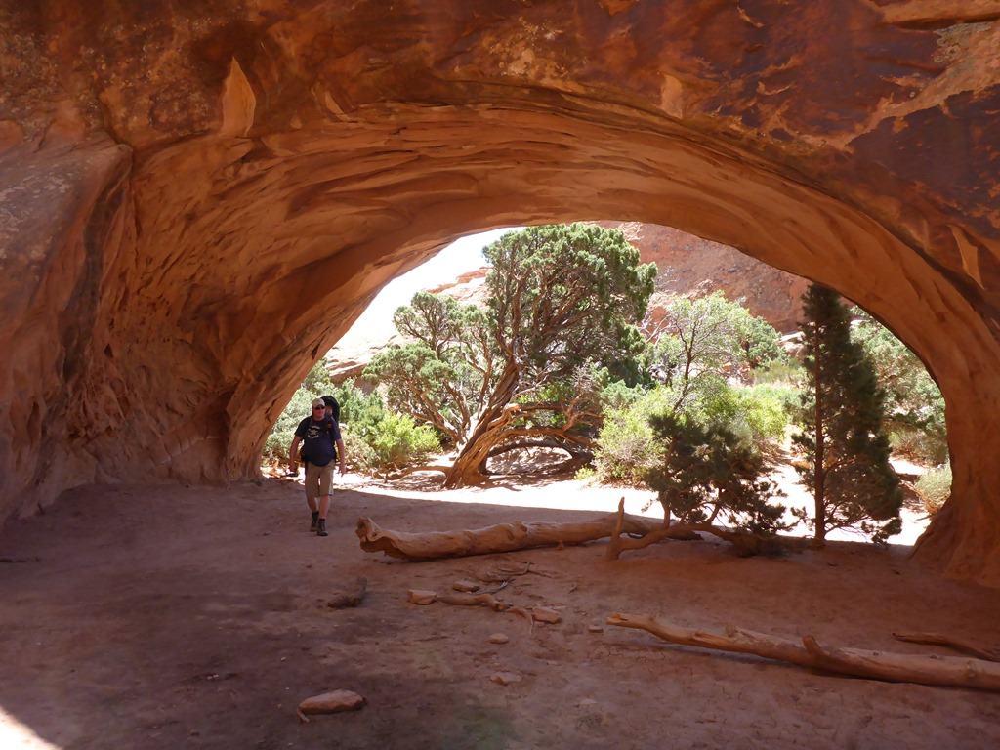
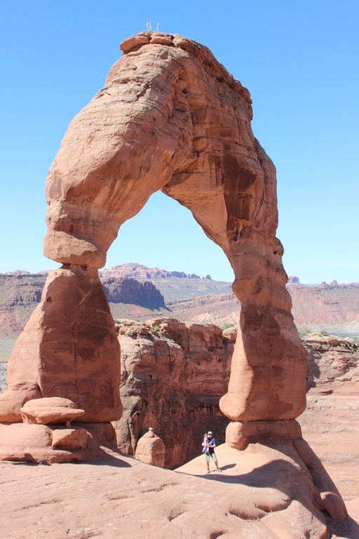
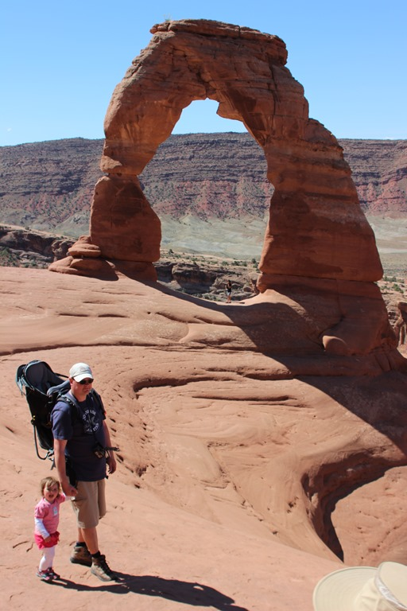

's Morgens werd parallel aan de was nog een bezoek gebracht aan het zwembad, en daarna zijn we vertrokken naar het volgende nationale park: Arches. Beroemd vanwege de vele bogen, in het park schijnen er zo'n 2000 te zijn, van 1 meter breed tot wel 100 meter. Eerste stop was Park Avenue, hier zijn dan wel geen arches, maar wel enorme platte, rechtopstaande "wanden". Mooi om te zien.

Daarna gingen we, Microsoft-fans als wij zijn, direct door naar de Windows sectie waar een aantal spectaculaire arches is te bewonderen.

Helemaal aan het einde van de weg door Arches kom je aan op de Devils Garden Campground, waar we een mooi plekje hadden. Met uitzicht op de besneeuwde toppen van de La Sal Mountains in de verte.

De volgende ochtend hebben we de Devils Garden trail gelopen. Tenminste, een deel daarvan, de hele trail is te lang (en het laatste deel is een primitive trail wat betekent dat je op handen en voeten op rotsen moet klimmen en dalen). Uiteindelijk hebben we Landscape Arch bezocht met een overspanning van ruim 100  meter, en ook nog de Partition en Navajo Arches. Op de terugweg klonk er muziek in de canyon, en wat bleek? Een verdwaalde Oostenrijker had zijn waldhorn meegenomen en gaf een mooi moppie weg!

De volgende morgen zijn we vroeg opgestaan om het hoogtepunt van dit park te gaan bezichtigen: Delicate Arch. Bij beide voorgaande bezoeken zijn we er nooit toe gekomen om deze arch te gaan gaan bekijken. En dat is best jammer, want ondanks de zware klim naar boven, is de arch zeer de moeite waard!

We vonden Delicate Arch zeer indrukwekkend. Ook al omdat hij boven op de top van een berg staat. Aan de ene kant is een steile afgrond, aan de andere kant een soort trechter die steeds steiler naar beneden gaat.

Na deze ochtendgymnastiek zijn we weer in de Roadbear gestapt om richting Monument Valley te gaan. Maar niet voordat we in Moab nog even naar onze oude camping geweest zijn om te dumpen, en even gebruik te maken van het zwembad.

## 1 opmerking

### Anoniem 6 juni 2015 om 09:27

Gaaf die Windows applicaties. Mooie, leuke verhalen verder. En nog indrukwekkendere èn jaloersmakende foto's. We zien uit naar jullie avonturen op zoek naar Apple - rock. iRock NP is ook erg mooi! Veel plezier.
