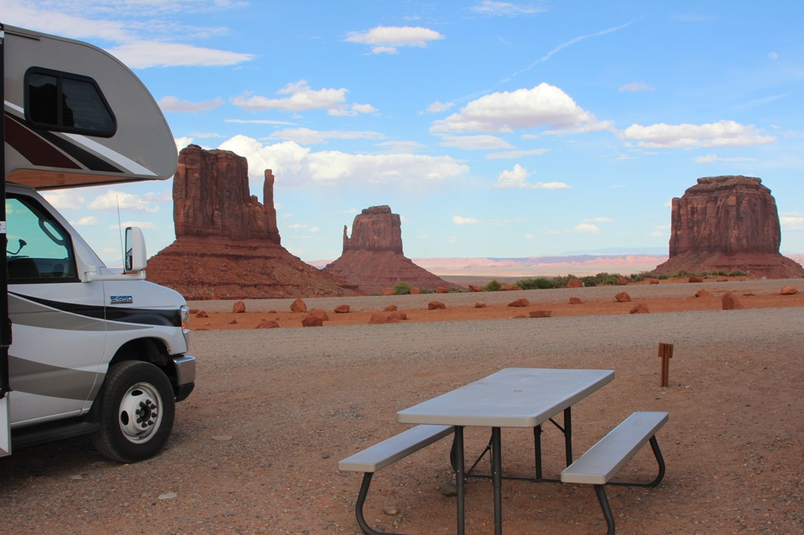
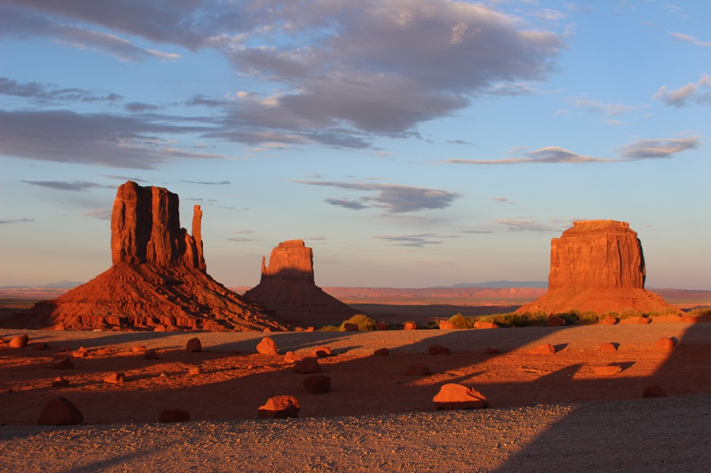

De kortste afstand tussen twee punten is een rechte lijn. Dit mathematisch basisprincipe wordt in Utah (en Arizona trouwens ook) veelvuldig toegepast, wat resulteert in kilometerslange rechte wegen door dorre omgevingen. Zeker als je een paar kilometer gewandeld hebt en het warm is, dan krijg je vlug de neiging te gaan zitten suffen tijdens het rijden. Zo konden we nog maar net op tijd stoppen voor een loslopende hond die plots de weg overstak.

De heren Indianen hebben sinds vorig jaar een camping aangelegd bij The View Hotel in het Tribal Park en het hotel zelf en de omringende faciliteiten grondig gerenoveerd (wat eerlijk gezegd ook wel erg nodig was). Op je kampeerplek heb je geen stroom of water, maar wel wifi. En het uitzicht is fenomenaal!

Aangezien we wat aan de late kant aankwamen, konden we meteen genieten van de zonsondergang.

De volgende morgen hebben we de fietsen gepakt en zijn we een klein stukje de scenic drive door de Valley gaan verkennen.

Na de lunch zijn we weer doorgereden naar de volgende bestemming Page, Arizona.
