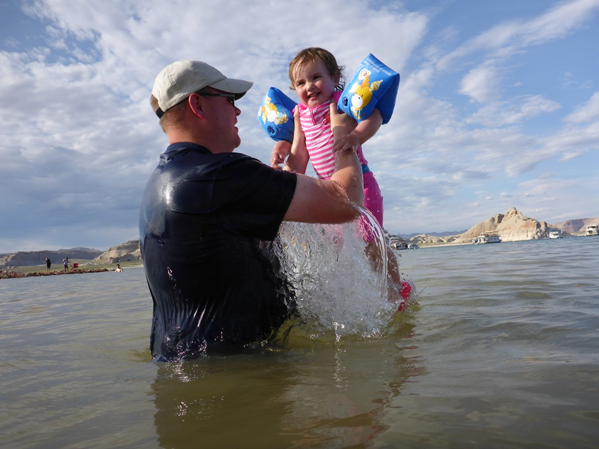
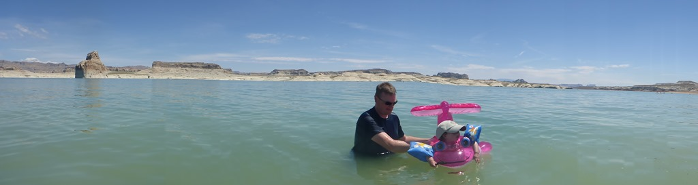
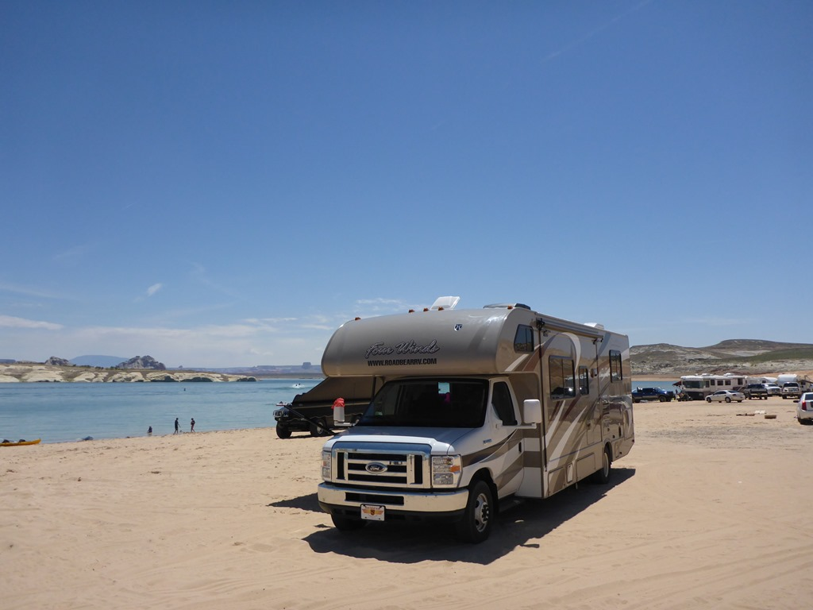

Vlak voordat de Colorado River de Grand Canyon instroomt, zorgt de Glen Canyon Dam bij Page (over de grens van Arizona) voor het enorme Lake Powell. Het meer dient als watervoorraad maar ook voor het opwekken van energie. Daarnaast vormt het een mooi gebied voor de watersportliefhebbers in de vorm van het Glen Canyon National Recreation Area. We hebben overnacht op de keurige camping in Wahweap. Omdat het hier erg warm is (38 graden) zijn we direct na aankomst gaan zwemmen in Lake Powell.

De volgende ochtend hebben we de camper geparkeerd op het strand van Lone Rock en zijn we weer gaan zwemmen. Het blijft toch apart, met je auto op het strand. Je kunt hier ook overnachten trouwens, maar dat gaan we wellicht een ander keertje doen.

En oh ja, Sofie wilde eindelijk in haar super-de-luxe zwembandje...

