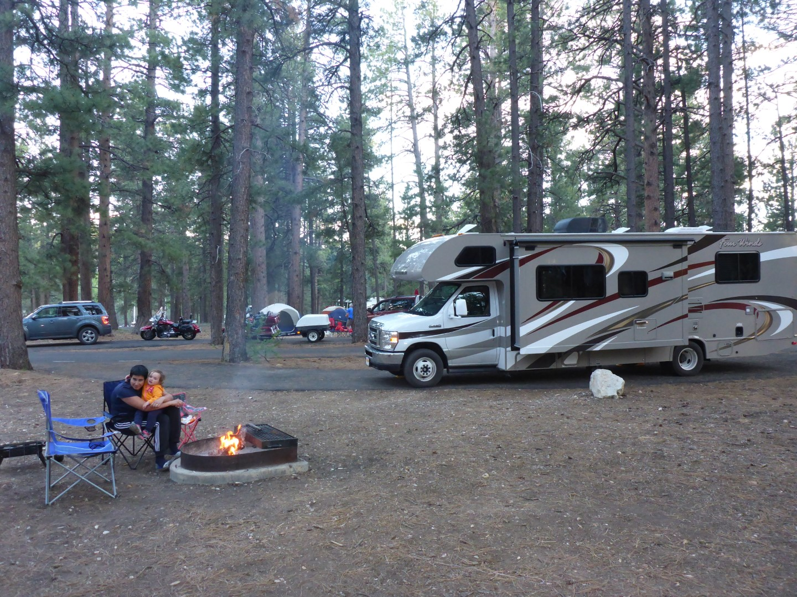
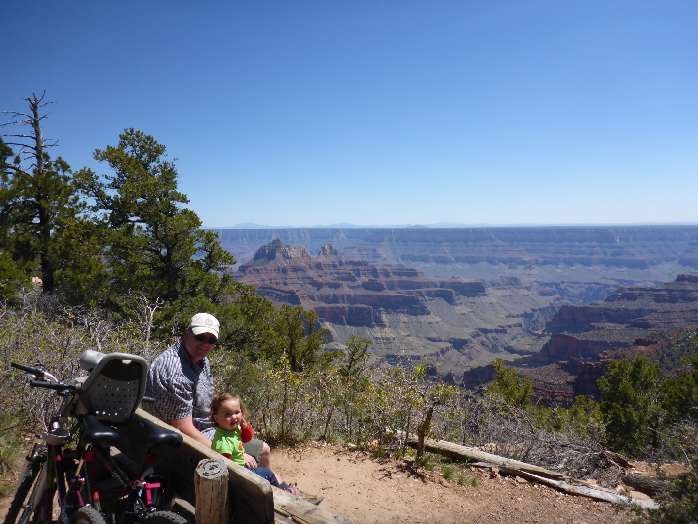
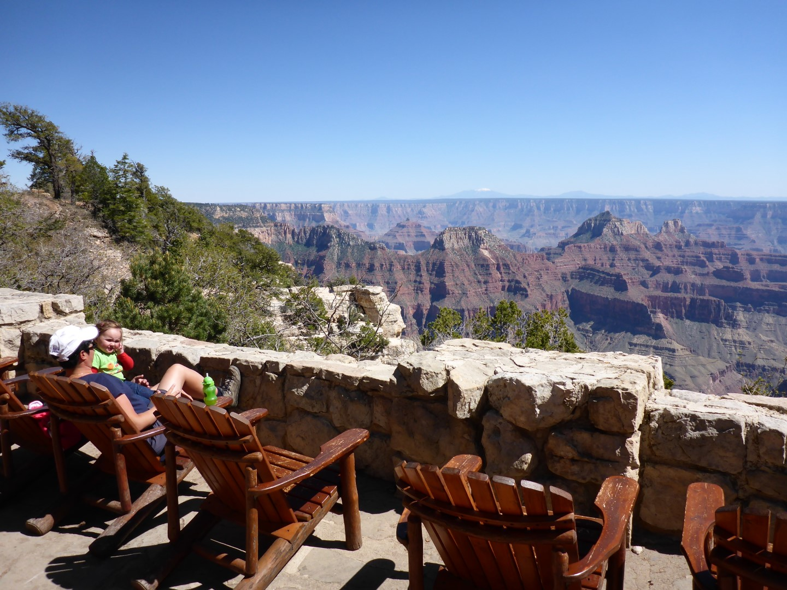
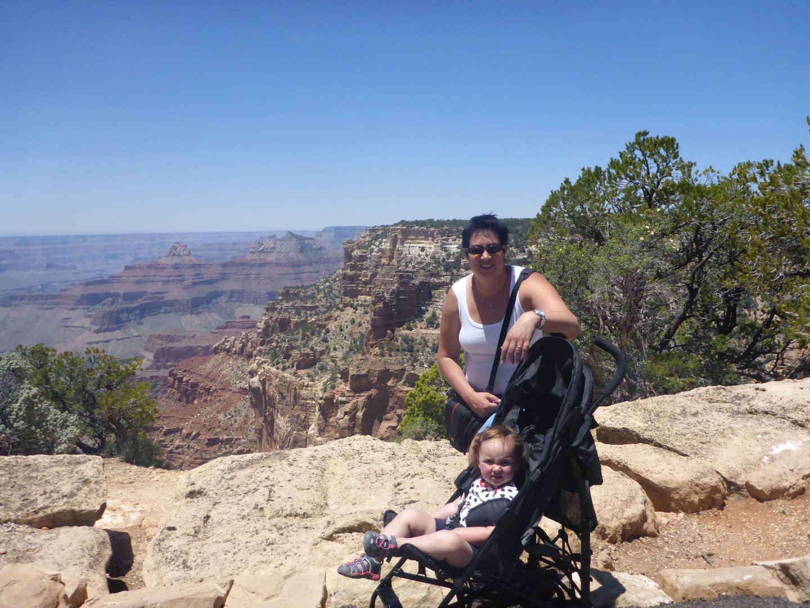
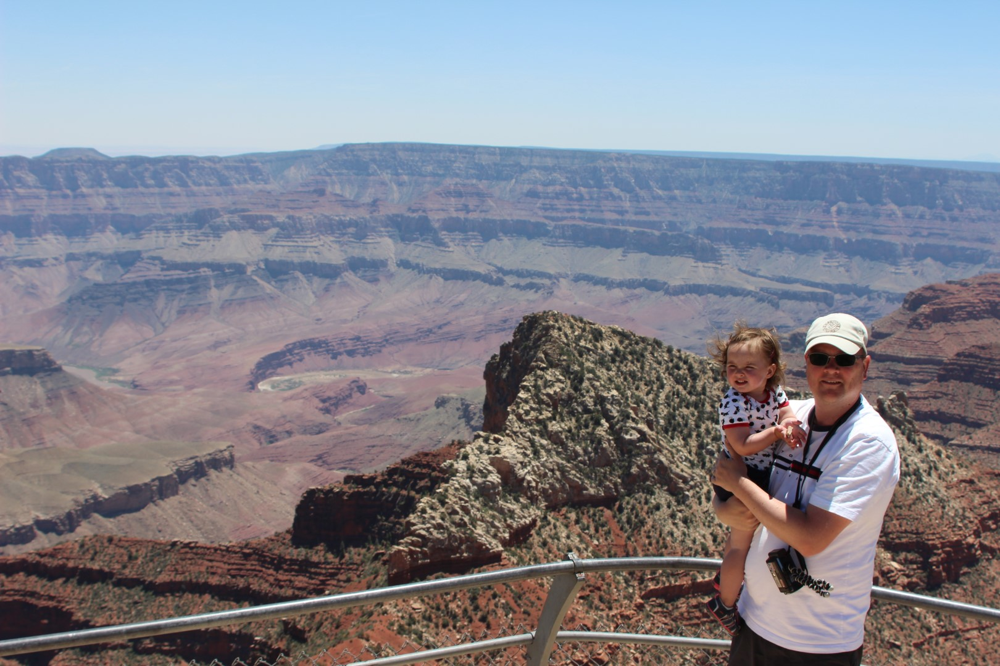

Vanuit Page zijn we via Kanab naar de noordkant van de Grand Canyon gereden. Het blijft een prachtige weg, met name vanaf Jacobs Lake. Het is hier qua temperatuur weer een stuk aangenamer, en ook de omgeving blijft indrukwekkend. We hebben een mooi plekkie voor de komende twee nachten.

We hebben niet zo'n goede eerste nacht gehad, want Sofie heeft koorts (last van de tandjes en/of oren denken we). Daarom hebben we onze oorspronkelijke plannen moeten aanpassen, en hebben we de ochtend niets gedaan. 's Middags was de koorts gelukkig weer een stuk gedaald, en zijn we met de fiets naar de Grand Canyon Lodge gefietst. De uitzichten op de canyon zijn aan de noordkant minder spectaculair dan aan de zuidkant. Daar staat dan weer wel tegenover dat de noordkant een heel stuk minder druk is, en de temperatuur hier is ook een stuk aangenamer (o.a. omdat het hoger ligt).

In de lodge hebben we op het terras een bier en een jus d'orange genuttigd en van het uitzicht genoten. Daarna zijn we weer teruggefietst (berg op!) naar de camper en hebben de BBQ aangezwengeld.

De volgende morgen zijn we naar Cape Royal gereden voor een laatste blik in de Grand Canyon. We zijn hier nu voor de vijfde keer, maar het blijft bijzonder indrukwekkend om te zien. De omvang van het geheel is moeilijk te bevatten, en niet vast te leggen op foto of video. Of eigenlijk is dat maar goed, en moeten we nog maar een keertje terugkomen.

Na de lunch zijn we naar Zion gereden, onze volgende tweedaagse stop.
