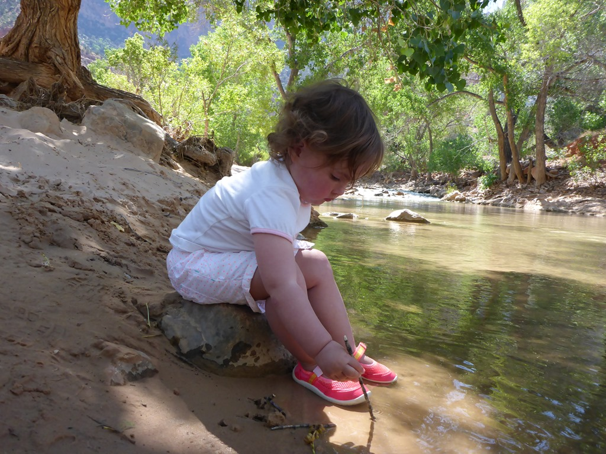
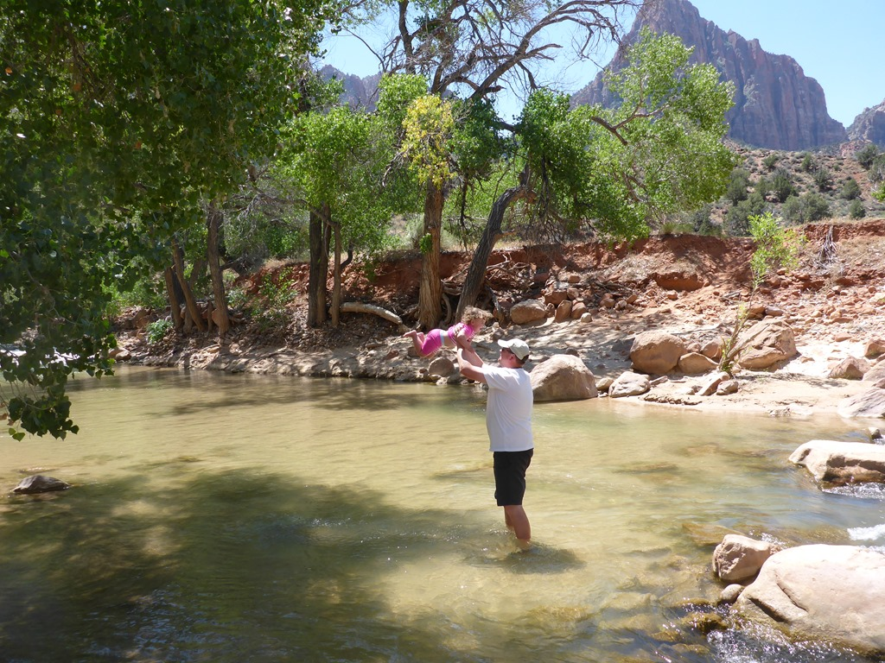
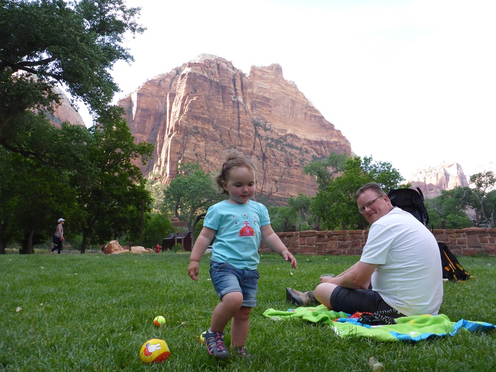
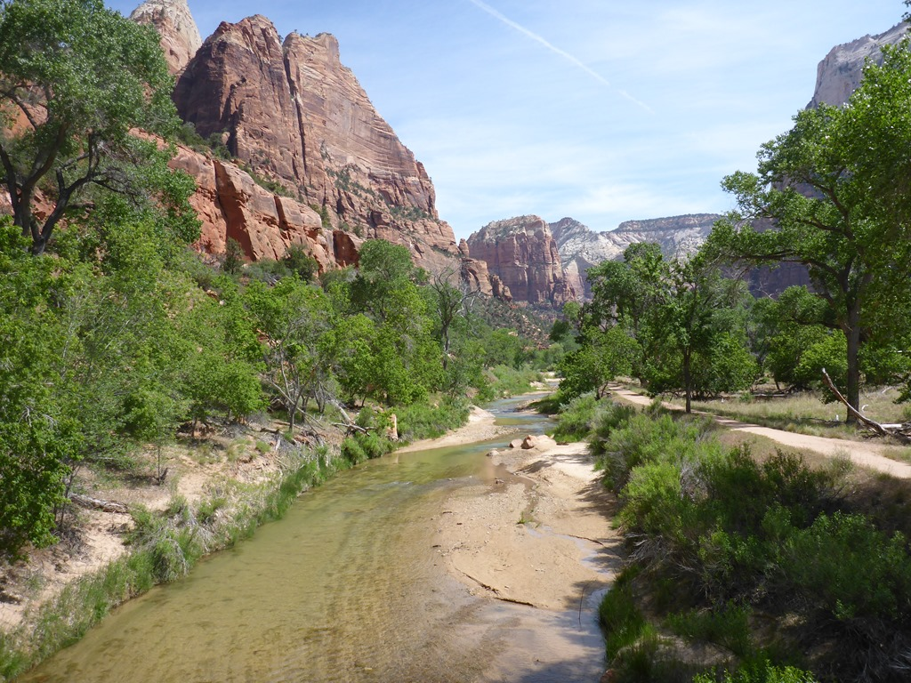
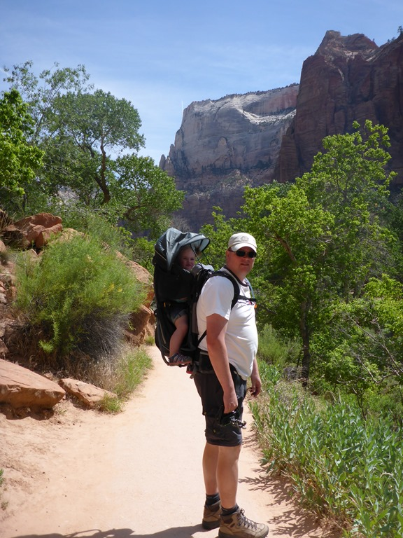
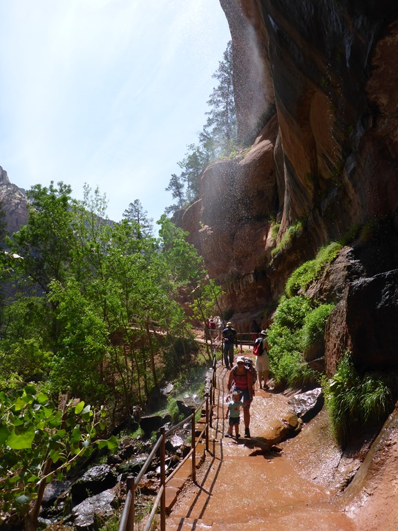
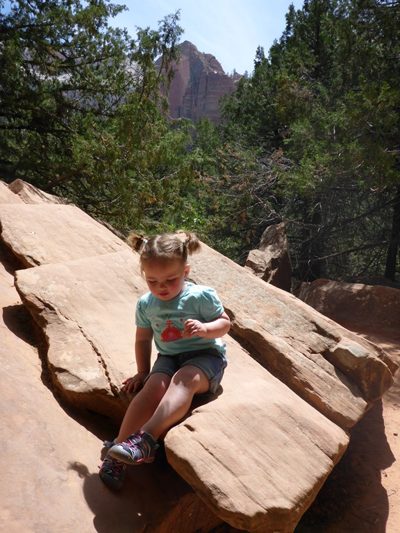

De humor van de buschauffeur in het algemeen is legendarisch, en, zo bleek vandaag, ook nog eens internationaal van aard. Na ons diner in de lodge stapten we zoals chauffeur Tim het zelf al aankondigde in "The Fun Bus". De 15 minuten durende rit terug naar de visitor center werd gevuld met de ene dijenkletser na de andere. Voorbeeld van zo’n kwinkslag: "What do you call a dear with no eyes?"... "No idear".

Maar laten we bij het begin beginnen. Na aankomst op de Watchman campground, hebben we de wandelwagen gepakt en Sofie meegenomen naar het stadje Springdale wat aan de ingang van ons favoriete nationale park ligt. We hebben goed gegeten bij de Spotted Dog, ons vast adres wanneer we in Zion zijn.

Omdat we een lange reisdag achter de rug hebben, willen we het de volgende dag wat rustig aan doen. En dus zijn we op zoek gegaan naar een strandje met toegang tot de Virgin River. Dit riviertje is verantwoordelijk voor de canyon, en is meestal nauwelijks groter dan een uit de kluiten gewassen beek. Dat mooie plekje vonden we gelukkig op 5 minuten fietsen van onze camper, nog steeds op de camping!

Het was erg warm, en dus zochten we al snel verkoeling op in de rivier. Wat een lol hadden we!

's Middags hebben we de bus gepakt naar de lodge, waar Sofie op het grasveld leuk heeft gespeeld.

Voordat we de volgende dag weer moeten vertrekken, zijn we weer met de bus naar de lodge gegaan. Van daaruit kun je de Emerald Pools bezoeken. Een makkelijk wandelingetje vergeleken met de zware dagwandelingen die we hier voorgaande keren gedaan hebben (Angels Landing, Observation Point, Hidden Canyon).

Op de foto hierboven zijn zowel Angels Landing (de rode rots in in het midden) als Observation Point te zien (de grijze hoop stenen helemaal achteraan).

Bij de Lower Emerald Pool druppelt het water van een rots boven je op het pad. Sofie vond het erg leuk om onder de, zoals ze zelf zei, douche te staan en ze wilde keer op keer weer terug.

Na de wandeling zijn we naar Pahrump gereden waar we overnachten op 1000 Lakes RV Resort.

## 1 opmerking

### Gerard 8 juni 2015 om 09:07

Het zijn en blijven prachtplaatjes en Sofie is al een echte globetrotter, zo blij en zo actief.
Veel plezier nog, de tijd schiet al weer op.
