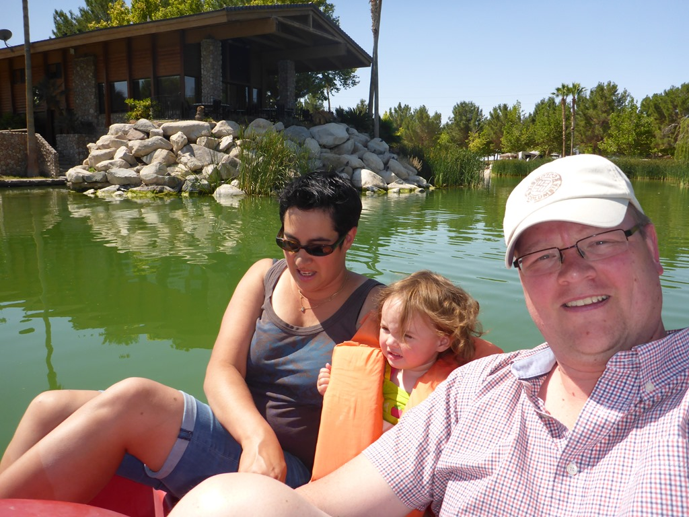
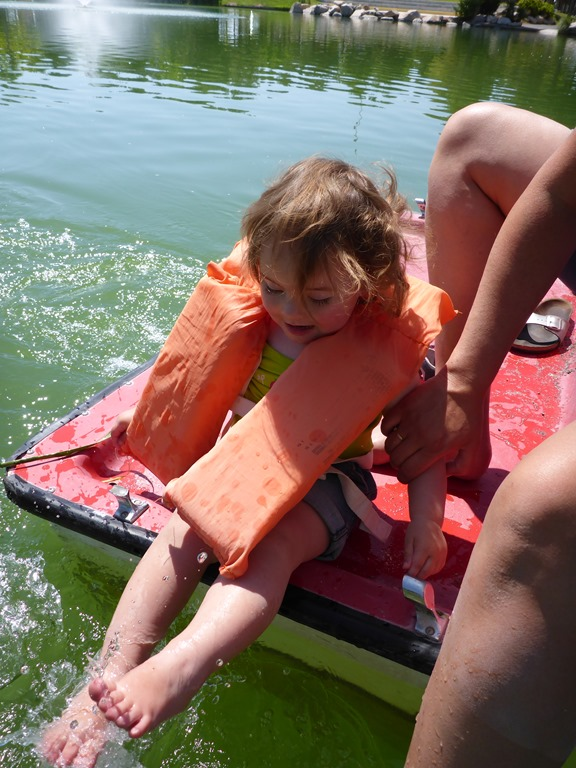
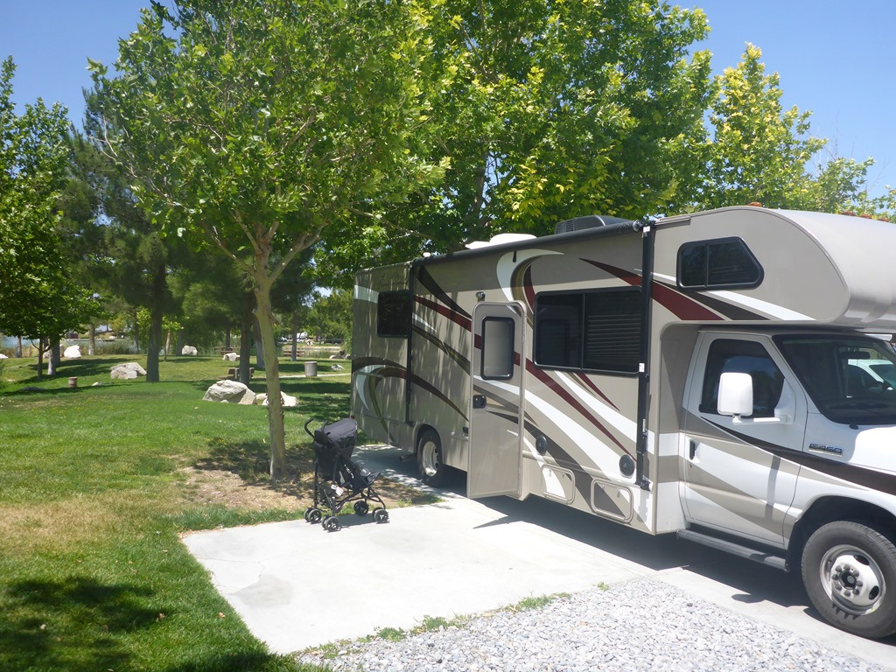
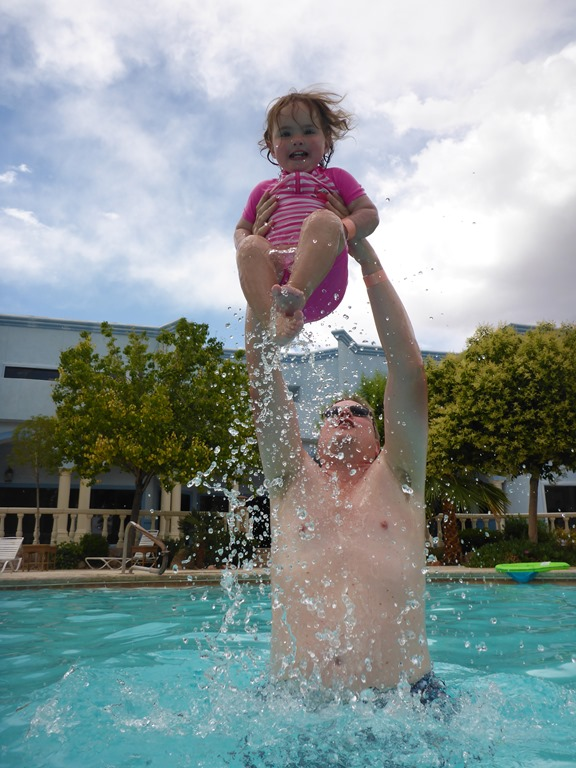
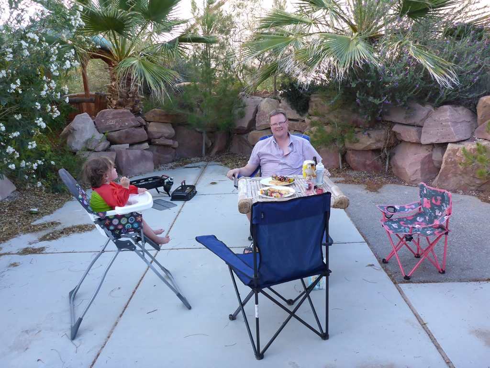
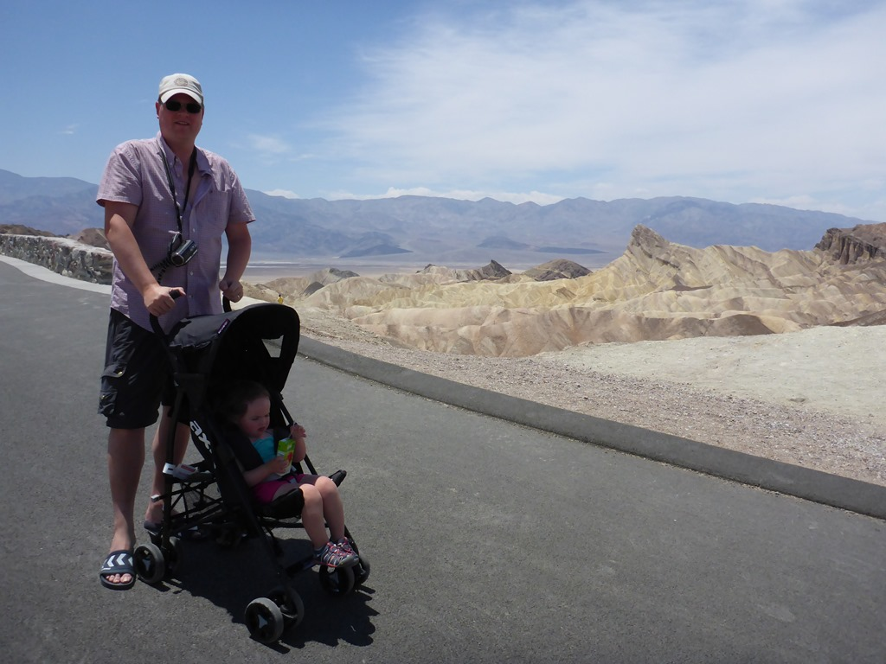
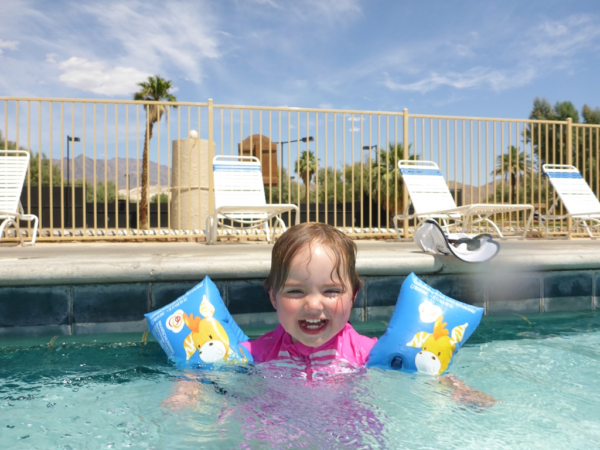
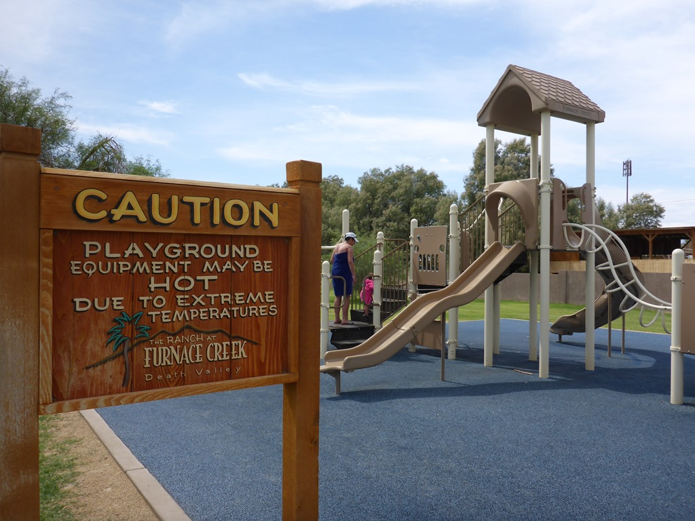
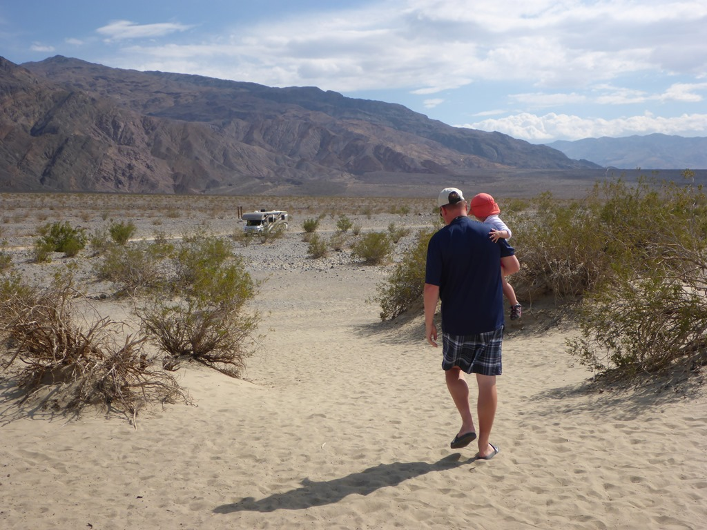

Vanuit Zion is het een lange en vervelende weg naar onze tussenstop Pahrump (want voornamelijk Interstate). De eerste nacht hebben we doorgebracht op de Lakeside Casino en RV Resort. Er is een groot meer aangelegd waarop je onder andere met een waterfiets een rondje kunt maken. Best leuk als ochtendgymnastiek.

Beide dames verhuisden al snel naar het achterdek, zodat papa zich het apelazerus kon trappen terwijl er al snel enkele voeten danwel voetjes in het water verdwenen.

Lakeside is een prachtige camping die met zorg is aangelegd en wordt onderhouden, op het zwembad en de wifi na. Aangezien we toch naar de Walmart moesten, zijn we gaan kijken bij de andere camping in Pahrump met een triple-ten rating: Nevada Treasure RV Resort. Aan de receptie werden we geholpen door een van de Gilmore girls (helaas niet de jongste of middelste van het drietal). De sta-plek zelf was dan wel (veel) minder mooi dan bij Lakeside, maar hier hebben we wel een privetuin met gazebo (prieeltje) tot onze beschikking. Bovendien hebben ze hier een veel mooier zwembad, en was de wifi eindelijk eens een keertje goed en snel.

Na al het zwemplezier hebben we heerlijk gezeten en gegeten in onze tuin.

De laatste ochtend zijn we op tijd opgestaan want de rit dwars door Death Valley staat op het programma. Death Valley is het laagste, droogste en warmste deel van Noord Amerika. We zijn gaan kijken bij de voor iedere bezoeker verplichte stop Zabriskie Point (en voor velen zal dit tevens de enige stop zijn vermoed ik). Het padje naar boven is onlangs geasfalteerd en dus was het niet al te zwaar naar boven.

Het was erg warm en dus besloten we om maar te gaan zwemmen bij Furnace Creek.

Het is hier zo warm dat ze op de speeltoestellen een waarschuwing hebben gehangen!

Na nog een bliksembezoek aan de duinen zijn we doorgereden naar de Boulder Creek campground in Lone Pine.

