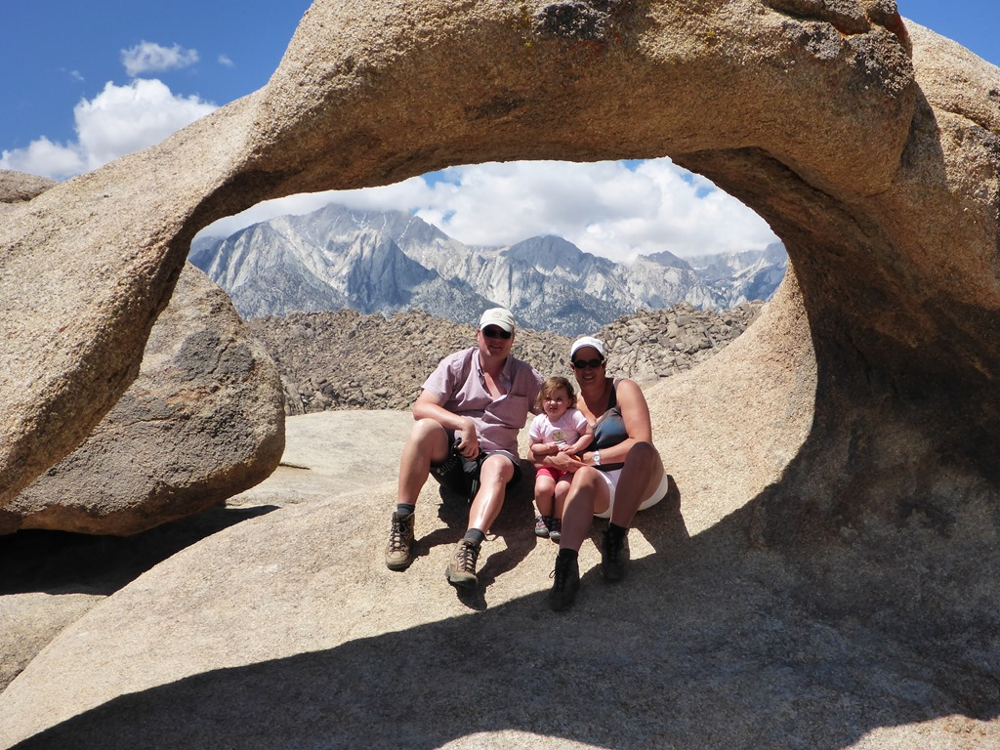
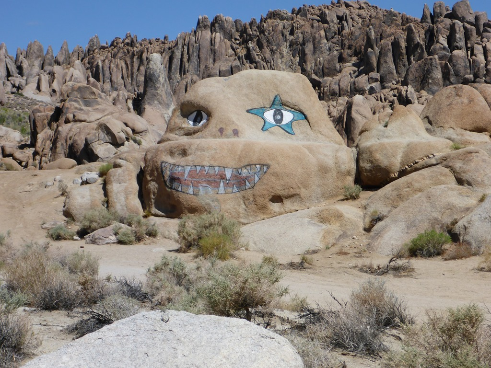
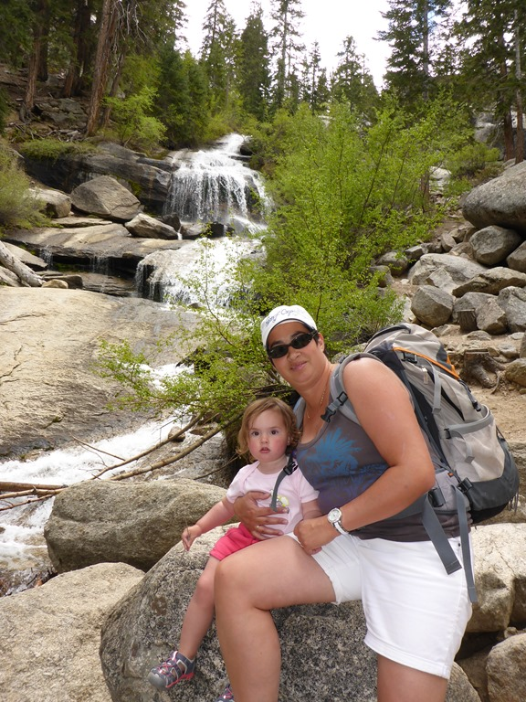
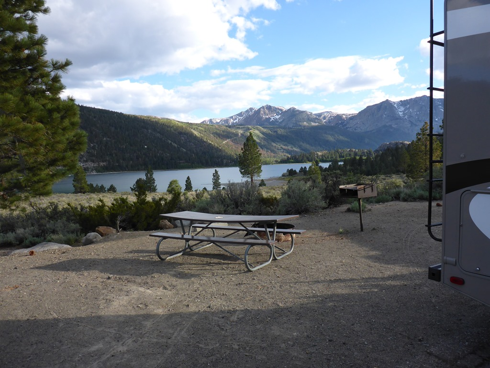
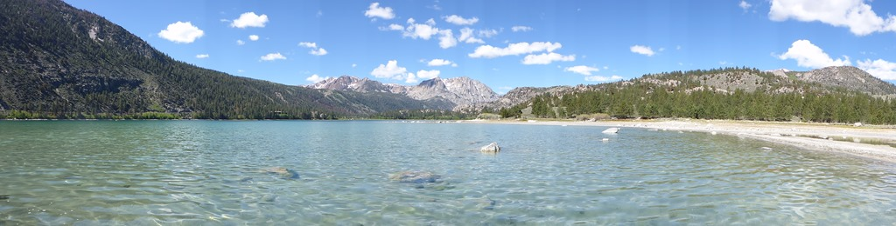

Het vreemde van dit deel van Californië is dat hier het laagste punt van de VS (Death Valley) en het hoogste punt van de VS (Mount Whitney) op nog geen 100 kilometer van elkaar verwijderd zijn. Vanuit Lone Pine kun je makkelijk beide bezoeken en dat maakt dat dit plaatsje vergeven is van de hotels en bijbehorende fastfood ketens en tankstations. Maar je kunt er ook een mooi uitstapje maken naar de Alabama Hills. In deze heuvels is een movie road aangelegd waar menig Hollywood film is opgenomen (recentelijk bijvoorbeeld Iron Man en Django Unchained). Je kunt er ook een leuk wandelingetje doen naar twee arches...

en langs de weg vind je Nightmare Rock!

Als je de weg naar boven volgt, dan kom je uit op een mooie camping en kun je wandelen naar de top van Mount Whitney. Dat is een meerdaagse trip, dus dat hebben we maar niet gedaan. Er is wel een mooie waterval!

Na de lunch zijn we weer naar beneden gereden naar onze volgende camping Oh Ridge aan June Lake. We hadden een mooie site (with a view!), helaas maar voor een nacht, want hierna gaan we naar Yosemite.

