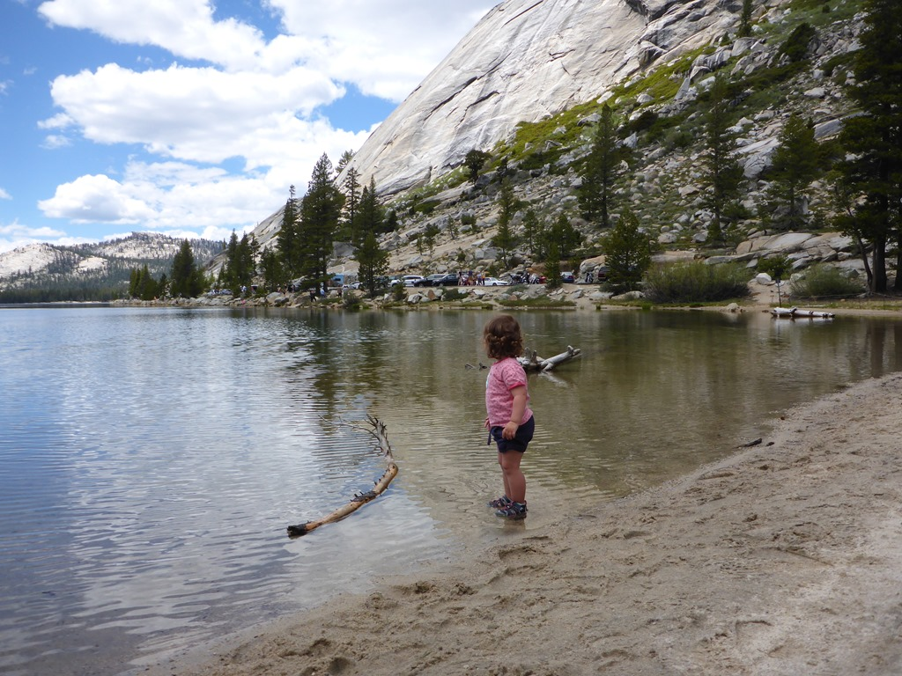
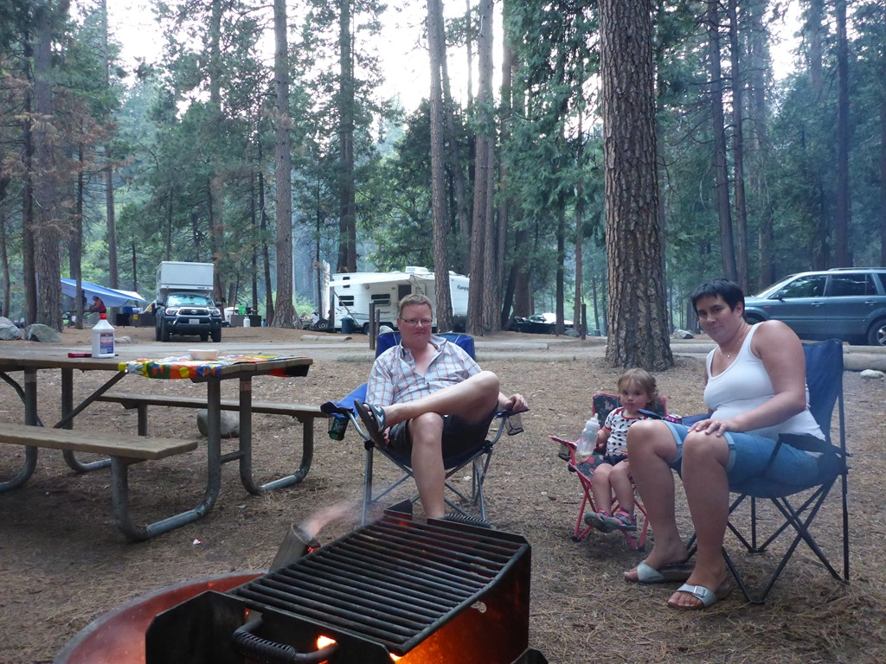
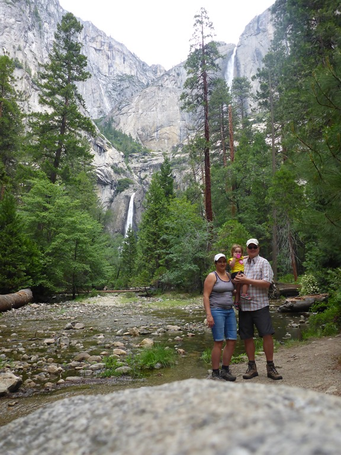
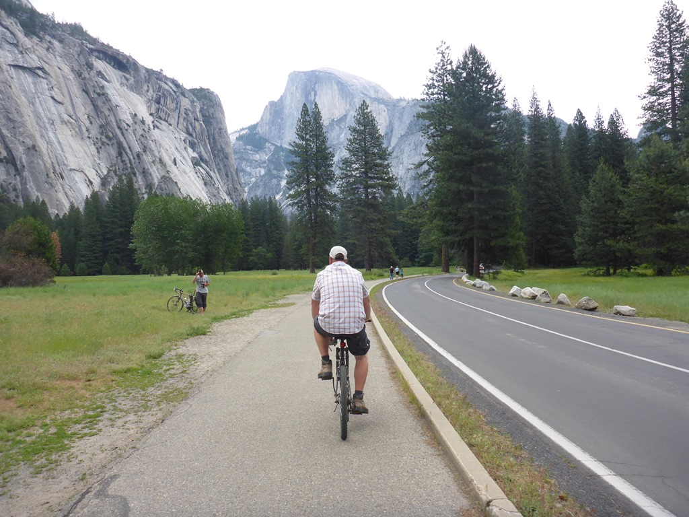
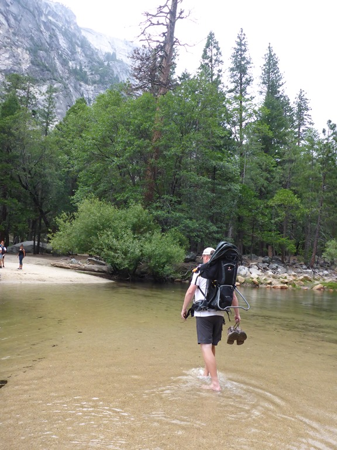
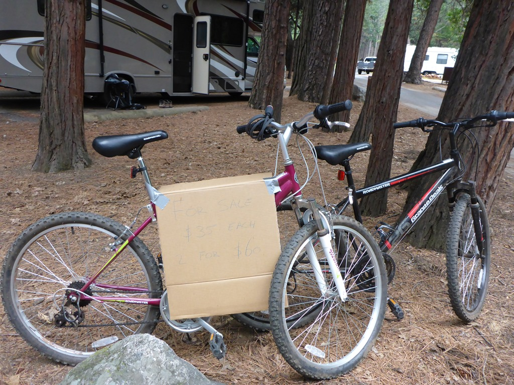

Yosemite inrijden via de Tioga Pass blijft indrukwekkend. Wat minder indrukwekkend was, was de hoeveelheid verkeer en de wegwerkzaamheden. Beide zorgden voor behoorlijk wat vertraging. Sofie heeft onderweg nog even gespetterd in Tenaya Lake waar ze alle aandacht kreeg van een Aziatische mevrouw.

We verblijven twee nachten op de North Pines campground. Mooi aan de rivier die door de vallei loopt met uitzicht op Yosemite Falls. Onze camper past maar net door de nauwe straatjes en de site zelf is ook wat lastig in te rijden, maar als je eenmaal staat, dan heb je een mooie plek. Bovendien moesten we natuurlijk wel op een A-locatie staan, want we moeten op de laatste dag onze fietsen zien te verkopen.

De volgende ochtend hebben we voor de laatste keer de fietsen uit de kelder gehaald en hebben we door de vallei gefietst en hebben we de Lower Yosemite Falls bezocht.

Na de middag zijn we naar Mirror Lake gelopen. Halverwege begon het een beetje te regenen en dus gingen we op zoek naar een shortcut en dat betekende dat we door het water heen moesten. Geen probleem!

Na thuiskomst heb ik een mooi bord gemaakt en op de fietsen gehangen. Na een uur of 4 hadden we een koper die de fietsen overgenomen heeft.

En bij het bekijken van wat sequoia's kreeg Sofie haar eerste beer te zien! Gelukkig waren we met veel mensen (bus met Franse toeristen: "un ours!") en bleef de beer op redelijke afstand.

