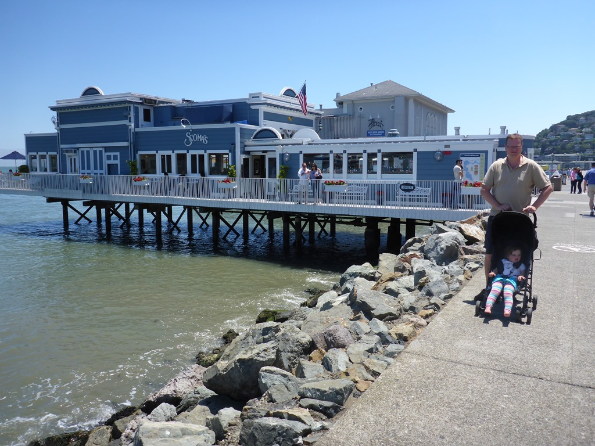
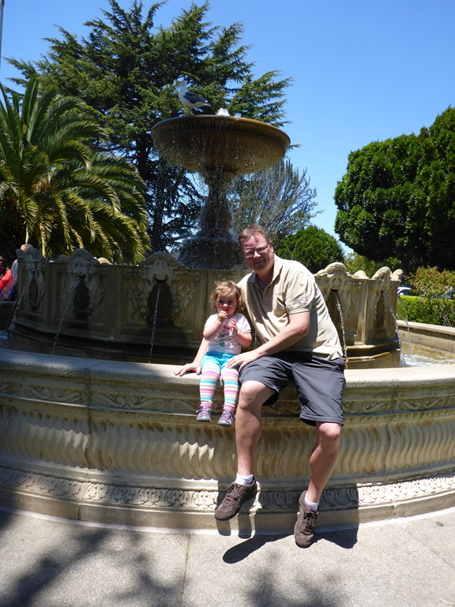
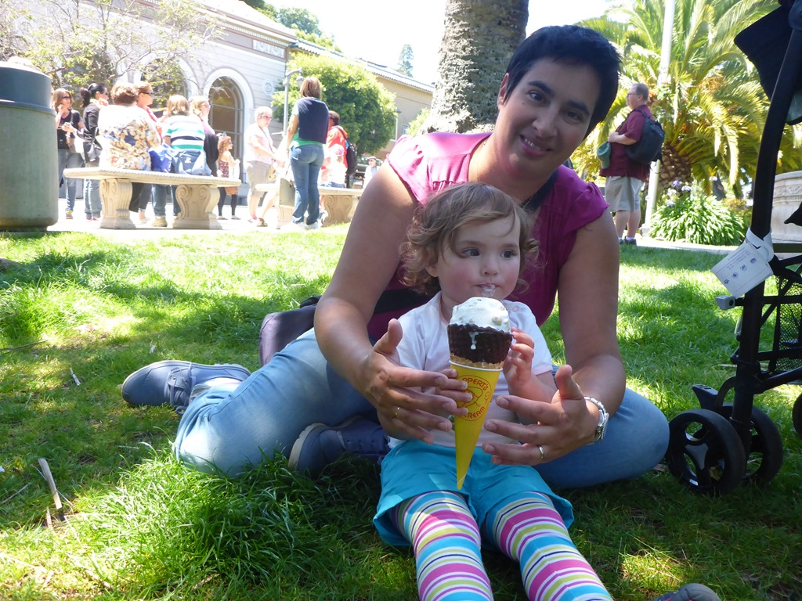
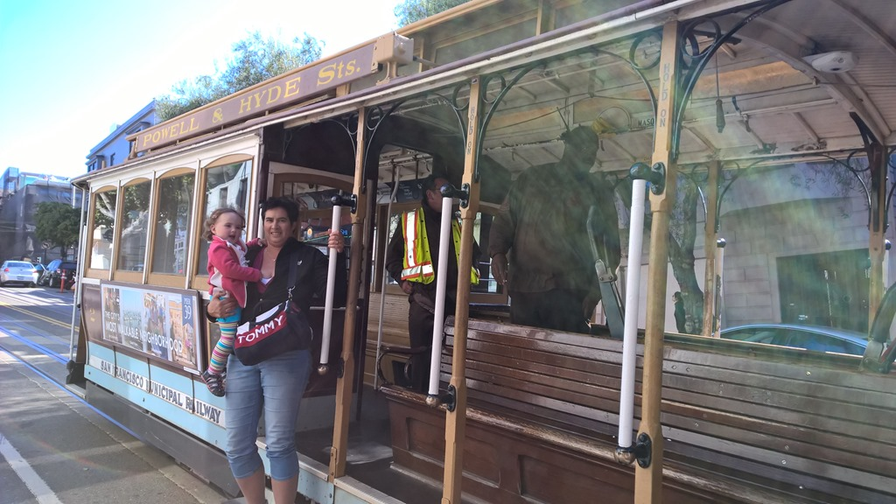
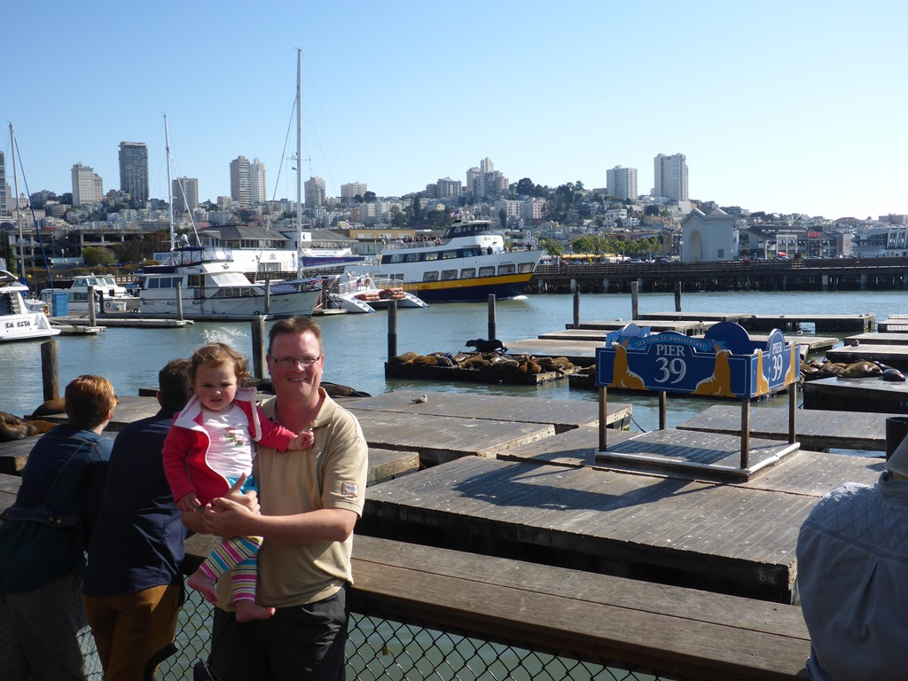
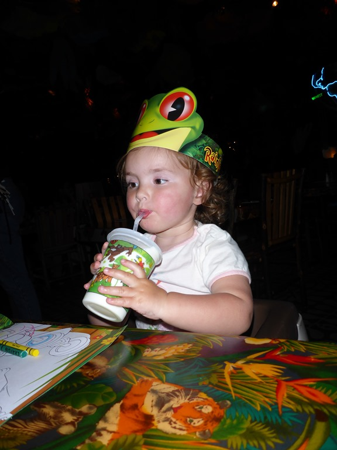

Voor het eerst hebben we Yosemite verlaten via de 120 (dus noordwest uitgang). Wat een prachtige slingerweg! Uiteindelijk kom je op de interstate terecht en wordt het al snel een stuk minder aantrekkelijk, ook al omdat je in de drukte belandt rond de Bay Area. Als eerste gaan we de huurauto ophalen op Oakland Airport, na wat onderhandelen krijgen we weer een Chevy Tahoe. We overnachten op de campground van Anthony Chabot Regional Park. Dit park bevindt zich in de heuvels achter Oakland, een niet al te beste voorstad van SF, en het is er prachtig! Bovendien is het van hieruit drie kwartiertjes rijden naar San Leandro waar we morgen de camper moeten inleveren.

Er rest ons niets anders dan de camper leeghalen en schoonmaken, de koffers vullen en in de Tahoe zetten. Na het afleveren van de camper zijn we met de auto een stukje naar het noorden gereden om vervolgens wat door Sausolito te struinen en een ijsje te eten.

De Golden Gate brug was vandaag geheel gehuld in de mist, dus dat was een beetje balen...

Hierna zijn we naar ons hotel Donatello vlak bij Union Square gereden. Met de cable car zijn we vervolgens naar Fisherman’s Wharf gegaan.

In Fisherman’s Wharf hebben we de zeeleeuwen bezocht en hebben we ons laatste diner op Amerikaans land genuttigd in de Rainforest Cafe.

